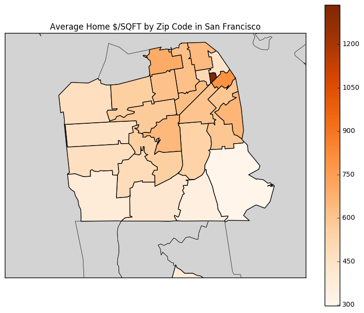
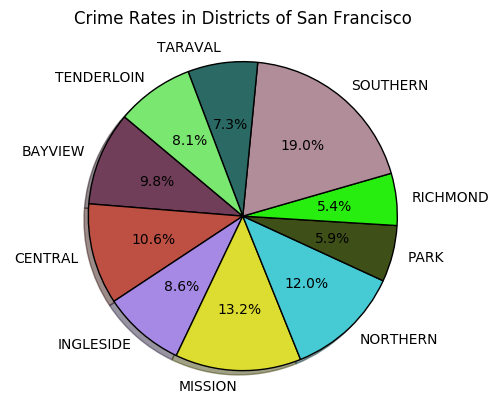
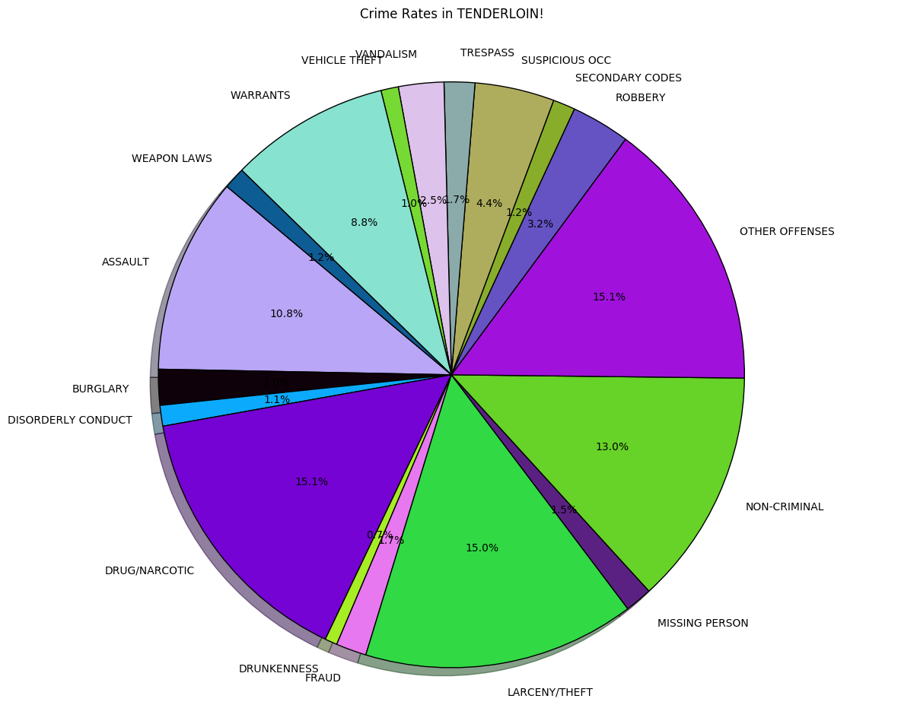
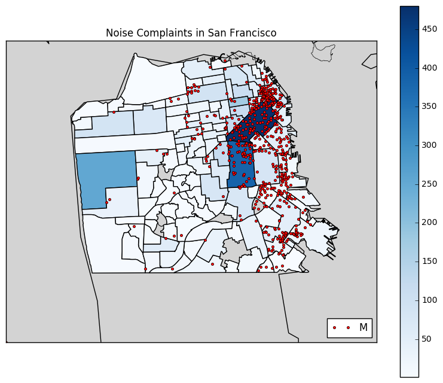
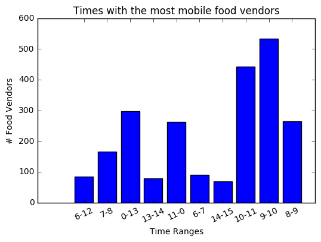
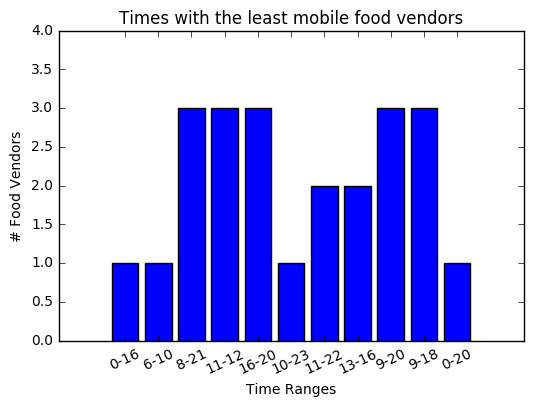
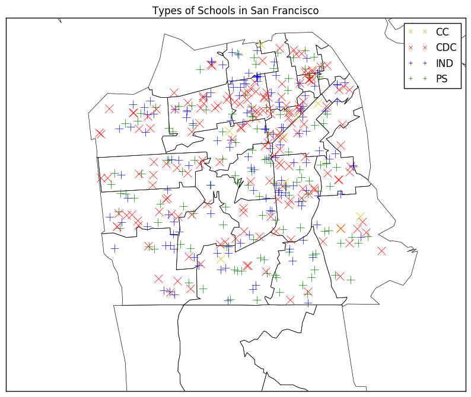

# San Francisco Community Analysis

In this assignment, you'll analyze a collection of data sets from the [San Francisco Open Data Portal](http://data.sfgov.org/) and [Zillow](https://www.zillow.com/). The data sets have been stored in the SQLite database `sf_data.sqlite`, which you can [download here](http://anson.ucdavis.edu/~nulle/sf_data.sqlite). The database contains the following tables:

Table                   | Description
----------------------- | -----------
`crime`                 | Crime reports dating back to 2010.
`mobile_food_locations` | List of all locations where mobile food vendors sell.
`mobile_food_permits`   | List of all mobile food vendor permits. More details [here](https://data.sfgov.org/api/views/rqzj-sfat/files/8g2f5RV4PEk0_b24iJEtgEet9gnh_eA27GlqoOjjK4k?download=true&filename=DPW_DataDictionary_Mobile-Food-Facility-Permit.pdf).
`mobile_food_schedule`  | Schedules for mobile food vendors.
`noise`                 | Noise complaints dating back to August 2015.
`parking`               | List of all parking lots.
`parks`                 | List of all parks.
`schools`               | List of all schools.
`zillow`                | Zillow rent and housing statistics dating back to 1996. More details [here](https://www.zillow.com/research/data/).

The `mobile_food_` tables are explicitly connected through the `locationid` and `permit` columns. The other tables are not connected, but you may be able to connect them using dates, latitude/longitude, or postal codes.

Shapefiles for US postal codes are available [here](https://www.census.gov/geo/maps-data/data/cbf/cbf_zcta.html). These may be useful for converting latitude/longitude to postal codes.

Shapefiles for San Francisco Neighborhoods are available [here](https://data.sfgov.org/Geographic-Locations-and-Boundaries/SF-Find-Neighborhoods/pty2-tcw4).

### NOTE: I deleted a lot of cells due to redundancy for when I looked at the correct column names for each df etc...

__Exercise 1.1.__ Which mobile food vendor(s) sells at the most locations?


```python
import sqlalchemy as sql
import pandas as pd

'''
I use sqlalchemy to create an 'engine'. I then connect to the sql database
'''

sfdb = sql.create_engine('sqlite:///sf_data.sqlite')
connection = sfdb.connect()
cursor = sfdb.execute("SELECT * FROM sqlite_master")
# rows = cursor.fetchall()
```


```python
'''
Here I create a table called location_schedule 
by merging mobile_food_schedule and 
mobile_food_locations tables on location id. 
I do this because I need imformation about the location
of the food truck along with the name of the business.
To do so I created a table all_stuffs, that joins 
location_schedule with mobile_food_permits 
on the ID 'permits'. This would allow me to view all information
about location and applicant together.
'''

sfdb.execute("CREATE TABLE location_schedule AS SELECT * FROM mobile_food_schedule INNER JOIN mobile_food_locations ON mobile_food_locations.locationid = mobile_food_schedule.locationid")

## location schedule to permit dataframe
## merging location schedule with mobile_food_permits using permit criteria

sfdb.execute("CREATE TABLE all_stuffs AS SELECT * FROM location_schedule INNER JOIN mobile_food_permits ON location_schedule.permit = mobile_food_permits.permit LIMIT 10")
```


```python
#name a table that selects applicant and lcoation only from all_stuffs
sway = pd.read_sql("SELECT Applicant, LocationDescription FROM all_stuffs WHERE LocationDescription IS NOT NULL", sfdb)
```


```python
nodupes = sway.drop_duplicates() #drop all duplicates to only count the ones for locations
nodupes['Applicant'].value_counts().head() #check which applicant operates at the most locations
```


    May Catering                52
    Anas Goodies Catering       34
    Natan's Catering            25
    Liang Bai Ping              24
    Singh Brothers Ice Cream    21
    Name: Applicant, dtype: int64


```python
print 'May Catering serves the most locations at 52 locations!'
```

    May Catering serves the most locations at 52 locations!


__Exercise 1.2.__ Ask and use the database to analyze 5 questions about San Francisco. For each question, write at least 150 words and support your answer with plots. Make a map for at least 2 of the 5 questions.

You should try to come up with some questions on your own, but these are examples of reasonable questions:

* Which parts of the city are the most and least expensive?
* Which parts of the city are the most dangerous (and at what times)?
* Are noise complaints and mobile food vendors related?
* What are the best times and places to find food trucks?
* Is there a relationship between housing prices and any of the other tables?

Please make sure to clearly state each of your questions in your submission.


```python
from matplotlib import pyplot as plt
import numpy as np
from mpl_toolkits.basemap import Basemap
from matplotlib.patches import Polygon
from matplotlib.collections import PatchCollection
from matplotlib.colors import Normalize
import random
```

## Which parts of the city are the most and least expensive?


```python
# acquire data from sql database of zip codes and average of the median sold price of homes from zillow

zipprice = pd.read_sql("SELECT RegionName, AVG(MedianSoldPricePerSqft_AllHomes) AS AverageHomePrice FROM zillow GROUP BY RegionName", sfdb)
zipprice['RegionName'] = zipprice['RegionName'].astype(str)
```


```python
'''
Here I first create a map using matplotlib.Basemap of 
San Francisco. I draw the mapboundary as well as the 
boundaries of the zip codes using the shape file given.
I create a dataframe of the polygons(shapes) of the 
zipcodes, this dataframe holds the shapes and the zipcode 
as 'RegionName'. This is so I could merge the df_poly
with zipprice which carries info about the average price
of homes. I then use cmap to have a color map using the 
data about the average home price. I default the figure
size to be large,add a colorbar, and title for clarity.

'''

fig, ax = plt.subplots(figsize=(10,20))
zip_map = Basemap(llcrnrlon = -122.553864, llcrnrlat = 37.675669, urcrnrlon=-122.334137,urcrnrlat = 37.816836,resolution = 'h', projection = 'merc')

zip_map.drawmapboundary(fill_color = 'lightgray')
zip_map.readshapefile("cb_2015_us_zcta510_500k", 'zipcodes')

df_poly = pd.DataFrame({
        'shapes': [Polygon(np.array(shape), True) for shape in zip_map.zipcodes],
        'RegionName': [zipcode['ZCTA5CE10'] for zipcode in zip_map.zipcodes_info]
    })

df_poly = df_poly.merge(zipprice, on = 'RegionName', how = 'left')
df_poly = df_poly.dropna()


cmap = plt.get_cmap('Oranges')   
pc = PatchCollection(df_poly.shapes, zorder=2)
norm = Normalize()

pc.set_facecolor(cmap(norm(df_poly['AverageHomePrice'].fillna(1).values)))
ax.add_collection(pc)
mapper = plt.cm.ScalarMappable(norm=norm, cmap=cmap)
mapper.set_array(df_poly['AverageHomePrice'])
plt.colorbar(mapper, shrink=0.4)
plt.title('Average Home $/SQFT by Zip Code in San Francisco')

plt.show()
```





By using the sql database, I was able to retrieve data on the average price of homes in San Francisco.  With this data, I averaged all the price per square foot of homes in each unique zip-code in San Francisco. I then found that __94158__ has the most expensive homes at __`$`1336.12 per SQFT__. This region San Francisco is known as  "down town" right next to _AT&T park_ where the SF Giants play, which explains the reason for its outrageously expensive housing prices. I created a map using _Basemap_ from _matplotlib_ that accurately and beautifully displays the information about housing prices in San Francisco. It is interesting to note that __94158__ is the only place where housing prices are above 1000 dollars. Though there are other areas with expensive housing prices like, __94105__ which is in between South Beach and the Financial District, at __`$`798.25__. Also, the area with the lowest housing prices is __94124__ at __`$`297__. This area is known as __Hunter's Point__, which is an area famous for having bad housing infrastructure, high pollution, high unemployment and crime rates. 

## Which parts of the city are the most dangerous?


```python
#create a dataframe of the crimes and districts
#then count each crime grouped by district

crimesbro = pd.read_sql('SELECT Descript,Category,PdDistrict FROM crime', sfdb)
crimesbro.groupby('PdDistrict').count()
```


<div>
<table border="1" class="dataframe">
  <thead>
    <tr style="text-align: right;">
      <th></th>
      <th>Descript</th>
      <th>Category</th>
      <th>PdDistrict</th>
    </tr>
  </thead>
  <tbody>
    <tr>
      <th>0</th>
      <td>LOST PROPERTY</td>
      <td>NON-CRIMINAL</td>
      <td>MISSION</td>
    </tr>
    <tr>
      <th>1</th>
      <td>ROBBERY, BODILY FORCE</td>
      <td>ROBBERY</td>
      <td>TENDERLOIN</td>
    </tr>
    <tr>
      <th>2</th>
      <td>AGGRAVATED ASSAULT WITH BODILY FORCE</td>
      <td>ASSAULT</td>
      <td>TENDERLOIN</td>
    </tr>
    <tr>
      <th>3</th>
      <td>DOMESTIC VIOLENCE</td>
      <td>SECONDARY CODES</td>
      <td>TENDERLOIN</td>
    </tr>
    <tr>
      <th>4</th>
      <td>MALICIOUS MISCHIEF, VANDALISM OF VEHICLES</td>
      <td>VANDALISM</td>
      <td>NORTHERN</td>
    </tr>
  </tbody>
</table>
</div>


```python
pd.read_sql('SELECT * FROM crime LIMIT 1',sfdb)
```


<div>
<table border="1" class="dataframe">
  <thead>
    <tr style="text-align: right;">
      <th></th>
      <th>IncidntNum</th>
      <th>Category</th>
      <th>Descript</th>
      <th>DayOfWeek</th>
      <th>Datetime</th>
      <th>PdDistrict</th>
      <th>Resolution</th>
      <th>Address</th>
      <th>Lon</th>
      <th>Lat</th>
    </tr>
  </thead>
  <tbody>
    <tr>
      <th>0</th>
      <td>150060275</td>
      <td>NON-CRIMINAL</td>
      <td>LOST PROPERTY</td>
      <td>Monday</td>
      <td>2015-01-19 14:00:00</td>
      <td>MISSION</td>
      <td>NONE</td>
      <td>18TH ST / VALENCIA ST</td>
      <td>-122.421582</td>
      <td>37.761701</td>
    </tr>
  </tbody>
</table>
</div>


```python
def rcol(numcolors):
    '''
    This is literally just a function I made
    to make coloring in pie charts a lot easier 
    for me. I took made it so black will never be
    in the pie chart so the percentages will be seen 
    easily. xD 
    '''
    listcolors = []
    for i in xrange(numcolors):
        if ("#%06x" % random.randint(0, 0xFFFFFF)) != '#000000':
            listcolors.append(("#%06x" % random.randint(0, 0xFFFFFF)))
    return listcolors
```


```python
'''
Here I use matplotlib to create a pie chart of crimes by the district.
The rest is quite self explanatory. Sizes are the counts
of crimes by the district. Labels are districts. 
'''
labelc = list(crimesbro.groupby('PdDistrict').count().index)
sizes = list(crimesbro.groupby('PdDistrict').count()['Descript'])
plt.pie(sizes, labels=labelc,
        autopct='%1.1f%%',colors =rcol(len(sizes)) , shadow=True, startangle=140)

plt.title('Crime Rates in Districts of San Francisco', y=1.1)
plt.axis('equal')
plt.show()
```





```python
sizes
```


    [101655, 109242, 89044, 136216, 124365, 60974, 56258, 196178, 75459, 84009]


In order to view which district has the highest crime rates I created a _pie chart_ to accurately view the distribution of crime rates.  There is a lot of information that comes out of this, we can see that the __Southern__ district, __Mission__ district and __Northern__ district have the highest distribution of crime in San Francisco at __19%, 13.2% and 12%__ respectively. Those this is an accurate representation of the distributionof total crime rates in each district, this chart does not account for the total population of the different districts. Thus, surely there would be more occurences of crimes if the population in the respective district is high. Because of this, I decided to use a pie chart to analyze Tenderloin's crime type distribution.


```python
'''
I was interested in seeing the distribution of crimes in
the Tenderloin district specifically. This is due to 
personal experience and curiosity lol. I do the same things
as above, however the sizes for the tenderloin district 
are the types of crimes committed. Also, note that I 
drop all the crimes that have less than 500 occurences 
by subsetting the data. 
'''

fig, ax = plt.subplots(figsize=(15,10))
tenderloinbaby = pd.read_sql('SELECT Descript,Category,PdDistrict FROM crime WHERE PdDistrict == "TENDERLOIN"', sfdb)
tenderloinbaby.groupby('Category').count()

tendy = tenderloinbaby.groupby('Category').count()

labelc = list(tendy[tendy['Descript'] > 500].index)
sizes = list(tendy[tendy['Descript'] > 500]['Descript'])
plt.pie(sizes, labels=labelc,
        autopct='%1.1f%%',colors =rcol(len(sizes)), shadow=True, startangle=140)

plt.title('Crime Rates in TENDERLOIN!', y=1.1)
plt.axis('equal')

plt.show()
```





Now I was really interested in analyzing the Tenderloin because of personally experiences (robbery was attempted on me but they weren't ready for me...), and also its prestige as being one of the most "ghetto" and crime ridden places in the country, notorius for its drug crimes and theft. Thus, I found that __larcency/theft__, __drug__ and __assualt__ issues are the most reported cases in the Tenderloin at __15%, 15.1% and 10.8%__ respectively.  It is also to note that __13%__ of the crimes reported were non-criminal, where as __15.1%__ (a very large chunk) of reports were "other offenses"   

# Are noise complaints and mobile food vendors related?


```python
# create a table using the noise table
# I could the number of noise complaint occurences
# 
noise = pd.read_sql('SELECT Neighborhood, COUNT(Type) AS countnoise'
                    ' FROM noise GROUP BY Neighborhood ORDER BY Type',sfdb)
noise['Neighborhood'] = noise['Neighborhood'].astype(str)

# create another dataframe with the lat and long from mobile_food_locations table
mlatlon = pd.read_sql('SELECT Latitude, Longitude FROM mobile_food_locations WHERE Latitude IS NOT NULL',sfdb)

```


```python
'''
I create a map using Basemap. Much like the map I made for the first question.
This map creates plots the districts of san francisco, I create a color map
of noise complaints by each district. Then I used the lat and lon data from
each mobile food location and plot that data as red points on the map. 
This accurately shows the relationship between noise complaints and food trucks.
'''
fig, ax = plt.subplots(figsize=(10,20))


noisemap = Basemap(llcrnrlon = -122.553864, llcrnrlat = 37.675669, urcrnrlon=-122.334137,urcrnrlat = 37.816836,resolution = 'h', projection = 'merc')
noisemap.drawmapboundary(fill_color = 'lightgray')
noisemap.drawcoastlines()
noisemap.readshapefile("geo_export_ade7905b-6b5f-4ec0-9145-bd9087516b19", 'districts')

df_poly2 = pd.DataFrame({
        'shapes': [Polygon(np.array(shape), True) for shape in noisemap.districts],
        'Neighborhood': [district['name'] for district in noisemap.districts_info]
    })

df_poly2 = df_poly2.merge(noise, on = 'Neighborhood', how = 'left')
df_poly2 = df_poly2.dropna()

cmap = plt.get_cmap('Blues')   
pc = PatchCollection(df_poly2.shapes, zorder=2)
norm = Normalize()

for lon, lat, in zip(mlatlon.drop_duplicates().Longitude, mlatlon.drop_duplicates().Latitude):
    x, y = noisemap(lon, lat)
    schoolmap.plot(x, y, 'ro', markersize = 3)

pc.set_facecolor(cmap(norm(df_poly2['countnoise'].fillna(1).values)))
ax.add_collection(pc)
mapper = plt.cm.ScalarMappable(norm=norm, cmap=cmap)
mapper.set_array(df_poly2['countnoise'])
plt.colorbar(mapper, shrink=0.4)
plt.legend(schoolmap.plot(1, 'ro',label = 'Mobile Food Vendor', markersize = 3), 'Mobile Food Vendor', loc = 'lower right')
plt.title('Noise Complaints in San Francisco')

plt.show()
```





Much like the first city map I created of San Francisco, I created this using Basemap. I then drew the boundaries of each _Neighborhood_ onto the map of San Francisco and colored it in by the number of _Noise Complaints_ seen in the blue shades. I then plotted each location of mobile food vendors across the map. I wanted to figure out if there was a correlation between the amount of noise complaint occurences and the amount of food vendors in a given area.  I found that most of the concentration of noise complaints happen where mobile food vendors are present.  Thus, there is a possibility that mobile food vendors increase the amount of noise complaints, as they bring along a mass of people during busy hours. However, the area with high noise complaints could also be an effect of the area being in down town San Francisco, where it is always hustlin' and bustlin'. I mention this because there are areas across the city with relatively high amounts of food vendors but with otherwise low amounts of noise complaints.  

# What are the most and least common mobile food vendor hours of operations?


```python
import operator
startcounts[-10:]
```


    [(u'14-15', 70),
     (u'13-14', 78),
     (u'6-12', 84),
     (u'6-7', 90),
     (u'7-8', 166),
     (u'11-0', 262),
     (u'8-9', 265),
     (u'0-13', 298),
     (u'10-11', 443),
     (u'9-10', 534)]


```python
'''
here I create a data frame from mf schedule of start and end hour
I combine the start and end hour to make it easier for a bar chart.
I then count each occurence of the time frames that each food truck
operates at as newSE. I then create a dictionary 'sortdict' from newSE
and I procede to create a bar chart of the 10 most common time ranges that 
a food truck operates at.
'''

SE = pd.read_sql('SELECT DayOfWeek, StartHour || "-" || EndHour AS StartEnd FROM mobile_food_schedule', sfdb)
newSE = SE['StartEnd'].value_counts().to_dict()

startcounts = sorted(newSE.items(), key=operator.itemgetter(1))
startcounts
sortdict = dict(startcounts[-10:])

plt.bar(range(len(sortdict)), sortdict.values(), align='center')
plt.xticks(range(len(sortdict)), sortdict.keys(), rotation=25)
plt.title("Times with the most mobile food vendors")
plt.xlabel('Time Ranges')
plt.ylabel('# Food Vendors')
plt.show()
```





I wanted to answer the question as to which time ranges do mobile food vendors operate on the most. To do so, I created a __bar chart__ with the number of mobile food vendors on the y-axis and the top ten time ranges (as military time) on the x-axis.  Note that I did not group the data by the day of the week, this is to show the overall time occcurences disregarding the fact that a day may be a weekend or not; I wanted the overall counts. With this, I find out that the top hours of operations are __9am to 10am__ at __534__ mobile food vendors operating at that time. The next time range with the most vendors operating are, __10am to 11am__. This is interesting to note, because it shows that the food trucks want to maximize their profits by only operating at times where demand for food is very high, such as breakfast and brunch times (9am-11am).  However, I was surprised to see that lunch times are not in the top 10 most operated times. 


```python
'''
Much like the graph created above, except this is the time
ranges of that the least amount of food trucks operate at.
I thought it was interesting to add, for people who look for
a late light snack.
'''
sortdict2 = dict(startcounts[0:11])
plt.bar(range(len(sortdict2)), sortdict2.values(), align='center')
plt.xticks(range(len(sortdict2)), sortdict2.keys(), rotation=25)
plt.title("Times with the least mobile food vendors")
plt.xlabel('Time Ranges')
plt.ylabel('# Food Vendors')
plt.ylim(0,4)
plt.show()
```





I added this bar chart to show the time ranges with the least food truck operations. This is minutely flawed, in that it does not show the number of operating vendors during any given hour, only the time ranges. But it could be a decent indication for someone looking to get a late night snack (and who would likely be discouraged due to lack of mobile food vendors at late times). 

# What types of schools are in San Francisco? And where?


```python
# just to look at the types of schools.
# 4 types: community colleges, public schools, child development centers, and independent schools

schools = pd.read_sql('SELECT * FROM schools', sfdb)
schools.groupby('GeneralType').count()
```


<div>
<table border="1" class="dataframe">
  <thead>
    <tr style="text-align: right;">
      <th></th>
      <th>Name</th>
      <th>Entity</th>
      <th>LowerGrade</th>
      <th>UpperGrade</th>
      <th>GradeRange</th>
      <th>Category</th>
      <th>LowerAge</th>
      <th>UpperAge</th>
      <th>Address</th>
      <th>Lat</th>
      <th>Lon</th>
    </tr>
    <tr>
      <th>GeneralType</th>
      <th></th>
      <th></th>
      <th></th>
      <th></th>
      <th></th>
      <th></th>
      <th></th>
      <th></th>
      <th></th>
      <th></th>
      <th></th>
    </tr>
  </thead>
  <tbody>
    <tr>
      <th>CC</th>
      <td>10</td>
      <td>10</td>
      <td>10</td>
      <td>10</td>
      <td>10</td>
      <td>10</td>
      <td>10</td>
      <td>10</td>
      <td>10</td>
      <td>10</td>
      <td>10</td>
    </tr>
    <tr>
      <th>CDC</th>
      <td>167</td>
      <td>167</td>
      <td>167</td>
      <td>167</td>
      <td>167</td>
      <td>167</td>
      <td>167</td>
      <td>167</td>
      <td>167</td>
      <td>167</td>
      <td>167</td>
    </tr>
    <tr>
      <th>IND</th>
      <td>141</td>
      <td>141</td>
      <td>141</td>
      <td>141</td>
      <td>141</td>
      <td>141</td>
      <td>141</td>
      <td>141</td>
      <td>141</td>
      <td>141</td>
      <td>141</td>
    </tr>
    <tr>
      <th>PS</th>
      <td>127</td>
      <td>127</td>
      <td>127</td>
      <td>127</td>
      <td>127</td>
      <td>127</td>
      <td>127</td>
      <td>127</td>
      <td>127</td>
      <td>127</td>
      <td>127</td>
    </tr>
  </tbody>
</table>
</div>


```python
'''
Here I use basemap to create a map of san francisco 
seperated by the zipcodes. Using A FOR loop, I plot
the points of the different school locations, to see
which locations have the most schools and what kinds 
of schools are the most dominant.

'''
fig, ax = plt.subplots(figsize=(10,20))

schoolmap = Basemap(projection='merc', llcrnrlon = -122.553864, llcrnrlat = 37.675669, urcrnrlon=-122.334137,urcrnrlat = 37.816836, resolution='h')

schoolmap.drawmapboundary()
schoolmap.readshapefile("cb_2015_us_zcta510_500k", 'zipcodes')

for lon, lat,GeneralType in zip(schools.Lon, schools.Lat, schools.GeneralType):
    x, y = schoolmap(lon, lat)
    if GeneralType == 'CC':
        color = "yx"
    elif GeneralType == 'CDC':
        color = "rx"
    elif GeneralType == 'IND': 
        color = "b+"
    elif GeneralType == 'PS':
        color = 'g+'
    schoolmap.plot(x, y, color,label = GeneralType, markersize = 10)
    
gts = ['CC','CDC','IND','PS']

cc, = schoolmap.plot(-122.553864,'y' + 'x', label = 'CC', markersize = 5)
cdc, = schoolmap.plot(-122.553864,'r' + 'x', label = 'CDC', markersize = 5)
ind, = schoolmap.plot(-122.553864,'b' + '+', label = 'IND', markersize = 5)
ps, = schoolmap.plot(-122.553864,'g' + '+', label = 'PS', markersize = 5)

plt.legend([cc,cdc,ind,ps], gts, loc = 'upper right')
plt.title('Types of Schools in San Francisco')

plt.show()
```





For this question I wanted to find the different types of schools around San Francisco, as well as their location.
Where are schools located? and which of the four types of schools are predominant in San Francisco, community colleges, public schools, independent schools and child development centers. I used Basemap to plot a map of San Francisco where the borders were by the zip codes.  I then plotted over the map with points that correspond to the longitude and the latitude of each school. The point colors and shape all correspond to different schools as shown on the legend.  I found that the general distribuion of schools is pretty even throughout SF, though schools are much more dominant in the areas near downtown for example, bernal heights, Haight-Ashbury, and Lower Pacific Heights. It is interesting to note that the schools in SF are mostly child development centers, public schools and independent (private) schools.


```python

```
