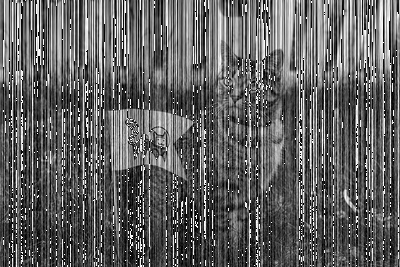

# Cute Cat!

## Part 1: Image Processing Basics

Computers use tiny dots called _pixels_ to display images. Each pixel is stored as an array of numbers that represent color intensities.

__Example.__ In an 8-bit grayscale image, each pixel is a single number. The number represents light intensity ranging from black (0) to white (255).

__Example.__ In a 24-bit RGB color image, each pixel is an array of 3 numbers. These numbers range from 0 to 255 and represent red, green, and blue intensity, respectively. For instance, `(0, 0, 255)` is <span style="color:#00F">bright blue</span> and `(255, 128, 0)` is <span style="color:#FF8000">orange</span>.

In this assignment, you'll use Python and NumPy to manipulate 24-bit RGB color images.

You can use `Image.open()` from the Python imaging library (PIL) to open an image:


```python
from PIL import Image

# Cat image from https://unsplash.com/photos/FqkBXo2Nkq0
cat_img = Image.open("cat.png")
```

Images display inline in Jupyter notebooks:


```python
cat_img
```


In a Python terminal, you can display the image in a new window with `.show()` instead.

NumPy can convert images to arrays:


```python
import numpy as np
import scipy

cat = np.array(cat_img)
```

To convert an array back to an image (for display) use the function below:


```python
def as_image(x):
    """Convert an ndarray to an Image.
    
    Args:
        x (ndarray): The array of pixels.
        
    Returns:
        Image: The Image object.
    """
    return Image.fromarray(np.uint8(x))
```

How many dimensions does the `cat` array have? What does each dimension represent?


```python
dim = cat.ndim
print dim
print cat.shape
#print cat
pix = 267 * 400 #number of pixels
n = pix * 3 # amount of numbers
```

    3
    (267, 400, 3)


 The `cat` array has __3__ dimensions and each dimension represents a color component of the array. The first dimension is the __red__ component, second dimension represents the __green__, and the third dimension represents the __blue__.

Use `.copy()` to copy the cat array to a new variable. Swap the green and blue color channels in the copy. Display the result.


```python
new_cat = cat.copy()
red = new_cat[:,:,0]  # just for reference
green = new_cat[:,:,1]
blue = new_cat[:,:,2]

new_cat[:,:,1] = cat[:,:,2]
new_cat[:,:,2] = cat[:,:,1]

as_image(new_cat) # call as_image function 


```


What happens if you don't use `.copy()`?

I think __.copy()__ is necessary here for 1.2 because it allows us to manipulate the photo without tampering with the  original components of the original photo. If I did not use __.copy()__ then the real photo would have been manipulated and it would be inconvenient to access the original photo. Another reason for this is because in python numpy module, initializing an entire component of a certain array would change that component entirely within the array entirely, and in this case I don't want that since I want to swap green and blue. If I had done so without copy: say I changed blue to green first, then I couldn't change green to blue because blue is already green!

Flip the blue color channel from left to right. Display the resulting image. _Hint: see the NumPy documentation on array manipulation routines._


```python
## swapping blue channels
# 1.4
new_cat2 = cat.copy()
flipcat = np.fliplr(new_cat2)
new_cat2[:,:,2] = flipcat[:,:,2]

as_image(new_cat2)
```


## Part 2: Singular Value Decomposition

Suppose $X$ is an $n \times p$ matrix (for instance, one color channel of the cat image). The _singular value decomposition_ (SVD) factors $X$ as $X = UD V^T$, where:

* $U$ is an $n \times n$ orthogonal matrix
* $D$ is an $n \times p$ matrix with zeroes everywhere except the diagonal
* $V$ is an $p \times p$ orthogonal matrix

Note that a matrix $A$ is _orthogonal_ when $A^T A = I$ and $AA^T = I$.

__Example.__ We can use NumPy to compute the SVD for a matrix: #your example forever confused me


If we let

* $u_i$ denote the $i$th column of $U$
* $d_i$ denote the $i$th diagonal element of $D$
* $v_i$ denote the $i$th column of $V$

then we can write the SVD as $\ X = UDV^T = d_1 u_1 v_1^T + \ldots + d_m u_m v_m^T\ $ using the rules of matrix multiplication. In other words, the SVD decomposes $X$ into a sum!

If we eliminate some of the terms in the sum, we get a simple approximation for $X$. For instance, we could eliminate all but first 3 terms to get the approximation $X \approx d_1 u_1 v_1^T + d_2 u_2 v_2^T + d_3 u_3 v_3^T$. This is the same as if we:


* Zero all but the first 3 diagonal elements of $D$ to get $D_3$, then compute $X \approx UD_3V^T$
* Eliminate all but the first 3 columns of $V$ to get $p \times 3$ matrix $V_3$, then compute $X \approx UDV_3^T$

We always eliminate terms starting from the end rather than the beginning, because these terms contribute the least to $X$.

Why would we want to approximate a matrix $X$?

In statistics, _principal components analysis_ uses this approximation to reduce the dimension (number of covariates) in a  centered (mean 0) data set. The vectors $d_i u_i$ are called the _principal components_ of $X$. The vectors $v_i^T$ are called the _basis vectors_. Note that both depend on $X$. The dimension is reduced by using the first $q$ principal components instead of the original $p$ covariates. In other words, the $n \times p$ data $X$ is replaced by the $n \times q$ data $UD_q = XV_q$

In computing, this approximation is sometimes used to __reduce the number of bits__ needed to store a matrix (or image). If $q$ terms are kept, then only $nq + pq$ values (for $XV_q$ and $V_q^T$) need to be stored instead of the uncompressed $np$ values. (manual compressing)

__Exercise 2.1.__ Write the functions described below.

* A function that takes a matrix $X$ and returns its principal component matrix $XV_q$ and basis matrix $V_q^T$. This function should also take the number of terms kept $q$ as an argument.

* A function that takes a principal component matrix $XV_q$ and basis matrix $V_q^T$ and returns an approximation $\hat{X}$ for the original matrix.

As usual, make sure to document your functions. Test your function on the red color channel of the cat image. What's the smallest number of terms where the cat is still recognizable as a cat?


```python
## u,d,vt = np.linalg.svd(cat)
def swagmatrix(X,q): #takes in two parameters a matrix X and q number of kept terms for the v and v transpose
    #n,m = X.shape
    u, d, v = np.linalg.svd(X)  #here returned the values from the linalg.svd in numpy
    vt = v.T  #manipulated the v and vt matrices such that i only have q terms
    v = v[:,0:q]
    vt = vt[0:q,:]
    p_comp = X.dot(v) #multiplication
    basis = vt 
    return p_comp, basis #returns principal component and the basis for X 

def approxmatrix(PC, basis): #approximates X given a principal component and  a basis
    return PC.dot(basis)
    
copycat = cat.copy()

ayeeeee = swagmatrix(copycat[:,:,0],300)

copycopy = approxmatrix(*ayeeeee) # * operator is the 'splat' operator, can put tuple of parameters into specific function 

as_image(copycopy)
```





I find that when `q` is __300__ I can still see a recognizable cat. 

__Exercise 2.2.__ You can check the number of bytes used by a NumPy array with the `.nbytes` attribute. How many bytes does the red color channel of the cat image use? How many bytes does the compressed version use when 10 terms are kept? What percentage of the original size is this?


```python
p_comp,basis = swagmatrix(copycat[:,:,0],10)

bytecomponents = p_comp.nbytes + basis.nbytes
perc = float(bytecomponents) / float(cat[:,:,0].nbytes)

print "Original: %d bytes, Comprssed: %d bytes. Compressed is %f of the Original " % (cat[:,:,0].nbytes, bytecomponents, perc)

```

    Original: 106800 bytes, Comprssed: 53360 bytes. Compressed is 0.499625 of the Original 


With the original photo we have about 106800 bytes and with the compressed photo we have 53360. The compressed image has about 49.96% as many bytes as the original image has.
