# Nutrition Analysis
The CSV file `fresh.csv` contains the fresh fruits and vegetables data I extracted earlier.

The USDA Food Composition Databases have a [documented](https://ndb.nal.usda.gov/ndb/doc/index) web API that returns data in JSON format . You need a key in order to use the API. Only 1000 requests are allowed per hour, so it would be a good idea to use [caching][requests_cache].

[Sign up for an API key here](https://api.data.gov/signup/). The key will work with any Data.gov API. You may need the key again later in the quarter, so make sure you save it.

These modules may be useful:

* [requests](http://docs.python-requests.org/en/master/user/quickstart/)
* [requests_cache][]
* [urlparse](https://docs.python.org/2/library/urlparse.html)
* [pandas](http://pandas.pydata.org/pandas-docs/stable/)

[requests_cache]: https://pypi.python.org/pypi/requests-cache

Read the [search request documentation](https://ndb.nal.usda.gov/ndb/doc/apilist/API-SEARCH.md), then write a function called `ndb_search()` that makes a search request. The function should accept the search term as an argument. The function should return the search result items as a list (for 0 items, return an empty list).

Note that the search url is: `https://api.nal.usda.gov/ndb/search`

As an example, a search for `"quail eggs"` should return this list:

```python
[{u'ds': u'BL',
  u'group': u'Branded Food Products Database',
  u'name': u'CHAOKOH, QUAIL EGG IN BRINE, UPC: 044738074186',
  u'ndbno': u'45094707',
  u'offset': 0},
 {u'ds': u'BL',
  u'group': u'Branded Food Products Database',
  u'name': u'L&W, QUAIL EGGS, UPC: 024072000256',
  u'ndbno': u'45094890',
  u'offset': 1},
 {u'ds': u'BL',
  u'group': u'Branded Food Products Database',
  u'name': u'BUDDHA, QUAIL EGGS IN BRINE, UPC: 761934535098',
  u'ndbno': u'45099560',
  u'offset': 2},
 {u'ds': u'BL',
  u'group': u'Branded Food Products Database',
  u'name': u'GRAN SABANA, QUAIL EGGS, UPC: 819140010103',
  u'ndbno': u'45169279',
  u'offset': 3},
 {u'ds': u'BL',
  u'group': u'Branded Food Products Database',
  u'name': u"D'ARTAGNAN, QUAIL EGGS, UPC: 736622102630",
  u'ndbno': u'45178254',
  u'offset': 4},
 {u'ds': u'SR',
  u'group': u'Dairy and Egg Products',
  u'name': u'Egg, quail, whole, fresh, raw',
  u'ndbno': u'01140',
  u'offset': 5}]
```

As usual, make sure you document and test your function.


```python
import requests as req
import requests_cache
import urlparse
import pandas as pd
import sys

requests_cache.install_cache('demo_cache') #caching my data
my_key = "eVT9HFLvxVgafOVvMu0zRycQnD6PaSWyQy6BoVsD" #my key used for this api
search_url = "https://api.nal.usda.gov/ndb/search"  #link


def ndb_search(search_term, yourkey): #function takes 2 args, a key and a search term
    search_url = "https://api.nal.usda.gov/ndb/search"  #link
    payload = {"q" : search_term, "api_key" : yourkey, "format" : "JSON"} #json added to automaticlly speficy i want json
    response = req.get(search_url, payload) 
    try:
        swae = response.json()["list"]["item"]# index accordingly from full json output to receive needed info like above^
    except KeyError:
        return []
    return swae
```


```python
ndb_search("quail eggs", my_key) #!!!!!
```


    [{u'ds': u'BL',
      u'group': u'Branded Food Products Database',
      u'name': u'CHAOKOH, QUAIL EGG IN BRINE, UPC: 044738074186',
      u'ndbno': u'45094707',
      u'offset': 0},
     {u'ds': u'BL',
      u'group': u'Branded Food Products Database',
      u'name': u'L&W, QUAIL EGGS, UPC: 024072000256',
      u'ndbno': u'45094890',
      u'offset': 1},
     {u'ds': u'BL',
      u'group': u'Branded Food Products Database',
      u'name': u'BUDDHA, QUAIL EGGS IN BRINE, UPC: 761934535098',
      u'ndbno': u'45099560',
      u'offset': 2},
     {u'ds': u'BL',
      u'group': u'Branded Food Products Database',
      u'name': u'GRAN SABANA, QUAIL EGGS, UPC: 819140010103',
      u'ndbno': u'45169279',
      u'offset': 3},
     {u'ds': u'BL',
      u'group': u'Branded Food Products Database',
      u'name': u"D'ARTAGNAN, QUAIL EGGS, UPC: 736622102630",
      u'ndbno': u'45178254',
      u'offset': 4},
     {u'ds': u'SR',
      u'group': u'Dairy and Egg Products',
      u'name': u'Egg, quail, whole, fresh, raw',
      u'ndbno': u'01140',
      u'offset': 5}]


__Use the search function to get NDB numbers for the foods in the `fresh.csv` file. It's okay if you don't get an NDB number for every food, but try to come up with a strategy that gets most of them. Discuss your strategy in a short paragraph.__

Hints:

* The foods are all raw and unbranded.
* You can test search terms with the [online search page](https://ndb.nal.usda.gov/ndb/search/list).
* You can convert the output of `ndb_search()` to a data frame with `pd.DataFrame()`.
* The string methods for [Python](https://docs.python.org/2/library/stdtypes.html#string-methods) and [Pandas](http://pandas.pydata.org/pandas-docs/stable/text.html#method-summary) are useful here. It's okay if you use _simple_ regular expressions in the Pandas methods, although this exercise can be solved without them.
* You can merge data frames that have a column in common with `pd.merge()`.


```python
def ndb_search2(search_term, yourkey, ds): 
    searchterm = " ".join(search_term.split('_')) + ", raw" #i am able to split by "_" and join with " " and add ", raw" for best search results
    search_url = "https://api.nal.usda.gov/ndb/search"  #link
    payload = {"q" : searchterm, "api_key" : yourkey, "format" : "JSON", "ds" : ds, "sort" : "r",} # parameters for accessing url json added to automaticlly speficy i want json
    response = req.get(search_url, payload) 
    try: #try except will check to see if there is anything in the response
        swae = response.json()["list"]["item"]# index accordingly from full json output to receive needed info like above^
    except KeyError: 
        return [] #if keyerrorr, it returns an empty list instead
    return swae #returns the "item" output in json form

def ndb_searchno(search_term, yourkey, ds): #takes a search term, key and data source
    # g = "green_pepper"
    #" ".join(g.split('_')) + ", raw"
    jsonstuff = ndb_search2(search_term, yourkey, ds) #calls the search function above
    namelist = [] 
    ndbnolist = []
    if len(jsonstuff) > 0: # to check if the length of the jsonstuff is 0, returns empty pd data frame if it is
        for item in jsonstuff: #iterates through each json dict in jsonstuff
            name = str(item["name"]) 
            ndbno = str(item["ndbno"])
            csv_name = search_term
            namelist.append(name) #after converting to str i append the name and number
            ndbnolist.append(ndbno)
        swaeswae = {"foods" : namelist, "ndb numbers" : ndbnolist, "csv name" : search_term} #i create a dictionary with these values, add column search term
        swaeswae = pd.DataFrame(swaeswae)  #turns into a data frame with "foods" "ndb numbers" and "csv name" as columns
        pd_raw2 = swaeswae[swaeswae["foods"].str.contains("raw") == True] # checks to see if raw is there with contains
        pd_raw = pd_raw2[pd_raw2["foods"].str.contains("Juice|Swamp|surinam") == False]  #removes unecessary terms
        return pd_raw[0:1] #to avoid multiple matches for pd_raw i only return the first item in pd_raw, which turns out to be good
    else:
        return pd.DataFrame()
```

###### The Strats ######

I first created another function named __ndb_search2__ which took in an extra parameter, data source, to create a better filter of results from usda website. Since I noticed the foods with "\_" had a hard time with filtering I decided to first split the search food by the "\_" and joining them by a whitespace.  I then concatenated 
_', raw'_ to the search term, since the search results should always have _', raw'_ in it. __ndb_search2__ then returns the list of all the _JSON_ elements within the item response element of the data, if there are no elements then it will return an empty list.  I then created another function called __ndb_searchno__ which takes 3 parameters, a search term, a key and a data source (in this case I would use "Standard Reference" as my data source for better filter results, since I want unbraded foods).  This function calls __ndb_search2__ to make search, I run a loop of the JSON elements for that food and acquire its name, ndb number and its name on the csv (this is so that I could merge the columns of the csv to this result). I then append the name and number to an empty list and create a pandas data frame with columns named _ndb numbers_, _foods_, and _csv name_.  Because I had an issue of having too many results for one food, I decided to only have my function return the first food as the relevant results.  It would return an empty data frame if there are no elements in the call to __ndb_search2__.


```python
fresh = pd.read_csv("fresh.csv") #read csv with pd
freshfoods = fresh["food"] #received the foods columns

x = [ndb_searchno(foods, my_key, "Standard Reference") for foods in freshfoods] #list comp to efficiently call all foods in freshfoods 
hasnums = pd.concat(x).drop_duplicates() #drops dupes, because fruits some have awkward dupes
hasnums #result is searches for 46 of the fruits. very hard, very very very very hard.
```


<div>
<table border="1" class="dataframe">
  <thead>
    <tr style="text-align: right;">
      <th></th>
      <th>csv name</th>
      <th>foods</th>
      <th>ndb numbers</th>
    </tr>
  </thead>
  <tbody>
    <tr>
      <th>0</th>
      <td>watermelon</td>
      <td>Watermelon, raw</td>
      <td>09326</td>
    </tr>
    <tr>
      <th>0</th>
      <td>cantaloupe</td>
      <td>Melons, cantaloupe, raw</td>
      <td>09181</td>
    </tr>
    <tr>
      <th>0</th>
      <td>tangerines</td>
      <td>Tangerine juice, raw</td>
      <td>09221</td>
    </tr>
    <tr>
      <th>0</th>
      <td>strawberries</td>
      <td>Strawberries, raw</td>
      <td>09316</td>
    </tr>
    <tr>
      <th>0</th>
      <td>plums</td>
      <td>Plums, raw</td>
      <td>09279</td>
    </tr>
    <tr>
      <th>0</th>
      <td>oranges</td>
      <td>Oranges, raw, California, valencias</td>
      <td>09201</td>
    </tr>
    <tr>
      <th>0</th>
      <td>raspberries</td>
      <td>Raspberries, raw</td>
      <td>09302</td>
    </tr>
    <tr>
      <th>0</th>
      <td>pomegranate</td>
      <td>Pomegranates, raw</td>
      <td>09286</td>
    </tr>
    <tr>
      <th>0</th>
      <td>pineapple</td>
      <td>Pineapple, raw, all varieties</td>
      <td>09266</td>
    </tr>
    <tr>
      <th>0</th>
      <td>apricots</td>
      <td>Apricots, raw</td>
      <td>09021</td>
    </tr>
    <tr>
      <th>0</th>
      <td>honeydew</td>
      <td>Melons, honeydew, raw</td>
      <td>09184</td>
    </tr>
    <tr>
      <th>0</th>
      <td>papaya</td>
      <td>Papayas, raw</td>
      <td>09226</td>
    </tr>
    <tr>
      <th>1</th>
      <td>cherries</td>
      <td>Acerola, (west indian cherry), raw</td>
      <td>09001</td>
    </tr>
    <tr>
      <th>0</th>
      <td>bananas</td>
      <td>Bananas, raw</td>
      <td>09040</td>
    </tr>
    <tr>
      <th>0</th>
      <td>apples</td>
      <td>Apples, raw, with skin</td>
      <td>09003</td>
    </tr>
    <tr>
      <th>0</th>
      <td>peaches</td>
      <td>Peaches, yellow, raw</td>
      <td>09236</td>
    </tr>
    <tr>
      <th>0</th>
      <td>nectarines</td>
      <td>Nectarines, raw</td>
      <td>09191</td>
    </tr>
    <tr>
      <th>0</th>
      <td>pears</td>
      <td>Pears, raw</td>
      <td>09252</td>
    </tr>
    <tr>
      <th>0</th>
      <td>grapefruit</td>
      <td>Grapefruit, raw, white, California</td>
      <td>09117</td>
    </tr>
    <tr>
      <th>0</th>
      <td>blackberries</td>
      <td>Blackberries, raw</td>
      <td>09042</td>
    </tr>
    <tr>
      <th>0</th>
      <td>grapes</td>
      <td>Grapes, muscadine, raw</td>
      <td>09129</td>
    </tr>
    <tr>
      <th>0</th>
      <td>blueberries</td>
      <td>Blueberries, raw</td>
      <td>09050</td>
    </tr>
    <tr>
      <th>0</th>
      <td>mangoes</td>
      <td>Mangos, raw</td>
      <td>09176</td>
    </tr>
    <tr>
      <th>0</th>
      <td>asparagus</td>
      <td>Asparagus, raw</td>
      <td>11011</td>
    </tr>
    <tr>
      <th>0</th>
      <td>cucumbers</td>
      <td>Cucumber, peeled, raw</td>
      <td>11206</td>
    </tr>
    <tr>
      <th>0</th>
      <td>lettuce_iceberg</td>
      <td>Lettuce, iceberg (includes crisphead types), raw</td>
      <td>11252</td>
    </tr>
    <tr>
      <th>0</th>
      <td>onions</td>
      <td>Onions, raw</td>
      <td>11282</td>
    </tr>
    <tr>
      <th>0</th>
      <td>turnip_greens</td>
      <td>Turnip greens, raw</td>
      <td>11568</td>
    </tr>
    <tr>
      <th>0</th>
      <td>mustard_greens</td>
      <td>Mustard greens, raw</td>
      <td>11270</td>
    </tr>
    <tr>
      <th>0</th>
      <td>potatoes</td>
      <td>Potatoes, raw, skin</td>
      <td>11362</td>
    </tr>
    <tr>
      <th>0</th>
      <td>collard_greens</td>
      <td>Collards, raw</td>
      <td>11161</td>
    </tr>
    <tr>
      <th>0</th>
      <td>green_beans</td>
      <td>Beans, snap, green, raw</td>
      <td>11052</td>
    </tr>
    <tr>
      <th>0</th>
      <td>acorn_squash</td>
      <td>Squash, winter, acorn, raw</td>
      <td>11482</td>
    </tr>
    <tr>
      <th>0</th>
      <td>red_peppers</td>
      <td>Peppers, sweet, red, raw</td>
      <td>11821</td>
    </tr>
    <tr>
      <th>0</th>
      <td>red_cabbage</td>
      <td>Cabbage, red, raw</td>
      <td>11112</td>
    </tr>
    <tr>
      <th>1</th>
      <td>green_cabbage</td>
      <td>Cabbage, raw</td>
      <td>11109</td>
    </tr>
    <tr>
      <th>0</th>
      <td>sweet potatoes</td>
      <td>Sweet potato, raw, unprepared</td>
      <td>11507</td>
    </tr>
    <tr>
      <th>0</th>
      <td>summer_squash</td>
      <td>Squash, summer, scallop, raw</td>
      <td>11475</td>
    </tr>
    <tr>
      <th>0</th>
      <td>radish</td>
      <td>Radishes, raw</td>
      <td>11429</td>
    </tr>
    <tr>
      <th>0</th>
      <td>butternut_squash</td>
      <td>Squash, winter, butternut, raw</td>
      <td>11485</td>
    </tr>
    <tr>
      <th>0</th>
      <td>avocados</td>
      <td>Avocados, raw, California</td>
      <td>09038</td>
    </tr>
    <tr>
      <th>0</th>
      <td>kale</td>
      <td>Kale, raw</td>
      <td>11233</td>
    </tr>
    <tr>
      <th>0</th>
      <td>artichoke</td>
      <td>Jerusalem-artichokes, raw</td>
      <td>11226</td>
    </tr>
    <tr>
      <th>0</th>
      <td>okra</td>
      <td>Okra, raw</td>
      <td>11278</td>
    </tr>
    <tr>
      <th>0</th>
      <td>green_peppers</td>
      <td>Peppers, sweet, green, raw</td>
      <td>11333</td>
    </tr>
    <tr>
      <th>0</th>
      <td>brussels_sprouts</td>
      <td>Brussels sprouts, raw</td>
      <td>11098</td>
    </tr>
    <tr>
      <th>0</th>
      <td>corn_sweet</td>
      <td>Corn, sweet, white, raw</td>
      <td>11900</td>
    </tr>
  </tbody>
</table>
</div>


Read the [food reports V2 documentation](https://ndb.nal.usda.gov/ndb/doc/apilist/API-FOOD-REPORTV2.md), then write a function called `ndb_report()` that requests a _basic_ food report. The function should accept the NDB number as an argument and return the list of nutrients for the food.

Note that the report url is: `https://api.nal.usda.gov/ndb/V2/reports`

For example, for `"09279"` (raw plums) the first element of the returned list should be:

```python
{u'group': u'Proximates',
 u'measures': [{u'eqv': 165.0,
   u'eunit': u'g',
   u'label': u'cup, sliced',
   u'qty': 1.0,
   u'value': u'143.93'},
  {u'eqv': 66.0,
   u'eunit': u'g',
   u'label': u'fruit (2-1/8" dia)',
   u'qty': 1.0,
   u'value': u'57.57'},
  {u'eqv': 151.0,
   u'eunit': u'g',
   u'label': u'NLEA serving',
   u'qty': 1.0,
   u'value': u'131.72'}],
 u'name': u'Water',
 u'nutrient_id': u'255',
 u'unit': u'g',
 u'value': u'87.23'}
```

Be sure to document and test your function.


```python
def ndb_report(ndbno, yourkey):
    report_url = "https://api.nal.usda.gov/ndb/V2/reports"
    payload = {"api_key" : yourkey, "format" : "JSON", 'ndbno' : ndbno, "type" : "b"}
    response = req.get(report_url, params = payload)
#     return response.json()["foods"][0]['food']['nutrients']
    try:
        nutrients = response.json()["foods"][0]['food']['nutrients']
    except KeyError:
        return []
#     nutrients = [x["ndb number"] = ndbno for x in nutrients]
    for nutrient in nutrients:
        nutrient[u"ndb numbers"] = ndbno
    return nutrients
```


```python
ndb_report("11", my_key)
```


    []


Which foods provide the best combination of price, yield, and nutrition? You can use kilocalories as a measure of "nutrition" here, but more a detailed analysis is better. Use plots to support your analysis.


```python
import math

def scores_calculator(df): #reads in a fully constructed dataframe 
    scores = []
    for i in xrange(len(df)):
        scores.append(math.log1p(float(df["value"][i])) - math.exp(-float(df["price_per_cup"][i])) + math.exp(float(df["yield"][i])))
    df["scores"] = scores
    return df
```

# Analysis on Energy of Food


```python
### gonna start my analysis with kcal, i construct the full data frame, plz dont give me hard coding points off :[
 
freshdf = pd.DataFrame(fresh) #the csv as a dataframe
coolnums = hasnums["ndb numbers"] #slice for only ndb numbers from ndbreport function

kcaldat_frame = pd.DataFrame([ndb_report(cool, my_key)[1] for cool in coolnums])
kcaldf = kcaldat_frame.merge(hasnums, on = "ndb numbers")
freshdf_kcal = freshdf.merge(kcaldf, left_on = "food", right_on = "csv name")
newcols = ['ndb numbers', 'food', 'type', 'value', 'unit','name', 'price_per_lb', 'lb_per_cup', 'price_per_cup', 'yield']

freshdf_kcal = freshdf_kcal[newcols] #rearranging the columns of the df, omit unescary variables
```


```python
energydf = scores_calculator(freshdf_kcal)
energydf = energydf.convert_objects(convert_numeric=True) #turning df into float64s so sns plot can implement
energydf
```

    /Users/menbok/anaconda2/lib/python2.7/site-packages/ipykernel/__main__.py:2: FutureWarning: convert_objects is deprecated.  Use the data-type specific converters pd.to_datetime, pd.to_timedelta and pd.to_numeric.
      from ipykernel import kernelapp as app


<div>
<table border="1" class="dataframe">
  <thead>
    <tr style="text-align: right;">
      <th></th>
      <th>ndb numbers</th>
      <th>food</th>
      <th>type</th>
      <th>value</th>
      <th>unit</th>
      <th>name</th>
      <th>price_per_lb</th>
      <th>lb_per_cup</th>
      <th>price_per_cup</th>
      <th>yield</th>
      <th>scores</th>
    </tr>
  </thead>
  <tbody>
    <tr>
      <th>0</th>
      <td>9326</td>
      <td>watermelon</td>
      <td>fruit</td>
      <td>30</td>
      <td>kcal</td>
      <td>Energy</td>
      <td>0.333412</td>
      <td>0.330693</td>
      <td>0.212033</td>
      <td>0.520000</td>
      <td>4.307077</td>
    </tr>
    <tr>
      <th>1</th>
      <td>9181</td>
      <td>cantaloupe</td>
      <td>fruit</td>
      <td>34</td>
      <td>kcal</td>
      <td>Energy</td>
      <td>0.535874</td>
      <td>0.374786</td>
      <td>0.393800</td>
      <td>0.510000</td>
      <td>4.546150</td>
    </tr>
    <tr>
      <th>2</th>
      <td>9221</td>
      <td>tangerines</td>
      <td>fruit</td>
      <td>43</td>
      <td>kcal</td>
      <td>Energy</td>
      <td>1.377962</td>
      <td>0.407855</td>
      <td>0.759471</td>
      <td>0.740000</td>
      <td>5.412211</td>
    </tr>
    <tr>
      <th>3</th>
      <td>9316</td>
      <td>strawberries</td>
      <td>fruit</td>
      <td>32</td>
      <td>kcal</td>
      <td>Energy</td>
      <td>2.358808</td>
      <td>0.319670</td>
      <td>0.802171</td>
      <td>0.940000</td>
      <td>5.608135</td>
    </tr>
    <tr>
      <th>4</th>
      <td>9279</td>
      <td>plums</td>
      <td>fruit</td>
      <td>46</td>
      <td>kcal</td>
      <td>Energy</td>
      <td>1.827416</td>
      <td>0.363763</td>
      <td>0.707176</td>
      <td>0.940000</td>
      <td>5.917095</td>
    </tr>
    <tr>
      <th>5</th>
      <td>9201</td>
      <td>oranges</td>
      <td>fruit</td>
      <td>49</td>
      <td>kcal</td>
      <td>Energy</td>
      <td>1.035173</td>
      <td>0.407855</td>
      <td>0.578357</td>
      <td>0.730000</td>
      <td>5.426285</td>
    </tr>
    <tr>
      <th>6</th>
      <td>9302</td>
      <td>raspberries</td>
      <td>fruit</td>
      <td>52</td>
      <td>kcal</td>
      <td>Energy</td>
      <td>6.975811</td>
      <td>0.319670</td>
      <td>2.322874</td>
      <td>0.960000</td>
      <td>6.483997</td>
    </tr>
    <tr>
      <th>7</th>
      <td>9286</td>
      <td>pomegranate</td>
      <td>fruit</td>
      <td>83</td>
      <td>kcal</td>
      <td>Energy</td>
      <td>2.173590</td>
      <td>0.341717</td>
      <td>1.326342</td>
      <td>0.560000</td>
      <td>5.916043</td>
    </tr>
    <tr>
      <th>8</th>
      <td>9266</td>
      <td>pineapple</td>
      <td>fruit</td>
      <td>50</td>
      <td>kcal</td>
      <td>Energy</td>
      <td>0.627662</td>
      <td>0.363763</td>
      <td>0.447686</td>
      <td>0.510000</td>
      <td>4.958012</td>
    </tr>
    <tr>
      <th>9</th>
      <td>9021</td>
      <td>apricots</td>
      <td>fruit</td>
      <td>48</td>
      <td>kcal</td>
      <td>Energy</td>
      <td>3.040072</td>
      <td>0.363763</td>
      <td>1.189102</td>
      <td>0.930000</td>
      <td>6.121835</td>
    </tr>
    <tr>
      <th>10</th>
      <td>9184</td>
      <td>honeydew</td>
      <td>fruit</td>
      <td>36</td>
      <td>kcal</td>
      <td>Energy</td>
      <td>0.796656</td>
      <td>0.374786</td>
      <td>0.649077</td>
      <td>0.460000</td>
      <td>4.672464</td>
    </tr>
    <tr>
      <th>11</th>
      <td>9226</td>
      <td>papaya</td>
      <td>fruit</td>
      <td>43</td>
      <td>kcal</td>
      <td>Energy</td>
      <td>1.298012</td>
      <td>0.308647</td>
      <td>0.646174</td>
      <td>0.620000</td>
      <td>5.119070</td>
    </tr>
    <tr>
      <th>12</th>
      <td>9001</td>
      <td>cherries</td>
      <td>fruit</td>
      <td>32</td>
      <td>kcal</td>
      <td>Energy</td>
      <td>3.592990</td>
      <td>0.341717</td>
      <td>1.334548</td>
      <td>0.920000</td>
      <td>5.742521</td>
    </tr>
    <tr>
      <th>13</th>
      <td>9040</td>
      <td>bananas</td>
      <td>fruit</td>
      <td>89</td>
      <td>kcal</td>
      <td>Energy</td>
      <td>0.566983</td>
      <td>0.330693</td>
      <td>0.292965</td>
      <td>0.640000</td>
      <td>5.650242</td>
    </tr>
    <tr>
      <th>14</th>
      <td>9003</td>
      <td>apples</td>
      <td>fruit</td>
      <td>52</td>
      <td>kcal</td>
      <td>Energy</td>
      <td>1.567515</td>
      <td>0.242508</td>
      <td>0.422373</td>
      <td>0.900000</td>
      <td>5.774406</td>
    </tr>
    <tr>
      <th>15</th>
      <td>9236</td>
      <td>peaches</td>
      <td>fruit</td>
      <td>39</td>
      <td>kcal</td>
      <td>Energy</td>
      <td>1.591187</td>
      <td>0.341717</td>
      <td>0.566390</td>
      <td>0.960000</td>
      <td>5.733005</td>
    </tr>
    <tr>
      <th>16</th>
      <td>9191</td>
      <td>nectarines</td>
      <td>fruit</td>
      <td>44</td>
      <td>kcal</td>
      <td>Energy</td>
      <td>1.761148</td>
      <td>0.319670</td>
      <td>0.618667</td>
      <td>0.910000</td>
      <td>5.752323</td>
    </tr>
    <tr>
      <th>17</th>
      <td>9252</td>
      <td>pears</td>
      <td>fruit</td>
      <td>57</td>
      <td>kcal</td>
      <td>Energy</td>
      <td>1.461575</td>
      <td>0.363763</td>
      <td>0.590740</td>
      <td>0.900000</td>
      <td>5.966129</td>
    </tr>
    <tr>
      <th>18</th>
      <td>9117</td>
      <td>grapefruit</td>
      <td>fruit</td>
      <td>37</td>
      <td>kcal</td>
      <td>Energy</td>
      <td>0.897802</td>
      <td>0.462971</td>
      <td>0.848278</td>
      <td>0.490000</td>
      <td>4.841751</td>
    </tr>
    <tr>
      <th>19</th>
      <td>9042</td>
      <td>blackberries</td>
      <td>fruit</td>
      <td>43</td>
      <td>kcal</td>
      <td>Energy</td>
      <td>5.774708</td>
      <td>0.319670</td>
      <td>1.922919</td>
      <td>0.960000</td>
      <td>6.249707</td>
    </tr>
    <tr>
      <th>20</th>
      <td>9129</td>
      <td>grapes</td>
      <td>fruit</td>
      <td>57</td>
      <td>kcal</td>
      <td>Energy</td>
      <td>2.093827</td>
      <td>0.330693</td>
      <td>0.721266</td>
      <td>0.960000</td>
      <td>6.186003</td>
    </tr>
    <tr>
      <th>21</th>
      <td>9050</td>
      <td>blueberries</td>
      <td>fruit</td>
      <td>57</td>
      <td>kcal</td>
      <td>Energy</td>
      <td>4.734622</td>
      <td>0.319670</td>
      <td>1.593177</td>
      <td>0.950000</td>
      <td>6.442874</td>
    </tr>
    <tr>
      <th>22</th>
      <td>9176</td>
      <td>mangoes</td>
      <td>fruit</td>
      <td>60</td>
      <td>kcal</td>
      <td>Energy</td>
      <td>1.377563</td>
      <td>0.363763</td>
      <td>0.705783</td>
      <td>0.710000</td>
      <td>5.651144</td>
    </tr>
    <tr>
      <th>23</th>
      <td>11011</td>
      <td>asparagus</td>
      <td>vegetables</td>
      <td>20</td>
      <td>kcal</td>
      <td>Energy</td>
      <td>3.213494</td>
      <td>0.396832</td>
      <td>2.582272</td>
      <td>0.493835</td>
      <td>4.607509</td>
    </tr>
    <tr>
      <th>24</th>
      <td>11206</td>
      <td>cucumbers</td>
      <td>vegetables</td>
      <td>12</td>
      <td>kcal</td>
      <td>Energy</td>
      <td>1.295931</td>
      <td>0.264555</td>
      <td>0.353448</td>
      <td>0.970000</td>
      <td>4.500631</td>
    </tr>
    <tr>
      <th>25</th>
      <td>11206</td>
      <td>cucumbers</td>
      <td>vegetables</td>
      <td>12</td>
      <td>kcal</td>
      <td>Energy</td>
      <td>1.295931</td>
      <td>0.264555</td>
      <td>0.469650</td>
      <td>0.730000</td>
      <td>4.014809</td>
    </tr>
    <tr>
      <th>26</th>
      <td>11252</td>
      <td>lettuce_iceberg</td>
      <td>vegetables</td>
      <td>14</td>
      <td>kcal</td>
      <td>Energy</td>
      <td>1.213039</td>
      <td>0.242508</td>
      <td>0.309655</td>
      <td>0.950000</td>
      <td>4.560060</td>
    </tr>
    <tr>
      <th>27</th>
      <td>11282</td>
      <td>onions</td>
      <td>vegetables</td>
      <td>40</td>
      <td>kcal</td>
      <td>Energy</td>
      <td>1.038107</td>
      <td>0.352740</td>
      <td>0.406868</td>
      <td>0.900000</td>
      <td>5.507443</td>
    </tr>
    <tr>
      <th>28</th>
      <td>11568</td>
      <td>turnip_greens</td>
      <td>vegetables</td>
      <td>32</td>
      <td>kcal</td>
      <td>Energy</td>
      <td>2.471749</td>
      <td>0.319670</td>
      <td>1.053526</td>
      <td>0.750000</td>
      <td>5.264802</td>
    </tr>
    <tr>
      <th>29</th>
      <td>11270</td>
      <td>mustard_greens</td>
      <td>vegetables</td>
      <td>27</td>
      <td>kcal</td>
      <td>Energy</td>
      <td>2.569235</td>
      <td>0.308647</td>
      <td>0.944032</td>
      <td>0.840000</td>
      <td>5.259516</td>
    </tr>
    <tr>
      <th>30</th>
      <td>11362</td>
      <td>potatoes</td>
      <td>vegetables</td>
      <td>58</td>
      <td>kcal</td>
      <td>Energy</td>
      <td>0.564320</td>
      <td>0.264555</td>
      <td>0.184017</td>
      <td>0.811301</td>
      <td>5.496451</td>
    </tr>
    <tr>
      <th>31</th>
      <td>11161</td>
      <td>collard_greens</td>
      <td>vegetables</td>
      <td>32</td>
      <td>kcal</td>
      <td>Energy</td>
      <td>2.630838</td>
      <td>0.286601</td>
      <td>0.650001</td>
      <td>1.160000</td>
      <td>6.164395</td>
    </tr>
    <tr>
      <th>32</th>
      <td>11052</td>
      <td>green_beans</td>
      <td>vegetables</td>
      <td>31</td>
      <td>kcal</td>
      <td>Energy</td>
      <td>2.139972</td>
      <td>0.275578</td>
      <td>0.696606</td>
      <td>0.846575</td>
      <td>5.299110</td>
    </tr>
    <tr>
      <th>33</th>
      <td>11482</td>
      <td>acorn_squash</td>
      <td>vegetables</td>
      <td>40</td>
      <td>kcal</td>
      <td>Energy</td>
      <td>1.172248</td>
      <td>0.451948</td>
      <td>1.155360</td>
      <td>0.458554</td>
      <td>4.980413</td>
    </tr>
    <tr>
      <th>34</th>
      <td>11821</td>
      <td>red_peppers</td>
      <td>vegetables</td>
      <td>31</td>
      <td>kcal</td>
      <td>Energy</td>
      <td>2.277940</td>
      <td>0.264555</td>
      <td>0.734926</td>
      <td>0.820000</td>
      <td>5.256695</td>
    </tr>
    <tr>
      <th>35</th>
      <td>11112</td>
      <td>red_cabbage</td>
      <td>vegetables</td>
      <td>31</td>
      <td>kcal</td>
      <td>Energy</td>
      <td>0.579208</td>
      <td>0.330693</td>
      <td>0.245944</td>
      <td>0.778797</td>
      <td>4.862620</td>
    </tr>
    <tr>
      <th>36</th>
      <td>11109</td>
      <td>green_cabbage</td>
      <td>vegetables</td>
      <td>25</td>
      <td>kcal</td>
      <td>Energy</td>
      <td>1.056450</td>
      <td>0.330693</td>
      <td>0.448412</td>
      <td>0.779107</td>
      <td>4.798979</td>
    </tr>
    <tr>
      <th>37</th>
      <td>11507</td>
      <td>sweet potatoes</td>
      <td>vegetables</td>
      <td>86</td>
      <td>kcal</td>
      <td>Energy</td>
      <td>0.918897</td>
      <td>0.440925</td>
      <td>0.499400</td>
      <td>0.811301</td>
      <td>6.109848</td>
    </tr>
    <tr>
      <th>38</th>
      <td>11475</td>
      <td>summer_squash</td>
      <td>vegetables</td>
      <td>18</td>
      <td>kcal</td>
      <td>Energy</td>
      <td>1.639477</td>
      <td>0.396832</td>
      <td>0.845480</td>
      <td>0.769500</td>
      <td>4.673775</td>
    </tr>
    <tr>
      <th>39</th>
      <td>11429</td>
      <td>radish</td>
      <td>vegetables</td>
      <td>16</td>
      <td>kcal</td>
      <td>Energy</td>
      <td>1.311629</td>
      <td>0.275578</td>
      <td>0.401618</td>
      <td>0.900000</td>
      <td>4.623580</td>
    </tr>
    <tr>
      <th>40</th>
      <td>11485</td>
      <td>butternut_squash</td>
      <td>vegetables</td>
      <td>45</td>
      <td>kcal</td>
      <td>Energy</td>
      <td>1.244737</td>
      <td>0.451948</td>
      <td>0.787893</td>
      <td>0.714000</td>
      <td>5.415983</td>
    </tr>
    <tr>
      <th>41</th>
      <td>9038</td>
      <td>avocados</td>
      <td>vegetables</td>
      <td>167</td>
      <td>kcal</td>
      <td>Energy</td>
      <td>2.235874</td>
      <td>0.319670</td>
      <td>0.964886</td>
      <td>0.740753</td>
      <td>6.840452</td>
    </tr>
    <tr>
      <th>42</th>
      <td>11233</td>
      <td>kale</td>
      <td>vegetables</td>
      <td>49</td>
      <td>kcal</td>
      <td>Energy</td>
      <td>2.807302</td>
      <td>0.286601</td>
      <td>0.766262</td>
      <td>1.050000</td>
      <td>6.304927</td>
    </tr>
    <tr>
      <th>43</th>
      <td>11226</td>
      <td>artichoke</td>
      <td>vegetables</td>
      <td>73</td>
      <td>kcal</td>
      <td>Energy</td>
      <td>2.213050</td>
      <td>0.385809</td>
      <td>2.274967</td>
      <td>0.375309</td>
      <td>5.656705</td>
    </tr>
    <tr>
      <th>44</th>
      <td>11278</td>
      <td>okra</td>
      <td>vegetables</td>
      <td>33</td>
      <td>kcal</td>
      <td>Energy</td>
      <td>3.213552</td>
      <td>0.352740</td>
      <td>1.473146</td>
      <td>0.769474</td>
      <td>5.455787</td>
    </tr>
    <tr>
      <th>45</th>
      <td>11333</td>
      <td>green_peppers</td>
      <td>vegetables</td>
      <td>20</td>
      <td>kcal</td>
      <td>Energy</td>
      <td>1.410363</td>
      <td>0.264555</td>
      <td>0.455022</td>
      <td>0.820000</td>
      <td>4.680588</td>
    </tr>
    <tr>
      <th>46</th>
      <td>11098</td>
      <td>brussels_sprouts</td>
      <td>vegetables</td>
      <td>43</td>
      <td>kcal</td>
      <td>Energy</td>
      <td>2.763553</td>
      <td>0.341717</td>
      <td>0.890898</td>
      <td>1.060000</td>
      <td>6.260273</td>
    </tr>
    <tr>
      <th>47</th>
      <td>11900</td>
      <td>corn_sweet</td>
      <td>vegetables</td>
      <td>86</td>
      <td>kcal</td>
      <td>Energy</td>
      <td>2.690623</td>
      <td>0.363763</td>
      <td>1.812497</td>
      <td>0.540000</td>
      <td>6.018669</td>
    </tr>
  </tbody>
</table>
</div>


```python
print max(energydf["scores"])
```

    6.84045221635


For my function __scores_calculator__ I thought it would be fun to create my mathematical model of "scores". I weighted the variables for price per cup, energy value and yield differently and computed the scores, then I added the scores as a column to a fully constructed dataframe. The scores don't really have a lower or upper bound limit, just that higher the score, the better combination of the 3 values the food has. Here I use __price_per_cup__ as my measurement for price and not __price_per_lb__, this is because the nutrients are measured in fruits per cup, not per lb (price per cup will be used throughout my analyses for consistency). I find _avocado_ to have the highest score here. This is likely due to the fact that _avocado_ has high fat content.


```python
import seaborn as sns
import matplotlib
import matplotlib.pyplot as plt
from pandas.tools.plotting import scatter_matrix #my plotting tools hehe some may or may not be used
```


```python
sns.FacetGrid(energydf, col = "type", size = 5).map(plt.hist, "scores").add_legend()
plt.show()
```


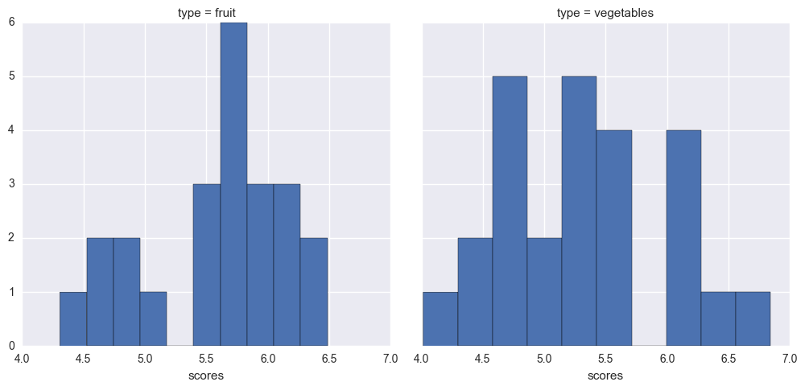


###### This shows the general distribution of scores given to each food from the model I made, given the energy nutrient.  On the higher end of the scores spectrum, vegetables have the highest scores.


```python
facets = sns.FacetGrid(energydf, hue = "type", size = 5) ## facets across the cut column with hue as paraeter
plotaye = facets.map(plt.scatter,"price_per_cup","value").add_legend() #scatters price and carat across different cuts
plotaye.set_axis_labels("$ per cup","Energy in kcal") #i use price per cup b/c nutrient measured in fruit per cup
plt.suptitle("Scatter Plot of Energy in kcal vs price per cup")
plt.show() 
```


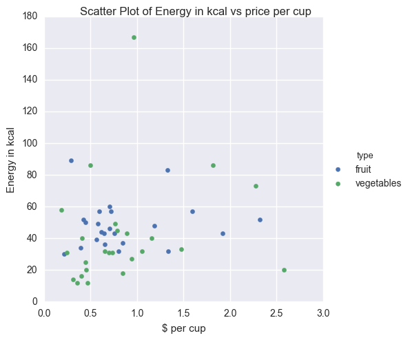


###### Here we see a general cluster on the lower end of the spectrum of price and energy with an exception, likely _avocado_. Avocado here is an outlier with a total of more than 160 kcal of energy.


```python
sns.lmplot(x = "price_per_cup", y = "value", col = "type", data = energydf).set_axis_labels("$ per cup","Energy in kcal")
plt.suptitle("Regression Energy vs $ per cup")
plt.show()
```


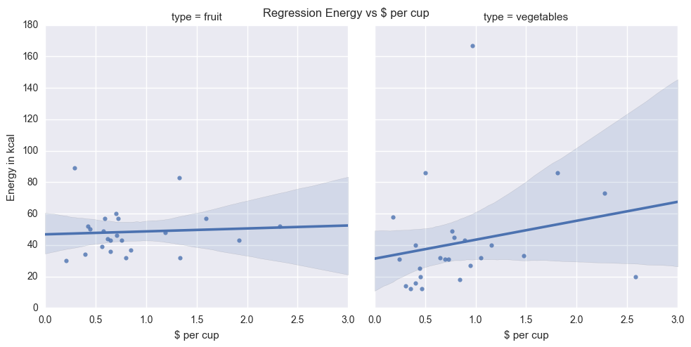


###### By analyzing these two graphs, I can determine that there is no noticeable linear trend between price and energy for fruits, however, there is a slight trend between price and energy for vegetables. Though it is slight, it is safe to say that perhaps _avocado_ plays a small factor in creating this slight trend. 


```python
sns.lmplot(x = "yield", y = "value", col = "type", data = energydf).set_axis_labels("yield","Energy in kcal")
plt.suptitle("Regression Energy vs yield")
plt.show()
```


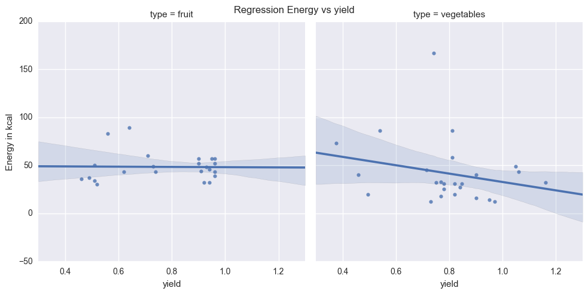


###### With the plot for fruits, there is no noticeable trend between yield and energy, however the vegetable graph gives us an obvious negative correlation between yield and energy. This could likely be due to a higher yield vegetable may have higher water retention, and thus, most of the vegetable would have more water and less energy.

# Analysis on Protein of Food
facets = sns.FacetGrid(energydf, hue = "type", size = 5) 
plotaye = facets.map(plt.scatter,"yield","value").add_legend().set_axis_labels("Yield","Energy in kcal")
plt.suptitle("Scatter Plot of Energy kcal vs Yield")
plt.show()

```python
frame2 = pd.DataFrame([ndb_report(cool, my_key)[2] for cool in coolnums])
frame2 = frame2.merge(hasnums, on = "ndb numbers")
proteindf = freshdf.merge(frame2, left_on = "food", right_on = "csv name")
proteindf
newcols = ['ndb numbers', 'food', 'type', 'value', 'unit', 'name', 'price_per_lb', 'lb_per_cup', 'price_per_cup', 'yield']
proteindf = proteindf[newcols] #rearranging the columns of the df, omit unescary variables
```


```python
proteinscoresdf = scores_calculator(proteindf)
proteinscoresdf = proteinscoresdf.convert_objects(convert_numeric = True)
proteinscoresdf
```

    /Users/menbok/anaconda2/lib/python2.7/site-packages/ipykernel/__main__.py:2: FutureWarning: convert_objects is deprecated.  Use the data-type specific converters pd.to_datetime, pd.to_timedelta and pd.to_numeric.
      from ipykernel import kernelapp as app


<div>
<table border="1" class="dataframe">
  <thead>
    <tr style="text-align: right;">
      <th></th>
      <th>ndb numbers</th>
      <th>food</th>
      <th>type</th>
      <th>value</th>
      <th>unit</th>
      <th>name</th>
      <th>price_per_lb</th>
      <th>lb_per_cup</th>
      <th>price_per_cup</th>
      <th>yield</th>
      <th>scores</th>
    </tr>
  </thead>
  <tbody>
    <tr>
      <th>0</th>
      <td>9326</td>
      <td>watermelon</td>
      <td>fruit</td>
      <td>0.61</td>
      <td>g</td>
      <td>Protein</td>
      <td>0.333412</td>
      <td>0.330693</td>
      <td>0.212033</td>
      <td>0.520000</td>
      <td>1.349324</td>
    </tr>
    <tr>
      <th>1</th>
      <td>9181</td>
      <td>cantaloupe</td>
      <td>fruit</td>
      <td>0.84</td>
      <td>g</td>
      <td>Protein</td>
      <td>0.535874</td>
      <td>0.374786</td>
      <td>0.393800</td>
      <td>0.510000</td>
      <td>1.600568</td>
    </tr>
    <tr>
      <th>2</th>
      <td>9221</td>
      <td>tangerines</td>
      <td>fruit</td>
      <td>0.50</td>
      <td>g</td>
      <td>Protein</td>
      <td>1.377962</td>
      <td>0.407855</td>
      <td>0.759471</td>
      <td>0.740000</td>
      <td>2.033487</td>
    </tr>
    <tr>
      <th>3</th>
      <td>9316</td>
      <td>strawberries</td>
      <td>fruit</td>
      <td>0.67</td>
      <td>g</td>
      <td>Protein</td>
      <td>2.358808</td>
      <td>0.319670</td>
      <td>0.802171</td>
      <td>0.940000</td>
      <td>2.624451</td>
    </tr>
    <tr>
      <th>4</th>
      <td>9279</td>
      <td>plums</td>
      <td>fruit</td>
      <td>0.70</td>
      <td>g</td>
      <td>Protein</td>
      <td>1.827416</td>
      <td>0.363763</td>
      <td>0.707176</td>
      <td>0.940000</td>
      <td>2.597575</td>
    </tr>
    <tr>
      <th>5</th>
      <td>9201</td>
      <td>oranges</td>
      <td>fruit</td>
      <td>1.04</td>
      <td>g</td>
      <td>Protein</td>
      <td>1.035173</td>
      <td>0.407855</td>
      <td>0.578357</td>
      <td>0.730000</td>
      <td>2.227211</td>
    </tr>
    <tr>
      <th>6</th>
      <td>9302</td>
      <td>raspberries</td>
      <td>fruit</td>
      <td>1.20</td>
      <td>g</td>
      <td>Protein</td>
      <td>6.975811</td>
      <td>0.319670</td>
      <td>2.322874</td>
      <td>0.960000</td>
      <td>3.302162</td>
    </tr>
    <tr>
      <th>7</th>
      <td>9286</td>
      <td>pomegranate</td>
      <td>fruit</td>
      <td>1.67</td>
      <td>g</td>
      <td>Protein</td>
      <td>2.173590</td>
      <td>0.341717</td>
      <td>1.326342</td>
      <td>0.560000</td>
      <td>2.467305</td>
    </tr>
    <tr>
      <th>8</th>
      <td>9266</td>
      <td>pineapple</td>
      <td>fruit</td>
      <td>0.54</td>
      <td>g</td>
      <td>Protein</td>
      <td>0.627662</td>
      <td>0.363763</td>
      <td>0.447686</td>
      <td>0.510000</td>
      <td>1.457968</td>
    </tr>
    <tr>
      <th>9</th>
      <td>9021</td>
      <td>apricots</td>
      <td>fruit</td>
      <td>1.40</td>
      <td>g</td>
      <td>Protein</td>
      <td>3.040072</td>
      <td>0.363763</td>
      <td>1.189102</td>
      <td>0.930000</td>
      <td>3.105483</td>
    </tr>
    <tr>
      <th>10</th>
      <td>9184</td>
      <td>honeydew</td>
      <td>fruit</td>
      <td>0.54</td>
      <td>g</td>
      <td>Protein</td>
      <td>0.796656</td>
      <td>0.374786</td>
      <td>0.649077</td>
      <td>0.460000</td>
      <td>1.493329</td>
    </tr>
    <tr>
      <th>11</th>
      <td>9226</td>
      <td>papaya</td>
      <td>fruit</td>
      <td>0.47</td>
      <td>g</td>
      <td>Protein</td>
      <td>1.298012</td>
      <td>0.308647</td>
      <td>0.646174</td>
      <td>0.620000</td>
      <td>1.720143</td>
    </tr>
    <tr>
      <th>12</th>
      <td>9001</td>
      <td>cherries</td>
      <td>fruit</td>
      <td>0.40</td>
      <td>g</td>
      <td>Protein</td>
      <td>3.592990</td>
      <td>0.341717</td>
      <td>1.334548</td>
      <td>0.920000</td>
      <td>2.582485</td>
    </tr>
    <tr>
      <th>13</th>
      <td>9040</td>
      <td>bananas</td>
      <td>fruit</td>
      <td>1.09</td>
      <td>g</td>
      <td>Protein</td>
      <td>0.566983</td>
      <td>0.330693</td>
      <td>0.292965</td>
      <td>0.640000</td>
      <td>1.887597</td>
    </tr>
    <tr>
      <th>14</th>
      <td>9003</td>
      <td>apples</td>
      <td>fruit</td>
      <td>0.26</td>
      <td>g</td>
      <td>Protein</td>
      <td>1.567515</td>
      <td>0.242508</td>
      <td>0.422373</td>
      <td>0.900000</td>
      <td>2.035225</td>
    </tr>
    <tr>
      <th>15</th>
      <td>9236</td>
      <td>peaches</td>
      <td>fruit</td>
      <td>0.91</td>
      <td>g</td>
      <td>Protein</td>
      <td>1.591187</td>
      <td>0.341717</td>
      <td>0.566390</td>
      <td>0.960000</td>
      <td>2.691229</td>
    </tr>
    <tr>
      <th>16</th>
      <td>9191</td>
      <td>nectarines</td>
      <td>fruit</td>
      <td>1.06</td>
      <td>g</td>
      <td>Protein</td>
      <td>1.761148</td>
      <td>0.319670</td>
      <td>0.618667</td>
      <td>0.910000</td>
      <td>2.668366</td>
    </tr>
    <tr>
      <th>17</th>
      <td>9252</td>
      <td>pears</td>
      <td>fruit</td>
      <td>0.36</td>
      <td>g</td>
      <td>Protein</td>
      <td>1.461575</td>
      <td>0.363763</td>
      <td>0.590740</td>
      <td>0.900000</td>
      <td>2.213171</td>
    </tr>
    <tr>
      <th>18</th>
      <td>9117</td>
      <td>grapefruit</td>
      <td>fruit</td>
      <td>0.88</td>
      <td>g</td>
      <td>Protein</td>
      <td>0.897802</td>
      <td>0.462971</td>
      <td>0.848278</td>
      <td>0.490000</td>
      <td>1.835436</td>
    </tr>
    <tr>
      <th>19</th>
      <td>9042</td>
      <td>blackberries</td>
      <td>fruit</td>
      <td>1.39</td>
      <td>g</td>
      <td>Protein</td>
      <td>5.774708</td>
      <td>0.319670</td>
      <td>1.922919</td>
      <td>0.960000</td>
      <td>3.336810</td>
    </tr>
    <tr>
      <th>20</th>
      <td>9129</td>
      <td>grapes</td>
      <td>fruit</td>
      <td>0.81</td>
      <td>g</td>
      <td>Protein</td>
      <td>2.093827</td>
      <td>0.330693</td>
      <td>0.721266</td>
      <td>0.960000</td>
      <td>2.718887</td>
    </tr>
    <tr>
      <th>21</th>
      <td>9050</td>
      <td>blueberries</td>
      <td>fruit</td>
      <td>0.74</td>
      <td>g</td>
      <td>Protein</td>
      <td>4.734622</td>
      <td>0.319670</td>
      <td>1.593177</td>
      <td>0.950000</td>
      <td>2.936316</td>
    </tr>
    <tr>
      <th>22</th>
      <td>9176</td>
      <td>mangoes</td>
      <td>fruit</td>
      <td>0.82</td>
      <td>g</td>
      <td>Protein</td>
      <td>1.377563</td>
      <td>0.363763</td>
      <td>0.705783</td>
      <td>0.710000</td>
      <td>2.139106</td>
    </tr>
    <tr>
      <th>23</th>
      <td>11011</td>
      <td>asparagus</td>
      <td>vegetables</td>
      <td>2.20</td>
      <td>g</td>
      <td>Protein</td>
      <td>3.213494</td>
      <td>0.396832</td>
      <td>2.582272</td>
      <td>0.493835</td>
      <td>2.726138</td>
    </tr>
    <tr>
      <th>24</th>
      <td>11206</td>
      <td>cucumbers</td>
      <td>vegetables</td>
      <td>0.59</td>
      <td>g</td>
      <td>Protein</td>
      <td>1.295931</td>
      <td>0.264555</td>
      <td>0.353448</td>
      <td>0.970000</td>
      <td>2.399416</td>
    </tr>
    <tr>
      <th>25</th>
      <td>11206</td>
      <td>cucumbers</td>
      <td>vegetables</td>
      <td>0.59</td>
      <td>g</td>
      <td>Protein</td>
      <td>1.295931</td>
      <td>0.264555</td>
      <td>0.469650</td>
      <td>0.730000</td>
      <td>1.913594</td>
    </tr>
    <tr>
      <th>26</th>
      <td>11252</td>
      <td>lettuce_iceberg</td>
      <td>vegetables</td>
      <td>0.90</td>
      <td>g</td>
      <td>Protein</td>
      <td>1.213039</td>
      <td>0.242508</td>
      <td>0.309655</td>
      <td>0.950000</td>
      <td>2.493864</td>
    </tr>
    <tr>
      <th>27</th>
      <td>11282</td>
      <td>onions</td>
      <td>vegetables</td>
      <td>1.10</td>
      <td>g</td>
      <td>Protein</td>
      <td>1.038107</td>
      <td>0.352740</td>
      <td>0.406868</td>
      <td>0.900000</td>
      <td>2.535809</td>
    </tr>
    <tr>
      <th>28</th>
      <td>11568</td>
      <td>turnip_greens</td>
      <td>vegetables</td>
      <td>1.50</td>
      <td>g</td>
      <td>Protein</td>
      <td>2.471749</td>
      <td>0.319670</td>
      <td>1.053526</td>
      <td>0.750000</td>
      <td>2.684585</td>
    </tr>
    <tr>
      <th>29</th>
      <td>11270</td>
      <td>mustard_greens</td>
      <td>vegetables</td>
      <td>2.86</td>
      <td>g</td>
      <td>Protein</td>
      <td>2.569235</td>
      <td>0.308647</td>
      <td>0.944032</td>
      <td>0.840000</td>
      <td>3.277978</td>
    </tr>
    <tr>
      <th>30</th>
      <td>11362</td>
      <td>potatoes</td>
      <td>vegetables</td>
      <td>2.57</td>
      <td>g</td>
      <td>Protein</td>
      <td>0.564320</td>
      <td>0.264555</td>
      <td>0.184017</td>
      <td>0.811301</td>
      <td>2.691479</td>
    </tr>
    <tr>
      <th>31</th>
      <td>11161</td>
      <td>collard_greens</td>
      <td>vegetables</td>
      <td>3.02</td>
      <td>g</td>
      <td>Protein</td>
      <td>2.630838</td>
      <td>0.286601</td>
      <td>0.650001</td>
      <td>1.160000</td>
      <td>4.059170</td>
    </tr>
    <tr>
      <th>32</th>
      <td>11052</td>
      <td>green_beans</td>
      <td>vegetables</td>
      <td>1.83</td>
      <td>g</td>
      <td>Protein</td>
      <td>2.139972</td>
      <td>0.275578</td>
      <td>0.696606</td>
      <td>0.846575</td>
      <td>2.873650</td>
    </tr>
    <tr>
      <th>33</th>
      <td>11482</td>
      <td>acorn_squash</td>
      <td>vegetables</td>
      <td>0.80</td>
      <td>g</td>
      <td>Protein</td>
      <td>1.172248</td>
      <td>0.451948</td>
      <td>1.155360</td>
      <td>0.458554</td>
      <td>1.854627</td>
    </tr>
    <tr>
      <th>34</th>
      <td>11821</td>
      <td>red_peppers</td>
      <td>vegetables</td>
      <td>0.99</td>
      <td>g</td>
      <td>Protein</td>
      <td>2.277940</td>
      <td>0.264555</td>
      <td>0.734926</td>
      <td>0.820000</td>
      <td>2.479094</td>
    </tr>
    <tr>
      <th>35</th>
      <td>11112</td>
      <td>red_cabbage</td>
      <td>vegetables</td>
      <td>1.43</td>
      <td>g</td>
      <td>Protein</td>
      <td>0.579208</td>
      <td>0.330693</td>
      <td>0.245944</td>
      <td>0.778797</td>
      <td>2.284775</td>
    </tr>
    <tr>
      <th>36</th>
      <td>11109</td>
      <td>green_cabbage</td>
      <td>vegetables</td>
      <td>1.28</td>
      <td>g</td>
      <td>Protein</td>
      <td>1.056450</td>
      <td>0.330693</td>
      <td>0.448412</td>
      <td>0.779107</td>
      <td>2.365058</td>
    </tr>
    <tr>
      <th>37</th>
      <td>11507</td>
      <td>sweet potatoes</td>
      <td>vegetables</td>
      <td>1.57</td>
      <td>g</td>
      <td>Protein</td>
      <td>0.918897</td>
      <td>0.440925</td>
      <td>0.499400</td>
      <td>0.811301</td>
      <td>2.587846</td>
    </tr>
    <tr>
      <th>38</th>
      <td>11475</td>
      <td>summer_squash</td>
      <td>vegetables</td>
      <td>1.20</td>
      <td>g</td>
      <td>Protein</td>
      <td>1.639477</td>
      <td>0.396832</td>
      <td>0.845480</td>
      <td>0.769500</td>
      <td>2.517793</td>
    </tr>
    <tr>
      <th>39</th>
      <td>11429</td>
      <td>radish</td>
      <td>vegetables</td>
      <td>0.68</td>
      <td>g</td>
      <td>Protein</td>
      <td>1.311629</td>
      <td>0.275578</td>
      <td>0.401618</td>
      <td>0.900000</td>
      <td>2.309160</td>
    </tr>
    <tr>
      <th>40</th>
      <td>11485</td>
      <td>butternut_squash</td>
      <td>vegetables</td>
      <td>1.00</td>
      <td>g</td>
      <td>Protein</td>
      <td>1.244737</td>
      <td>0.451948</td>
      <td>0.787893</td>
      <td>0.714000</td>
      <td>2.280489</td>
    </tr>
    <tr>
      <th>41</th>
      <td>9038</td>
      <td>avocados</td>
      <td>vegetables</td>
      <td>1.96</td>
      <td>g</td>
      <td>Protein</td>
      <td>2.235874</td>
      <td>0.319670</td>
      <td>0.964886</td>
      <td>0.740753</td>
      <td>2.801678</td>
    </tr>
    <tr>
      <th>42</th>
      <td>11233</td>
      <td>kale</td>
      <td>vegetables</td>
      <td>4.28</td>
      <td>g</td>
      <td>Protein</td>
      <td>2.807302</td>
      <td>0.286601</td>
      <td>0.766262</td>
      <td>1.050000</td>
      <td>4.056830</td>
    </tr>
    <tr>
      <th>43</th>
      <td>11226</td>
      <td>artichoke</td>
      <td>vegetables</td>
      <td>2.00</td>
      <td>g</td>
      <td>Protein</td>
      <td>2.213050</td>
      <td>0.385809</td>
      <td>2.274967</td>
      <td>0.375309</td>
      <td>2.451253</td>
    </tr>
    <tr>
      <th>44</th>
      <td>11278</td>
      <td>okra</td>
      <td>vegetables</td>
      <td>1.93</td>
      <td>g</td>
      <td>Protein</td>
      <td>3.213552</td>
      <td>0.352740</td>
      <td>1.473146</td>
      <td>0.769474</td>
      <td>3.004429</td>
    </tr>
    <tr>
      <th>45</th>
      <td>11333</td>
      <td>green_peppers</td>
      <td>vegetables</td>
      <td>0.86</td>
      <td>g</td>
      <td>Protein</td>
      <td>1.410363</td>
      <td>0.264555</td>
      <td>0.455022</td>
      <td>0.820000</td>
      <td>2.256642</td>
    </tr>
    <tr>
      <th>46</th>
      <td>11098</td>
      <td>brussels_sprouts</td>
      <td>vegetables</td>
      <td>3.38</td>
      <td>g</td>
      <td>Protein</td>
      <td>2.763553</td>
      <td>0.341717</td>
      <td>0.890898</td>
      <td>1.060000</td>
      <td>3.953133</td>
    </tr>
    <tr>
      <th>47</th>
      <td>11900</td>
      <td>corn_sweet</td>
      <td>vegetables</td>
      <td>3.22</td>
      <td>g</td>
      <td>Protein</td>
      <td>2.690623</td>
      <td>0.363763</td>
      <td>1.812497</td>
      <td>0.540000</td>
      <td>2.992596</td>
    </tr>
  </tbody>
</table>
</div>


```python
print max(proteinscoresdf["scores"])
```

    4.05916968024


###### I found that the highest score is _4.059_ which corresponds to kale.  Kale has the highest _protein_ content and yield per its price.


```python
sns.FacetGrid(proteinscoresdf, col = "type", size = 5).map(plt.hist, "scores").add_legend()
plt.show()
```


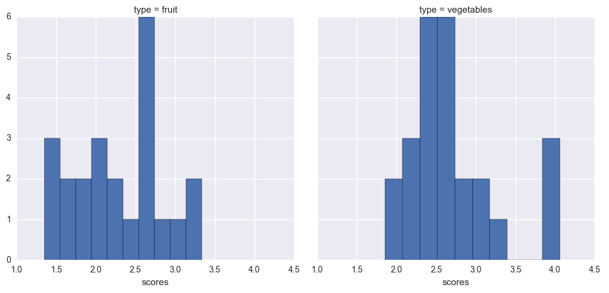


###### Again, these histograms show a general distribution of the scores created from my model given the protein nutrient, here, vegetables have the higher scores again. With the highest score being Kale. 


```python
facetspro = sns.FacetGrid(proteinscoresdf, hue = "type", size = 5) ## facets across the cut column with hue as paraeter
facetspro = facetspro.map(plt.scatter,"price_per_cup","value").add_legend() #scatters price and carat across different cuts
facetspro.set_axis_labels("$ per cup","Protein in g") #i use price per cup b/c nutrient measured in fruit per cup
plt.suptitle("Scatter Plot of Protein vs price per cup")
plt.show() 
```


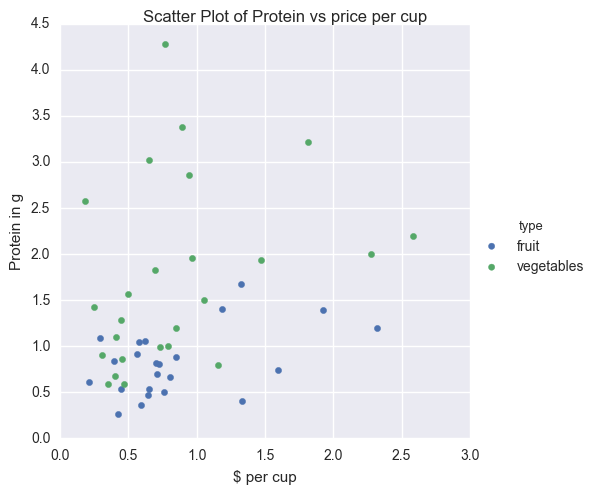


###### It is interesting to note here, that a lot of vegetables have a higher protein content than most fruits, with many of them having higher than 2.5 grams of protein per cup.  


```python
sns.lmplot(x = "price_per_cup", y = "value", col = "type" ,data = proteinscoresdf).set_axis_labels("$ per cup", "Protein in g")
plt.suptitle("Regression Price vs Protein")
plt.show()
```


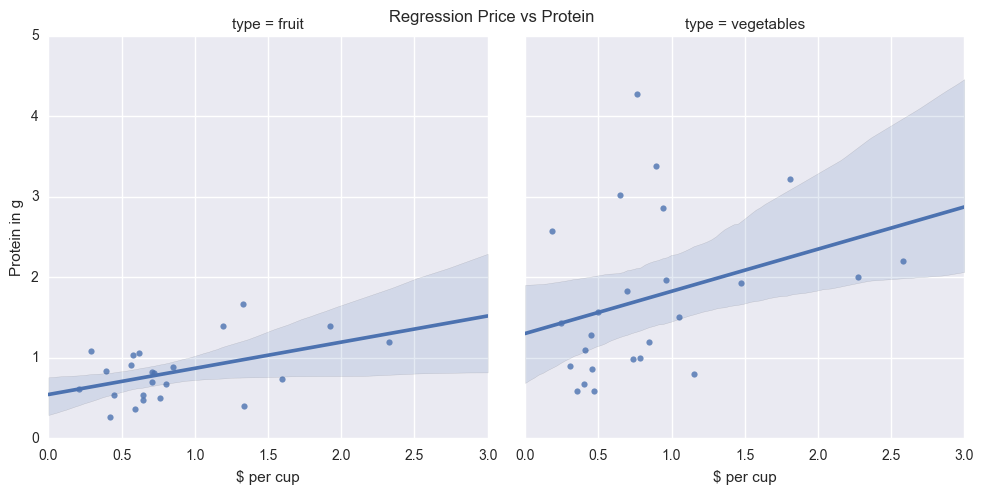


###### Both graphs show a slight linear trend between price and protein. This shows that a big increase in the price of the food constitutes to a low increase in the protein of the food.


```python
sns.lmplot(x = "yield", y = "value", col = "type" ,data = proteinscoresdf).set_axis_labels("Yield", "Protein in g")
plt.suptitle("Regression Yield vs Protein")
plt.show()
```


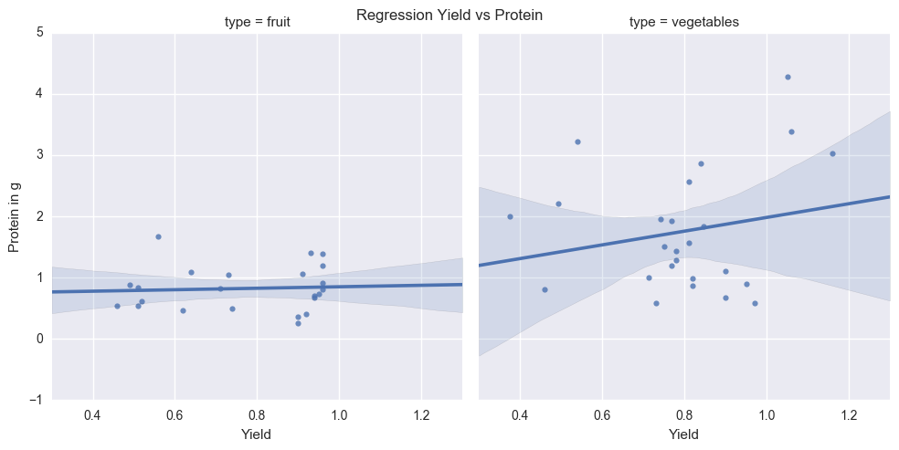


###### The protein of fruits is clustered within the 0.5 and 1.5 range, and thus no linear trend between yield and protein is present. There also seems to be a slight linear trend between yield and protein with vegetables.

# Fiber in Different Foods #


```python
fiber = pd.DataFrame([ndb_report(cool, my_key)[5] for cool in coolnums])
fiber = fiber.merge(hasnums, on = "ndb numbers")
fiberdf = freshdf.merge(fiber, left_on = "food", right_on = "csv name")
newcols = ['ndb numbers', 'food', 'type', 'value', 'unit', 'name', 'price_per_lb', 'lb_per_cup', 'price_per_cup', 'yield']
fiberdf = fiberdf[newcols] #rearranging the columns of the df, omit unescary variables

fiberscoresdf = scores_calculator(fiberdf)
fiberscoresdf = fiberscoresdf.convert_objects(convert_numeric=True) #turning df into float64s so sns plot works
```

    /Users/menbok/anaconda2/lib/python2.7/site-packages/ipykernel/__main__.py:8: FutureWarning: convert_objects is deprecated.  Use the data-type specific converters pd.to_datetime, pd.to_timedelta and pd.to_numeric.


```python
fiberscoresdf
```


<div>
<table border="1" class="dataframe">
  <thead>
    <tr style="text-align: right;">
      <th></th>
      <th>ndb numbers</th>
      <th>food</th>
      <th>type</th>
      <th>value</th>
      <th>unit</th>
      <th>name</th>
      <th>price_per_lb</th>
      <th>lb_per_cup</th>
      <th>price_per_cup</th>
      <th>yield</th>
      <th>scores</th>
    </tr>
  </thead>
  <tbody>
    <tr>
      <th>0</th>
      <td>9326</td>
      <td>watermelon</td>
      <td>fruit</td>
      <td>0.4</td>
      <td>g</td>
      <td>Fiber, total dietary</td>
      <td>0.333412</td>
      <td>0.330693</td>
      <td>0.212033</td>
      <td>0.520000</td>
      <td>1.209562</td>
    </tr>
    <tr>
      <th>1</th>
      <td>9181</td>
      <td>cantaloupe</td>
      <td>fruit</td>
      <td>0.9</td>
      <td>g</td>
      <td>Fiber, total dietary</td>
      <td>0.535874</td>
      <td>0.374786</td>
      <td>0.393800</td>
      <td>0.510000</td>
      <td>1.632656</td>
    </tr>
    <tr>
      <th>2</th>
      <td>9221</td>
      <td>tangerines</td>
      <td>fruit</td>
      <td>0.2</td>
      <td>g</td>
      <td>Fiber, total dietary</td>
      <td>1.377962</td>
      <td>0.407855</td>
      <td>0.759471</td>
      <td>0.740000</td>
      <td>1.810343</td>
    </tr>
    <tr>
      <th>3</th>
      <td>9316</td>
      <td>strawberries</td>
      <td>fruit</td>
      <td>2.0</td>
      <td>g</td>
      <td>Fiber, total dietary</td>
      <td>2.358808</td>
      <td>0.319670</td>
      <td>0.802171</td>
      <td>0.940000</td>
      <td>3.210239</td>
    </tr>
    <tr>
      <th>4</th>
      <td>9279</td>
      <td>plums</td>
      <td>fruit</td>
      <td>1.4</td>
      <td>g</td>
      <td>Fiber, total dietary</td>
      <td>1.827416</td>
      <td>0.363763</td>
      <td>0.707176</td>
      <td>0.940000</td>
      <td>2.942416</td>
    </tr>
    <tr>
      <th>5</th>
      <td>9201</td>
      <td>oranges</td>
      <td>fruit</td>
      <td>2.5</td>
      <td>g</td>
      <td>Fiber, total dietary</td>
      <td>1.035173</td>
      <td>0.407855</td>
      <td>0.578357</td>
      <td>0.730000</td>
      <td>2.767025</td>
    </tr>
    <tr>
      <th>6</th>
      <td>9302</td>
      <td>raspberries</td>
      <td>fruit</td>
      <td>6.5</td>
      <td>g</td>
      <td>Fiber, total dietary</td>
      <td>6.975811</td>
      <td>0.319670</td>
      <td>2.322874</td>
      <td>0.960000</td>
      <td>4.528608</td>
    </tr>
    <tr>
      <th>7</th>
      <td>9286</td>
      <td>pomegranate</td>
      <td>fruit</td>
      <td>4.0</td>
      <td>g</td>
      <td>Fiber, total dietary</td>
      <td>2.173590</td>
      <td>0.341717</td>
      <td>1.326342</td>
      <td>0.560000</td>
      <td>3.094664</td>
    </tr>
    <tr>
      <th>8</th>
      <td>9266</td>
      <td>pineapple</td>
      <td>fruit</td>
      <td>1.4</td>
      <td>g</td>
      <td>Fiber, total dietary</td>
      <td>0.627662</td>
      <td>0.363763</td>
      <td>0.447686</td>
      <td>0.510000</td>
      <td>1.901655</td>
    </tr>
    <tr>
      <th>9</th>
      <td>9021</td>
      <td>apricots</td>
      <td>fruit</td>
      <td>2.0</td>
      <td>g</td>
      <td>Fiber, total dietary</td>
      <td>3.040072</td>
      <td>0.363763</td>
      <td>1.189102</td>
      <td>0.930000</td>
      <td>3.328627</td>
    </tr>
    <tr>
      <th>10</th>
      <td>9184</td>
      <td>honeydew</td>
      <td>fruit</td>
      <td>0.8</td>
      <td>g</td>
      <td>Fiber, total dietary</td>
      <td>0.796656</td>
      <td>0.374786</td>
      <td>0.649077</td>
      <td>0.460000</td>
      <td>1.649333</td>
    </tr>
    <tr>
      <th>11</th>
      <td>9226</td>
      <td>papaya</td>
      <td>fruit</td>
      <td>1.7</td>
      <td>g</td>
      <td>Fiber, total dietary</td>
      <td>1.298012</td>
      <td>0.308647</td>
      <td>0.646174</td>
      <td>0.620000</td>
      <td>2.328133</td>
    </tr>
    <tr>
      <th>12</th>
      <td>9001</td>
      <td>cherries</td>
      <td>fruit</td>
      <td>1.1</td>
      <td>g</td>
      <td>Fiber, total dietary</td>
      <td>3.592990</td>
      <td>0.341717</td>
      <td>1.334548</td>
      <td>0.920000</td>
      <td>2.987951</td>
    </tr>
    <tr>
      <th>13</th>
      <td>9040</td>
      <td>bananas</td>
      <td>fruit</td>
      <td>2.6</td>
      <td>g</td>
      <td>Fiber, total dietary</td>
      <td>0.566983</td>
      <td>0.330693</td>
      <td>0.292965</td>
      <td>0.640000</td>
      <td>2.431367</td>
    </tr>
    <tr>
      <th>14</th>
      <td>9003</td>
      <td>apples</td>
      <td>fruit</td>
      <td>2.4</td>
      <td>g</td>
      <td>Fiber, total dietary</td>
      <td>1.567515</td>
      <td>0.242508</td>
      <td>0.422373</td>
      <td>0.900000</td>
      <td>3.027889</td>
    </tr>
    <tr>
      <th>15</th>
      <td>9236</td>
      <td>peaches</td>
      <td>fruit</td>
      <td>1.5</td>
      <td>g</td>
      <td>Fiber, total dietary</td>
      <td>1.591187</td>
      <td>0.341717</td>
      <td>0.566390</td>
      <td>0.960000</td>
      <td>2.960417</td>
    </tr>
    <tr>
      <th>16</th>
      <td>9191</td>
      <td>nectarines</td>
      <td>fruit</td>
      <td>1.7</td>
      <td>g</td>
      <td>Fiber, total dietary</td>
      <td>1.761148</td>
      <td>0.319670</td>
      <td>0.618667</td>
      <td>0.910000</td>
      <td>2.938912</td>
    </tr>
    <tr>
      <th>17</th>
      <td>9252</td>
      <td>pears</td>
      <td>fruit</td>
      <td>3.1</td>
      <td>g</td>
      <td>Fiber, total dietary</td>
      <td>1.461575</td>
      <td>0.363763</td>
      <td>0.590740</td>
      <td>0.900000</td>
      <td>3.316673</td>
    </tr>
    <tr>
      <th>18</th>
      <td>9117</td>
      <td>grapefruit</td>
      <td>fruit</td>
      <td>12.0</td>
      <td>mg</td>
      <td>Calcium, Ca</td>
      <td>0.897802</td>
      <td>0.462971</td>
      <td>0.848278</td>
      <td>0.490000</td>
      <td>3.769114</td>
    </tr>
    <tr>
      <th>19</th>
      <td>9042</td>
      <td>blackberries</td>
      <td>fruit</td>
      <td>5.3</td>
      <td>g</td>
      <td>Fiber, total dietary</td>
      <td>5.774708</td>
      <td>0.319670</td>
      <td>1.922919</td>
      <td>0.960000</td>
      <td>4.306067</td>
    </tr>
    <tr>
      <th>20</th>
      <td>9129</td>
      <td>grapes</td>
      <td>fruit</td>
      <td>3.9</td>
      <td>g</td>
      <td>Fiber, total dietary</td>
      <td>2.093827</td>
      <td>0.330693</td>
      <td>0.721266</td>
      <td>0.960000</td>
      <td>3.714795</td>
    </tr>
    <tr>
      <th>21</th>
      <td>9050</td>
      <td>blueberries</td>
      <td>fruit</td>
      <td>2.4</td>
      <td>g</td>
      <td>Fiber, total dietary</td>
      <td>4.734622</td>
      <td>0.319670</td>
      <td>1.593177</td>
      <td>0.950000</td>
      <td>3.606206</td>
    </tr>
    <tr>
      <th>22</th>
      <td>9176</td>
      <td>mangoes</td>
      <td>fruit</td>
      <td>1.6</td>
      <td>g</td>
      <td>Fiber, total dietary</td>
      <td>1.377563</td>
      <td>0.363763</td>
      <td>0.705783</td>
      <td>0.710000</td>
      <td>2.495781</td>
    </tr>
    <tr>
      <th>23</th>
      <td>11011</td>
      <td>asparagus</td>
      <td>vegetables</td>
      <td>2.1</td>
      <td>g</td>
      <td>Fiber, total dietary</td>
      <td>3.213494</td>
      <td>0.396832</td>
      <td>2.582272</td>
      <td>0.493835</td>
      <td>2.694389</td>
    </tr>
    <tr>
      <th>24</th>
      <td>11206</td>
      <td>cucumbers</td>
      <td>vegetables</td>
      <td>0.7</td>
      <td>g</td>
      <td>Fiber, total dietary</td>
      <td>1.295931</td>
      <td>0.264555</td>
      <td>0.353448</td>
      <td>0.970000</td>
      <td>2.466310</td>
    </tr>
    <tr>
      <th>25</th>
      <td>11206</td>
      <td>cucumbers</td>
      <td>vegetables</td>
      <td>0.7</td>
      <td>g</td>
      <td>Fiber, total dietary</td>
      <td>1.295931</td>
      <td>0.264555</td>
      <td>0.469650</td>
      <td>0.730000</td>
      <td>1.980488</td>
    </tr>
    <tr>
      <th>26</th>
      <td>11252</td>
      <td>lettuce_iceberg</td>
      <td>vegetables</td>
      <td>1.2</td>
      <td>g</td>
      <td>Fiber, total dietary</td>
      <td>1.213039</td>
      <td>0.242508</td>
      <td>0.309655</td>
      <td>0.950000</td>
      <td>2.640467</td>
    </tr>
    <tr>
      <th>27</th>
      <td>11282</td>
      <td>onions</td>
      <td>vegetables</td>
      <td>1.7</td>
      <td>g</td>
      <td>Fiber, total dietary</td>
      <td>1.038107</td>
      <td>0.352740</td>
      <td>0.406868</td>
      <td>0.900000</td>
      <td>2.787123</td>
    </tr>
    <tr>
      <th>28</th>
      <td>11568</td>
      <td>turnip_greens</td>
      <td>vegetables</td>
      <td>3.2</td>
      <td>g</td>
      <td>Fiber, total dietary</td>
      <td>2.471749</td>
      <td>0.319670</td>
      <td>1.053526</td>
      <td>0.750000</td>
      <td>3.203379</td>
    </tr>
    <tr>
      <th>29</th>
      <td>11270</td>
      <td>mustard_greens</td>
      <td>vegetables</td>
      <td>3.2</td>
      <td>g</td>
      <td>Fiber, total dietary</td>
      <td>2.569235</td>
      <td>0.308647</td>
      <td>0.944032</td>
      <td>0.840000</td>
      <td>3.362396</td>
    </tr>
    <tr>
      <th>30</th>
      <td>11362</td>
      <td>potatoes</td>
      <td>vegetables</td>
      <td>2.5</td>
      <td>g</td>
      <td>Fiber, total dietary</td>
      <td>0.564320</td>
      <td>0.264555</td>
      <td>0.184017</td>
      <td>0.811301</td>
      <td>2.671676</td>
    </tr>
    <tr>
      <th>31</th>
      <td>11161</td>
      <td>collard_greens</td>
      <td>vegetables</td>
      <td>4.0</td>
      <td>g</td>
      <td>Fiber, total dietary</td>
      <td>2.630838</td>
      <td>0.286601</td>
      <td>0.650001</td>
      <td>1.160000</td>
      <td>4.277326</td>
    </tr>
    <tr>
      <th>32</th>
      <td>11052</td>
      <td>green_beans</td>
      <td>vegetables</td>
      <td>2.7</td>
      <td>g</td>
      <td>Fiber, total dietary</td>
      <td>2.139972</td>
      <td>0.275578</td>
      <td>0.696606</td>
      <td>0.846575</td>
      <td>3.141706</td>
    </tr>
    <tr>
      <th>33</th>
      <td>11482</td>
      <td>acorn_squash</td>
      <td>vegetables</td>
      <td>1.5</td>
      <td>g</td>
      <td>Fiber, total dietary</td>
      <td>1.172248</td>
      <td>0.451948</td>
      <td>1.155360</td>
      <td>0.458554</td>
      <td>2.183131</td>
    </tr>
    <tr>
      <th>34</th>
      <td>11821</td>
      <td>red_peppers</td>
      <td>vegetables</td>
      <td>2.1</td>
      <td>g</td>
      <td>Fiber, total dietary</td>
      <td>2.277940</td>
      <td>0.264555</td>
      <td>0.734926</td>
      <td>0.820000</td>
      <td>2.922361</td>
    </tr>
    <tr>
      <th>35</th>
      <td>11112</td>
      <td>red_cabbage</td>
      <td>vegetables</td>
      <td>2.1</td>
      <td>g</td>
      <td>Fiber, total dietary</td>
      <td>0.579208</td>
      <td>0.330693</td>
      <td>0.245944</td>
      <td>0.778797</td>
      <td>2.528286</td>
    </tr>
    <tr>
      <th>36</th>
      <td>11109</td>
      <td>green_cabbage</td>
      <td>vegetables</td>
      <td>2.5</td>
      <td>g</td>
      <td>Fiber, total dietary</td>
      <td>1.056450</td>
      <td>0.330693</td>
      <td>0.448412</td>
      <td>0.779107</td>
      <td>2.793646</td>
    </tr>
    <tr>
      <th>37</th>
      <td>11507</td>
      <td>sweet potatoes</td>
      <td>vegetables</td>
      <td>3.0</td>
      <td>g</td>
      <td>Fiber, total dietary</td>
      <td>0.918897</td>
      <td>0.440925</td>
      <td>0.499400</td>
      <td>0.811301</td>
      <td>3.030235</td>
    </tr>
    <tr>
      <th>38</th>
      <td>11475</td>
      <td>summer_squash</td>
      <td>vegetables</td>
      <td>1.2</td>
      <td>g</td>
      <td>Fiber, total dietary</td>
      <td>1.639477</td>
      <td>0.396832</td>
      <td>0.845480</td>
      <td>0.769500</td>
      <td>2.517793</td>
    </tr>
    <tr>
      <th>39</th>
      <td>11429</td>
      <td>radish</td>
      <td>vegetables</td>
      <td>1.6</td>
      <td>g</td>
      <td>Fiber, total dietary</td>
      <td>1.311629</td>
      <td>0.275578</td>
      <td>0.401618</td>
      <td>0.900000</td>
      <td>2.745878</td>
    </tr>
    <tr>
      <th>40</th>
      <td>11485</td>
      <td>butternut_squash</td>
      <td>vegetables</td>
      <td>2.0</td>
      <td>g</td>
      <td>Fiber, total dietary</td>
      <td>1.244737</td>
      <td>0.451948</td>
      <td>0.787893</td>
      <td>0.714000</td>
      <td>2.685954</td>
    </tr>
    <tr>
      <th>41</th>
      <td>9038</td>
      <td>avocados</td>
      <td>vegetables</td>
      <td>6.8</td>
      <td>g</td>
      <td>Fiber, total dietary</td>
      <td>2.235874</td>
      <td>0.319670</td>
      <td>0.964886</td>
      <td>0.740753</td>
      <td>3.770612</td>
    </tr>
    <tr>
      <th>42</th>
      <td>11233</td>
      <td>kale</td>
      <td>vegetables</td>
      <td>3.6</td>
      <td>g</td>
      <td>Fiber, total dietary</td>
      <td>2.807302</td>
      <td>0.286601</td>
      <td>0.766262</td>
      <td>1.050000</td>
      <td>3.918960</td>
    </tr>
    <tr>
      <th>43</th>
      <td>11226</td>
      <td>artichoke</td>
      <td>vegetables</td>
      <td>1.6</td>
      <td>g</td>
      <td>Fiber, total dietary</td>
      <td>2.213050</td>
      <td>0.385809</td>
      <td>2.274967</td>
      <td>0.375309</td>
      <td>2.308152</td>
    </tr>
    <tr>
      <th>44</th>
      <td>11278</td>
      <td>okra</td>
      <td>vegetables</td>
      <td>3.2</td>
      <td>g</td>
      <td>Fiber, total dietary</td>
      <td>3.213552</td>
      <td>0.352740</td>
      <td>1.473146</td>
      <td>0.769474</td>
      <td>3.364511</td>
    </tr>
    <tr>
      <th>45</th>
      <td>11333</td>
      <td>green_peppers</td>
      <td>vegetables</td>
      <td>1.7</td>
      <td>g</td>
      <td>Fiber, total dietary</td>
      <td>1.410363</td>
      <td>0.264555</td>
      <td>0.455022</td>
      <td>0.820000</td>
      <td>2.629318</td>
    </tr>
    <tr>
      <th>46</th>
      <td>11098</td>
      <td>brussels_sprouts</td>
      <td>vegetables</td>
      <td>3.8</td>
      <td>g</td>
      <td>Fiber, total dietary</td>
      <td>2.763553</td>
      <td>0.341717</td>
      <td>0.890898</td>
      <td>1.060000</td>
      <td>4.044700</td>
    </tr>
    <tr>
      <th>47</th>
      <td>11900</td>
      <td>corn_sweet</td>
      <td>vegetables</td>
      <td>2.7</td>
      <td>g</td>
      <td>Fiber, total dietary</td>
      <td>2.690623</td>
      <td>0.363763</td>
      <td>1.812497</td>
      <td>0.540000</td>
      <td>2.861094</td>
    </tr>
  </tbody>
</table>
</div>


```python
max(fiberscoresdf["scores"])
```


    4.5286079771336638


###### Here, the food with the best combination of fiber, price and yield is raspberries. Though there is a slight discrepency, in that for grapefruit I accessed the Calcium category for nutrition information, so that will be dropped for graphical analysis.


```python
sns.FacetGrid(fiberscoresdf, col = "type", size = 5).map(plt.hist, "scores").add_legend()
plt.show()
```


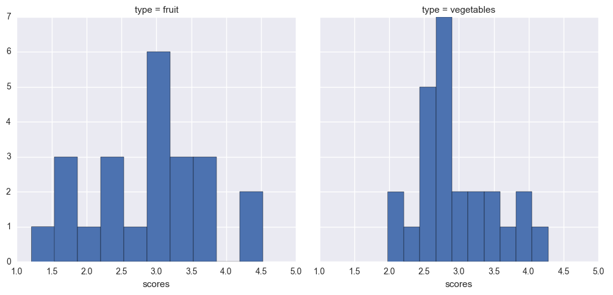


###### Here shows the distribution of scores given the fiber nutrient.  I see here that the distribution of scores for vegetables is a little bit more narrow than that of fruits.  The highest score is given to fruits here, _rasperries_ in this case.


```python
fiberscoresdf2 = fiberscoresdf[fiberscoresdf["food"].str.contains("grapefruit") == False] # removing grapefruit

facetsfib = sns.FacetGrid(fiberscoresdf2, hue = "type", size = 5) ## facets across the cut column with hue as paraeter
facetsfib = facetsfib.map(plt.scatter,"price_per_cup","value").add_legend() #scatters price and carat across different cuts
facetsfib.set_axis_labels("$ per cup","Fiber in g") #i use price per cup b/c nutrient measured in fruit per cup
plt.suptitle("Scatter Plot of Fiber vs price per cup")
plt.show() 
```


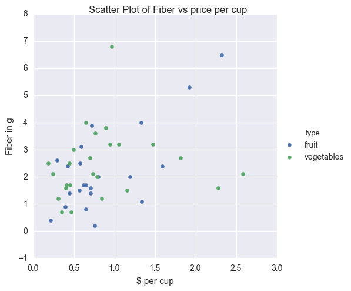


###### Here there is a good cluster present with the amount of low fiber and low cost foods, but we can we raspberries at the top of the fiber range, along with another food, a vegetable which from the dataframe should be an avocado. This proves that though raspberries have the highest combination score, avocado has a slightly higher fiber content. 


```python
sns.lmplot(x= "price_per_cup", y="value", data=fiberscoresdf2, col = "type").set_axis_labels("$ per cup", "Fiber in g")
plt.suptitle("Regression Price vs Fiber")
plt.show()
```


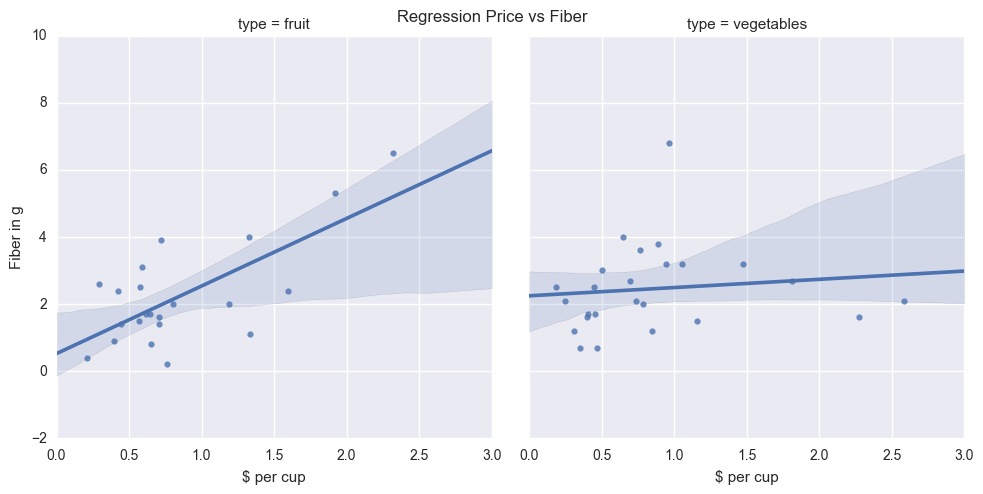


###### It is very interesting to note that fiber and price among fruits are highly positively correlating and no real trend amongst vegetables.  This shows that fruits with higher fiber would most likely cost more than vegetables that yield the same amount of fiber.


```python
sns.lmplot(x= "yield", y="value", data=fiberscoresdf2, col = "type").set_axis_labels("yield", "Fiber in g")
plt.suptitle("Regression Yield vs Fiber")
plt.show()
```


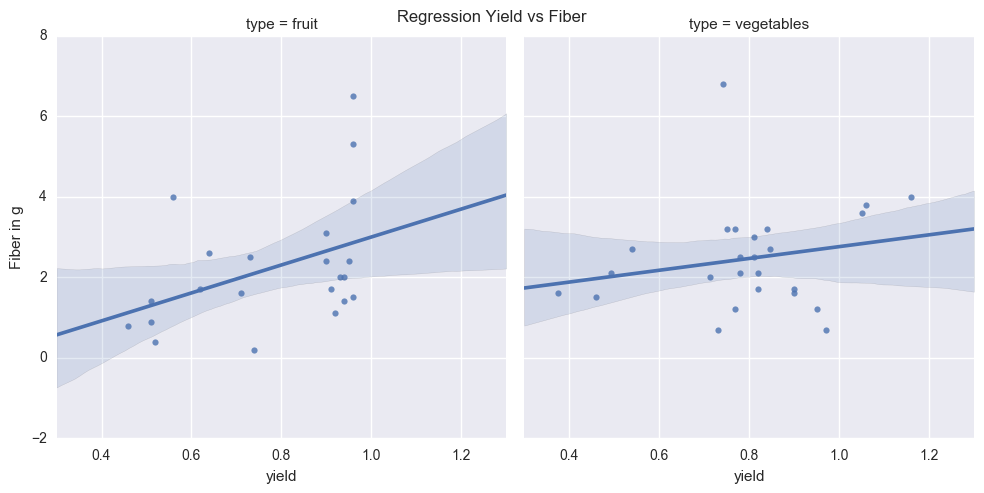


##### Again, no trend with vegetables but a general linearly postive trend with fruits.  Could this mean that fiber increases as yield increases with the type of fruit and not vegetables? 
