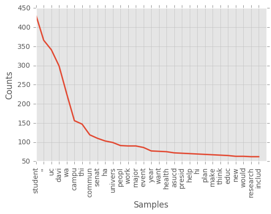
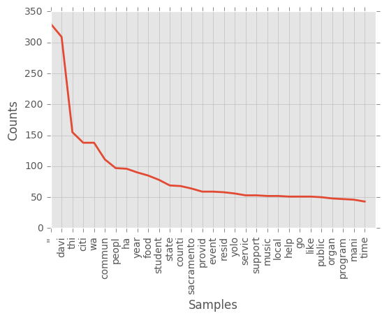
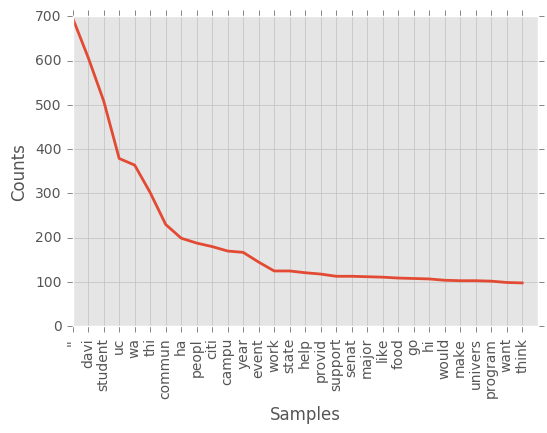
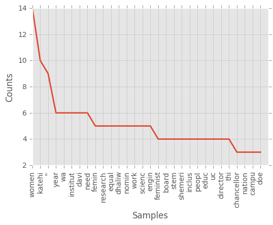
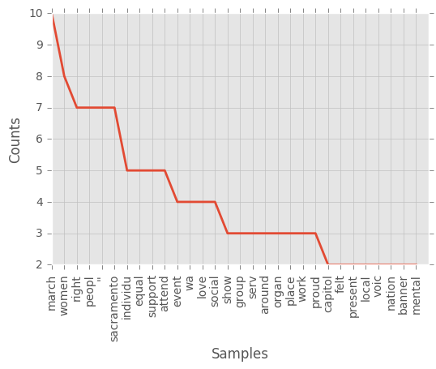
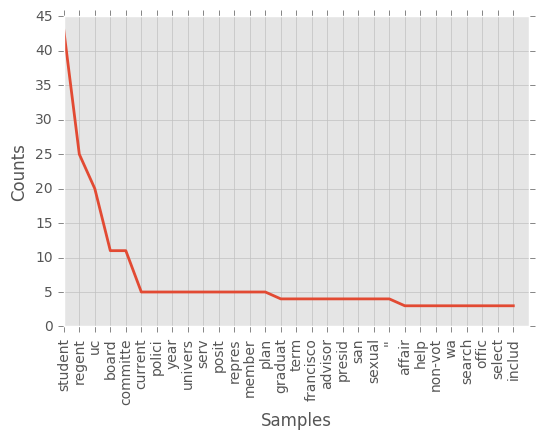
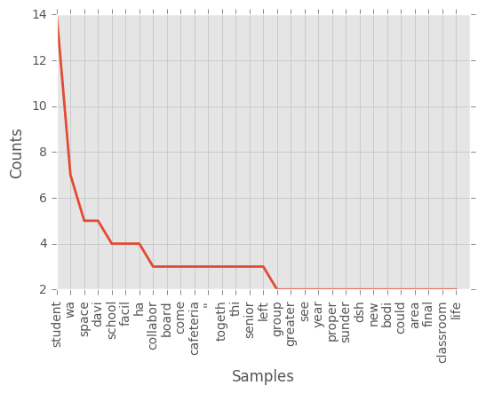
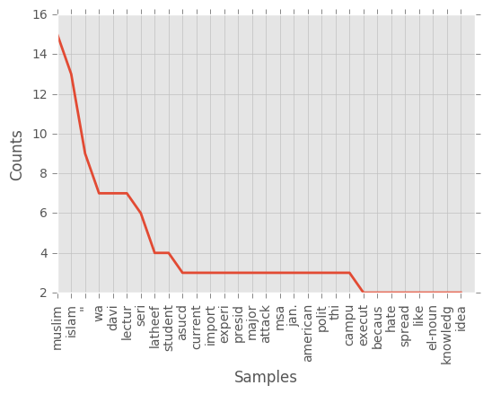
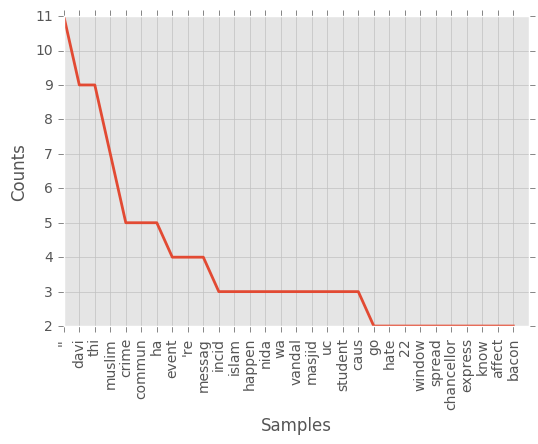

# News Articles, how are they alike?

In this assignment, you'll scrape text from [The California Aggie](https://theaggie.org/) and then analyze the text.

The Aggie is organized by category into article lists. For example, there's a [Campus News](https://theaggie.org/campus/) list, [Arts & Culture](https://theaggie.org/arts/) list, and [Sports](https://theaggie.org/sports/) list. Notice that each list has multiple pages, with a maximum of 15 articles per page.

The goal of exercises 1.1 - 1.3 is to scrape articles from the Aggie for analysis in exercise 1.4.

Write a function that extracts all of the links to articles in an Aggie article list. The function should:

* Have a parameter `url` for the URL of the article list.

* Have a parameter `page` for the number of pages to fetch links from. The default should be `1`.

* Return a list of aricle URLs (each URL should be a string).


* Be polite to The Aggie and save time by setting up [requests_cache](https://pypi.python.org/pypi/requests-cache) before you write your function.

* Start by getting your function to work for just 1 page. Once that works, have your function call itself to get additional pages.

* You can use [lxml.html](http://lxml.de/lxmlhtml.html) or [BeautifulSoup](https://www.crummy.com/software/BeautifulSoup/bs4/doc/) to scrape HTML. Choose one and use it throughout the entire assignment.


```python
import requests_cache
from bs4 import BeautifulSoup
import requests
import lxml
import pandas as pd

requests_cache.install_cache('demo_cache')

def extract_url(url, numpages = 1): #extrcct url using requests.get, 
    if numpages == 0:
        return []
    results = []
    url2 = url + 'page/' + str(numpages) + '/'
    response = requests.get(url2)
    soup1 = BeautifulSoup(response.text, 'html.parser')
        
    for heads in soup1.find_all(attrs = {'class' : 'entry-title'}): #for loop to grab each link under a tag and class entry-title 
        for link in heads.find_all('a'): 
            results.append(str(link.get('href')))
    
    results.extend(extract_url(url,numpages-1)) #ran recursive function to call itself until numpages satisfied
    return results

extract_url("https://theaggie.org/arts/", 4)
```


    ['https://theaggie.org/2016/12/09/an-earful-a-holiday-playlist/',
     'https://theaggie.org/2016/12/09/heres-the-scoop/',
     'https://theaggie.org/2016/12/09/writing-through-the-writers-block/',
     'https://theaggie.org/2016/12/08/student-fashion-association-to-offer-fashion-show-planning-class/',
     'https://theaggie.org/2016/12/08/thats-alottacappella/',
     'https://theaggie.org/2016/12/08/black-mirror-our-disturbing-reality/',
     'https://theaggie.org/2016/12/07/happy-holidays-from-the-california-aggie-arts-and-culture-desk/',
     'https://theaggie.org/2016/12/04/manetti-shrem-museum-now-open-to-the-public/',
     'https://theaggie.org/2016/11/30/knock-knock-whos-there-the-ucd-stand-up-comedy-club/',
     'https://theaggie.org/2016/11/30/album-review-24k-magic/',
     'https://theaggie.org/2016/11/29/an-earful-on-music-and-timing/',
     'https://theaggie.org/2016/11/29/davis-thrifting-your-guide-to-second-hand-shopping/',
     'https://theaggie.org/2016/11/29/boiling-pot-a-unique-dining-experience/',
     'https://theaggie.org/2016/11/28/my-first-rave/',
     'https://theaggie.org/2016/11/27/open-mic-open-heart/',
     'https://theaggie.org/2017/01/26/presenting-hasan-minhaj/',
     'https://theaggie.org/2017/01/26/who-is-u-s/',
     'https://theaggie.org/2017/01/26/waltz-in-magic/',
     'https://theaggie.org/2017/01/24/student-sounds-tempura/',
     'https://theaggie.org/2017/01/23/the-hidden-museums-of-uc-davis/',
     'https://theaggie.org/2017/01/23/aggie-style-watch-winter-edition/',
     'https://theaggie.org/2017/01/22/modern-love/',
     'https://theaggie.org/2017/01/22/la-la-land-review/',
     'https://theaggie.org/2017/01/20/old-holiday-allows-for-new-traditions/',
     'https://theaggie.org/2017/01/17/four-apps-to-help-foster-creativity-2/',
     'https://theaggie.org/2017/01/16/a-workout-playlist/',
     'https://theaggie.org/2017/01/15/fashion-trends-of-2017/',
     'https://theaggie.org/2017/01/15/top-three-albums-of-2016/',
     'https://theaggie.org/2017/01/12/davis-is-burning-fires-up-for-two-performances/',
     'https://theaggie.org/2017/01/12/how-hallmark-has-mastered-the-holidays/',
     'https://theaggie.org/2017/02/09/events-calendar-for-february/',
     'https://theaggie.org/2017/02/09/hopped-up-comedy-x-arrives-in-time-for-valentines-day-weekend/',
     'https://theaggie.org/2017/02/09/lantern-festival-the-beginning-of-the-year/',
     'https://theaggie.org/2017/02/07/top-three-places-to-eat-when-hungover/',
     'https://theaggie.org/2017/02/06/dance-dance/',
     'https://theaggie.org/2017/02/06/skams-universal-appeal/',
     'https://theaggie.org/2017/02/06/t-v-revisited-breaking-bad/',
     'https://theaggie.org/2017/02/02/headline-a-look-inside-kdvs/',
     'https://theaggie.org/2017/02/02/spoken-word-allows-for-expression-of-much-more-than-words/',
     'https://theaggie.org/2017/02/02/the-self-proclaimed-cure-for-racism/',
     'https://theaggie.org/2017/02/02/a-feast-for-the-ears-just-in-time-for-lunch/',
     'https://theaggie.org/2017/01/30/pronoun-highlights-struggles-of-transgender-youth/',
     'https://theaggie.org/2017/01/30/through-the-artists-eye-sammy-sanchez-monter/',
     'https://theaggie.org/2017/01/29/the-books-that-inspire-uc-davis-faculty/',
     'https://theaggie.org/2017/01/29/an-earful-introducing-andy-shauf/',
     'https://theaggie.org/2017/02/20/student-sounds-samantha-sipin/',
     'https://theaggie.org/2017/02/20/tv-revisited-the-office/',
     'https://theaggie.org/2017/02/19/uc-davis-theater-and-dance-presents-its-newest-comedy/',
     'https://theaggie.org/2017/02/19/twenty-one-pilots-emotional-roadshow-world-tour/',
     'https://theaggie.org/2017/02/16/a-night-under-the-stars/',
     'https://theaggie.org/2017/02/14/critically-acclaimed-stand-up-comic-brian-regan-to-perform-at-mondavi-center/',
     'https://theaggie.org/2017/02/13/burning-love-parody-of-the-bachelor/',
     'https://theaggie.org/2017/02/12/the-bachelor-engages-viewers-prompts-viewing-rituals/',
     'https://theaggie.org/2017/02/12/seven-movies-from-the-seven-countries-targeted-by-president-trumps-muslim-ban/',
     'https://theaggie.org/2017/02/12/the-best-of-times-and-the-worst-of-times-a-valentines-day-playlist/',
     'https://theaggie.org/2017/02/09/events-calendar-for-february/',
     'https://theaggie.org/2017/02/09/hopped-up-comedy-x-arrives-in-time-for-valentines-day-weekend/',
     'https://theaggie.org/2017/02/09/lantern-festival-the-beginning-of-the-year/',
     'https://theaggie.org/2017/02/07/top-three-places-to-eat-when-hungover/',
     'https://theaggie.org/2017/02/06/dance-dance/']


__Write a function that extracts the title, text, and author of an Aggie article. The function should:

* Have a parameter `url` for the URL of the article.

* For the author, extract the "Written By" line that appears at the end of most articles. You don't have to extract the author's name from this line.

* Return a dictionary with keys "url", "title", "text", and "author". The values for these should be the article url, title, text, and author, respectively.

For example, for [this article](https://theaggie.org/2017/02/14/project-toto-aims-to-address-questions-regarding-city-finances/) your function should return something similar to this:
```
{
    'author': u'Written By: Bianca Antunez \xa0\u2014\xa0city@theaggie.org',
    'text': u'Davis residents create financial model to make city\'s financial state more transparent To increase transparency between the city\'s financial situation and the community, three residents created a model called Project Toto which aims to improve how the city communicates its finances in an easily accessible design. Jeff Miller and Matt Williams, who are members of Davis\' Finance and Budget Commission, joined together with Davis entrepreneur Bob Fung to create the model plan to bring the project to the Finance and Budget Commission in February, according to Kelly Stachowicz, assistant city manager. "City staff appreciate the efforts that have gone into this, and the interest in trying to look at the city\'s potential financial position over the long term," Stachowicz said in an email interview. "We all have a shared goal to plan for a sound fiscal future with few surprises. We believe the Project Toto effort will mesh well with our other efforts as we build the budget for the next fiscal year and beyond." Project Toto complements the city\'s effort to amplify the transparency of city decisions to community members. The aim is to increase the understanding about the city\'s financial situation and make the information more accessible and easier to understand. The project is mostly a tool for public education, but can also make predictions about potential decisions regarding the city\'s financial future. Once completed, the program will allow residents to manipulate variables to see their eventual consequences, such as tax increases or extensions and proposed developments "This really isn\'t a budget, it is a forecast to see the intervention of these decisions," Williams said in an interview with The Davis Enterprise. "What happens if we extend the sales tax? What does it do given the other numbers that are in?" Project Toto enables users, whether it be a curious Davis resident, a concerned community member or a city leader, with the ability to project city finances with differing variables. The online program consists of the 400-page city budget for the 2016-2017 fiscal year, the previous budget, staff reports and consultant analyses. All of the documents are cited and accessible to the public within Project Toto. "It\'s a model that very easily lends itself to visual representation," Mayor Robb Davis said. "You can see the impacts of decisions the council makes on the fiscal health of the city." Complementary to this program, there is also a more advanced version of the model with more in-depth analyses of the city\'s finances. However, for an easy-to-understand, simplistic overview, Project Toto should be enough to help residents comprehend Davis finances. There is still more to do on the project, but its creators are hard at work trying to finalize it before the 2017-2018 fiscal year budget. "It\'s something I have been very much supportive of," Davis said. "Transparency is not just something that I have been supportive of but something we have stated as a city council objective [ ] this fits very well with our attempt to inform the public of our challenges with our fiscal situation." ',
    'title': 'Project Toto aims to address questions regarding city finances',
    'url': 'https://theaggie.org/2017/02/14/project-toto-aims-to-address-questions-regarding-city-finances/'
}
```

Hints:

* The author line is always the last line of the last paragraph.

*   Python 2 displays some Unicode characters as `\uXXXX`. For instance, `\u201c` is a left-facing quotation mark.
    You can convert most of these to ASCII characters with the method call (on a string)
    ```
    .translate({ 0x2018:0x27, 0x2019:0x27, 0x201C:0x22, 0x201D:0x22, 0x2026:0x20 })
    ```
    If you're curious about these characters, you can look them up on [this page](http://unicode.org/cldr/utility/character.jsp), or read 
    more about [what Unicode is](http://unicode.org/standard/WhatIsUnicode.html).


```python
#     Return a dictionary with keys "url", "title", "text", and "author". The values for these should 
#     be the article url, title, text, and author, respectively

def extracts(article_url): #takes in an article url as a param
    article = requests.get(article_url)
    soup = BeautifulSoup(article.text, 'html.parser') #used beautiful soup html.parser
    totranslate ={0x2013:0x82, 0x2014:0x45, 0x2018:0x27, 0x2019:0x27, 0x275D:0x22, 0x275E:0x22, 0x0022:0x22, 0x201C:0x22, 0x201D:0x22, 0x2026:0x20}
    stuff = {}
    
    #found that author was stored in itemprop 'articlebody' under p tag and it was at the last line of the last paragraph
    #though i could not find ALL of the authors :[, i used james's hint... please don't dock me off for that
    finalpara = soup.body.find(itemprop = 'articleBody').find_all('p')[-1] 
    author = finalpara.get_text().split('\n')[-1]
    
    texted = ''    
    for texts in soup.find_all('p')[:-2]: #again text is under ptag up till the 2nd to last one and i translate unicode 
        texts.get_text()
        texted = texted + texts.get_text()
    texted = texted.translate(totranslate)
    
    title = soup.title.string #title here always carries the  '| The Aggie' so i found that was the simplest way to retrieve 
                                # a title from an article on the aggie ONLY
    title = str(title.translate(totranslate)).replace(" | The Aggie", '')
    stuff.update({'author' : author, 'text' : texted,'title' : title, 'url' : article_url}) 
    return stuff #returned a huge dictionary of the stuff i retrieved from each article link

extracts('https://theaggie.org/2017/01/12/police-logs-7/')

```


    {'author': u'Written by: Sam Solomon\xa0\u2014\xa0city@theaggie.org',
     'text': u'Season\'s Greetings EditionDec. 24"Downstairs neighbor tapping on RP\'s floor"Dec. 25"Two intoxicated males \'sitting in RP\'s planter boxes\'"Dec. 25"Motorola walkie found"Dec. 25"Guest currently walking around naked"Dec. 26"RP saw someone in front yard stealing plants"Dec. 27"Bundle of wood in the roadway"Dec. 28"Highly intoxicated male in women\'s restroom"Dec. 28"Male subj. trying to push down a street sign"Dec. 29"Male just stole red lantern and walked out"',
     'title': 'Police Logs',
     'url': 'https://theaggie.org/2017/01/12/police-logs-7/'}


__Use your functions from exercises 1.1 and 1.2 to get a data frame of 60 [Campus News](https://theaggie.org/campus/) articles and a data frame of 60 [City News](https://theaggie.org/city/) articles. Add a column to each that indicates the category, then combine them into one big data frame.

The "text" column of this data frame will be your corpus for natural language processing in exercise 1.4.


```python
campusurl = "https://theaggie.org/campus/"
cityurl = 'https://theaggie.org/city/'
campuslinks = extract_url(campusurl, 4) #extracted 60 urls from campus and city news sites
citylinks = extract_url(cityurl, 4)

campusstuff = [extracts(campuslink) for campuslink in campuslinks] #list comp to retrieve stuff form all of the sites using extracts
citystuff = [extracts(citylink) for citylink in citylinks]
```


```python
campusdf = pd.DataFrame(campusstuff) 
campusdf['article type'] = 'campus' #new colname article type to differentiate between types of article
citydf = pd.DataFrame(citystuff)
citydf['article type'] = 'city'

ayedf = pd.concat([campusdf,citydf]) #combined two dataframe together to do tfidf transform later on
campusdf
```


<div>
<table border="1" class="dataframe">
  <thead>
    <tr style="text-align: right;">
      <th></th>
      <th>author</th>
      <th>text</th>
      <th>title</th>
      <th>url</th>
      <th>article type</th>
    </tr>
  </thead>
  <tbody>
    <tr>
      <th>0</th>
      <td>Written by: Lindsay Floyd — campus@theaggie.org</td>
      <td>Former plans paused in light of Katehi's resig...</td>
      <td>Napolitano to reinforce tentative plans to exp...</td>
      <td>https://theaggie.org/2017/01/23/napolitano-to-...</td>
      <td>campus</td>
    </tr>
    <tr>
      <th>1</th>
      <td>Written by: Ivan Valenzuela — campus@theaggie.org</td>
      <td>Feminist Research Institute nominates Linda Ka...</td>
      <td>Former chancellor turns down feminist leadersh...</td>
      <td>https://theaggie.org/2017/01/23/former-chancel...</td>
      <td>campus</td>
    </tr>
    <tr>
      <th>2</th>
      <td>Written by: Yvonne Leong — campus@theaggie.org</td>
      <td>The first endowed brewer will be Joe WilliamsS...</td>
      <td>Sierra Nevada Brewing owners gift $2 million t...</td>
      <td>https://theaggie.org/2017/01/22/sierra-nevada-...</td>
      <td>campus</td>
    </tr>
    <tr>
      <th>3</th>
      <td>Written by: Jayashri Padmanabhan — campus@thea...</td>
      <td>250 institutions ask new administration to add...</td>
      <td>Interim Chancellor Hexter, UC leaders sign let...</td>
      <td>https://theaggie.org/2017/01/22/interim-chance...</td>
      <td>campus</td>
    </tr>
    <tr>
      <th>4</th>
      <td>Written by: Jeanna Totah — campus@theaggie.org</td>
      <td>Higher education leaders stand by undocumented...</td>
      <td>California schools press Donald Trump to conti...</td>
      <td>https://theaggie.org/2017/01/22/california-sch...</td>
      <td>campus</td>
    </tr>
    <tr>
      <th>5</th>
      <td>Written by: Aaron Liss — campus@theaggie.org</td>
      <td>UC Student Workers Union hosts walkout, teach-...</td>
      <td>UC-wide walkout, teach-ins on Trump's inaugura...</td>
      <td>https://theaggie.org/2017/01/22/uc-wide-walkou...</td>
      <td>campus</td>
    </tr>
    <tr>
      <th>6</th>
      <td>Written By: Lindsay Floyd — campus@theaggie.org</td>
      <td>Some activists in favor of Yiannopoulos, other...</td>
      <td>Protests erupt at Milo Yiannopoulos event</td>
      <td>https://theaggie.org/2017/01/20/protests-erupt...</td>
      <td>campus</td>
    </tr>
    <tr>
      <th>7</th>
      <td>Written by: Kenton Goldsby — campus@theaggie.org</td>
      <td>Speakers CeCe McDonald and Franchesca Ramsey k...</td>
      <td>Student organizers host "Change/The Conversati...</td>
      <td>https://theaggie.org/2017/01/20/student-organi...</td>
      <td>campus</td>
    </tr>
    <tr>
      <th>8</th>
      <td>Written by: Lindsay Floyd — campus@theaggie.org</td>
      <td>Napolitano expected to leave hospital soon, ma...</td>
      <td>UC President Janet Napolitano hospitalized</td>
      <td>https://theaggie.org/2017/01/19/uc-president-j...</td>
      <td>campus</td>
    </tr>
    <tr>
      <th>9</th>
      <td>Written by: Yvonne Leong — campus@theaggie.org</td>
      <td>Former interim chief of nursing and patient ca...</td>
      <td>UC Davis appoints new chief of nursing and pat...</td>
      <td>https://theaggie.org/2017/01/17/uc-davis-appoi...</td>
      <td>campus</td>
    </tr>
    <tr>
      <th>10</th>
      <td>Written by: Demi Caceres — campus@theaggie.org</td>
      <td>UC Board of Regents creates position of studen...</td>
      <td>Student regent recruitment for the 2018-2019 s...</td>
      <td>https://theaggie.org/2017/01/16/student-regent...</td>
      <td>campus</td>
    </tr>
    <tr>
      <th>11</th>
      <td>Written by: Aaron Liss — campus@theaggie.org</td>
      <td>LRDP update preserves Russell Boulevard fields...</td>
      <td>Russell Boulevard intramural fields withdrawn ...</td>
      <td>https://theaggie.org/2017/01/15/russell-boulev...</td>
      <td>campus</td>
    </tr>
    <tr>
      <th>12</th>
      <td>Written by: Jeanna Totah — campus@theaggie.org</td>
      <td>Increase in applications brings more diverse p...</td>
      <td>UCs receive record-breaking number of applicants</td>
      <td>https://theaggie.org/2017/01/15/ucs-receive-re...</td>
      <td>campus</td>
    </tr>
    <tr>
      <th>13</th>
      <td>Written by: Alyssa Vandenberg  — campus@theagg...</td>
      <td>Yiannopoulos explains event's cancellation, ma...</td>
      <td>Davis College Republicans club leads protest a...</td>
      <td>https://theaggie.org/2017/01/14/davis-college-...</td>
      <td>campus</td>
    </tr>
    <tr>
      <th>14</th>
      <td>Written by: Alyssa Vandenberg  — campus@theagg...</td>
      <td>Protests against far-right conservative Milo Y...</td>
      <td>BREAKING NEWS: Milo Yiannopoulos event cancelled</td>
      <td>https://theaggie.org/2017/01/13/breaking-news-...</td>
      <td>campus</td>
    </tr>
    <tr>
      <th>15</th>
      <td>Written by: Jeanna Totah — campus@theaggie.org</td>
      <td>The second ASUCD Senate meeting of the new yea...</td>
      <td>Last week in Senate</td>
      <td>https://theaggie.org/2017/02/02/last-week-in-s...</td>
      <td>campus</td>
    </tr>
    <tr>
      <th>16</th>
      <td>Written by: Demi Caceres — campus@theaggie.org</td>
      <td>Action Jackson known for quality breeding, ext...</td>
      <td>Action Jackson E famous breeding donkey E dies...</td>
      <td>https://theaggie.org/2017/02/02/action-jackson...</td>
      <td>campus</td>
    </tr>
    <tr>
      <th>17</th>
      <td>Written by: Alyssa Vandenberg  — campus@theagg...</td>
      <td>Interim senator to be appointedOn Jan. 19, ASU...</td>
      <td>ASUCD Senator Sam Park resigns</td>
      <td>https://theaggie.org/2017/02/02/asucd-senator-...</td>
      <td>campus</td>
    </tr>
    <tr>
      <th>18</th>
      <td>Written by: Demi Caceres — campus@theaggie.org</td>
      <td>Huttle helps students receive career advice fr...</td>
      <td>UC Davis graduate creates online website to co...</td>
      <td>https://theaggie.org/2017/01/31/uc-davis-gradu...</td>
      <td>campus</td>
    </tr>
    <tr>
      <th>19</th>
      <td>Written by: Jeanna Totah — campus@theaggie.org</td>
      <td>Campus winery aims to remain environmentally s...</td>
      <td>UC Davis plans to bottle student wine for $80</td>
      <td>https://theaggie.org/2017/01/30/uc-davis-plans...</td>
      <td>campus</td>
    </tr>
    <tr>
      <th>20</th>
      <td>Written by: Jayashri Padmanabhan — campus@thea...</td>
      <td>Conference aims to destigmatize mental health,...</td>
      <td>UC Davis to host first ever mental health conf...</td>
      <td>https://theaggie.org/2017/01/30/uc-davis-to-ho...</td>
      <td>campus</td>
    </tr>
    <tr>
      <th>21</th>
      <td>Written by: Ivan Valenzuela — campus@theaggie.org</td>
      <td>AMCP award recognizes excellence in marketing,...</td>
      <td>UC Davis Sexual Violence Awareness and Educati...</td>
      <td>https://theaggie.org/2017/01/29/uc-davis-sexua...</td>
      <td>campus</td>
    </tr>
    <tr>
      <th>22</th>
      <td>Written by: Yvonne Leong — campus@theaggie.org</td>
      <td>Awards geared toward students of color, studen...</td>
      <td>UC Davis study abroad secures $22,000 in grant...</td>
      <td>https://theaggie.org/2017/01/29/uc-davis-study...</td>
      <td>campus</td>
    </tr>
    <tr>
      <th>23</th>
      <td>Written by: Alyssa Vandenberg  — campus@theagg...</td>
      <td>Tuition to increase by $336On Thursday, Jan. 2...</td>
      <td>UC Regents vote to raise tuition for UC campuses</td>
      <td>https://theaggie.org/2017/01/27/uc-regents-vot...</td>
      <td>campus</td>
    </tr>
    <tr>
      <th>24</th>
      <td>Written by: Aaron Liss — campus@theaggie.org</td>
      <td>Kevin Samy of Forbes' 2016 "30 under 30" list ...</td>
      <td>Former White House speechwriter comes to UC Davis</td>
      <td>https://theaggie.org/2017/01/26/former-white-h...</td>
      <td>campus</td>
    </tr>
    <tr>
      <th>25</th>
      <td>Written by: Jayashri Padmanabhan — campus@thea...</td>
      <td>ASUCD held its first senate meeting of Winter ...</td>
      <td>Last week in Senate</td>
      <td>https://theaggie.org/2017/01/26/last-week-in-s...</td>
      <td>campus</td>
    </tr>
    <tr>
      <th>26</th>
      <td>Written by: Kenton Goldsby — campus@theaggie.org</td>
      <td>Police chief provides information about safety...</td>
      <td>Davis area receives nearly eight inches of rai...</td>
      <td>https://theaggie.org/2017/01/26/davis-area-rec...</td>
      <td>campus</td>
    </tr>
    <tr>
      <th>27</th>
      <td>Written by: Yvonne Leong — campus@theaggie.org</td>
      <td>Protesters demand that Trump, UC system suppor...</td>
      <td>Students walk out of classes to protest Trump'...</td>
      <td>https://theaggie.org/2017/01/25/students-walk-...</td>
      <td>campus</td>
    </tr>
    <tr>
      <th>28</th>
      <td>Written by: Aaron Liss — campus@theaggie.org</td>
      <td>GreenMetric names UC Davis the greenest univer...</td>
      <td>UC Davis ranked most sustainable university in...</td>
      <td>https://theaggie.org/2017/01/24/uc-davis-ranke...</td>
      <td>campus</td>
    </tr>
    <tr>
      <th>29</th>
      <td>Written by: Demi Caceres — campus@theaggie.org</td>
      <td>UC Davis-led institute one of five national tr...</td>
      <td>US Department of Transportation awards $14 mil...</td>
      <td>https://theaggie.org/2017/01/24/us-department-...</td>
      <td>campus</td>
    </tr>
    <tr>
      <th>30</th>
      <td>Written by: Demi Caceres — campus@theaggie.org</td>
      <td>Last week in SenateThe ASUCD Senate meeting wa...</td>
      <td>Last week in Senate</td>
      <td>https://theaggie.org/2017/02/16/last-week-in-s...</td>
      <td>campus</td>
    </tr>
    <tr>
      <th>31</th>
      <td>Written by: Alyssa Vandenberg and Emilie DeFaz...</td>
      <td>Executive: Josh Dalavai and Adilla JamaludinIn...</td>
      <td>2017 ASUCD Winter Elections E Meet the Candidates</td>
      <td>https://theaggie.org/2017/02/16/2017-asucd-win...</td>
      <td>campus</td>
    </tr>
    <tr>
      <th>32</th>
      <td></td>
      <td>New showcase provides opportunity for students...</td>
      <td>Shields Library hosts new exhibit for Davis ce...</td>
      <td>https://theaggie.org/2017/02/14/shields-librar...</td>
      <td>campus</td>
    </tr>
    <tr>
      <th>33</th>
      <td>Written by: Demi Caceres — campus@theaggie.org</td>
      <td>Students promote fruit and vegetable meals via...</td>
      <td>Student Health and Counseling Services hosts "...</td>
      <td>https://theaggie.org/2017/02/14/student-health...</td>
      <td>campus</td>
    </tr>
    <tr>
      <th>34</th>
      <td>Written by: Lindsay Floyd — campus@theaggie.org</td>
      <td>New fees to pay for equipment replacementTo co...</td>
      <td>PE classes may charge additional fees</td>
      <td>https://theaggie.org/2017/02/13/pe-classes-may...</td>
      <td>campus</td>
    </tr>
    <tr>
      <th>35</th>
      <td>Written by: Jeanna Totah — campus@theaggie.org</td>
      <td>Recipients each rewarded $25,000 for researchU...</td>
      <td>11 new Chancellor Fellows honored for 2016</td>
      <td>https://theaggie.org/2017/02/12/11-new-chancel...</td>
      <td>campus</td>
    </tr>
    <tr>
      <th>36</th>
      <td>Written by: Aaron Liss — campus@theaggie.org</td>
      <td>Muslim Student Association curates five-part D...</td>
      <td>Muslim students respond to recent political ev...</td>
      <td>https://theaggie.org/2017/02/12/muslim-student...</td>
      <td>campus</td>
    </tr>
    <tr>
      <th>37</th>
      <td>Written by: Lindsay Floyd — campus@theaggie.or...</td>
      <td>Events to promote safe sexOn Feb. 1, Student H...</td>
      <td>Sexcessful Campaign launched in time for Valen...</td>
      <td>https://theaggie.org/2017/02/12/sexcessful-cam...</td>
      <td>campus</td>
    </tr>
    <tr>
      <th>38</th>
      <td>Written by: Alyssa Vandenberg  — campus@theagg...</td>
      <td>Chan replaces former senator Sam ParkMichael C...</td>
      <td>Michael Chan sworn in as interim senator</td>
      <td>https://theaggie.org/2017/02/10/michael-chan-s...</td>
      <td>campus</td>
    </tr>
    <tr>
      <th>39</th>
      <td>Written by: Kenton Goldsby — campus@theaggie.org</td>
      <td>Regents approve tuition increase in 16-4 voteT...</td>
      <td>University of California Regents meet, approve...</td>
      <td>https://theaggie.org/2017/02/09/university-of-...</td>
      <td>campus</td>
    </tr>
    <tr>
      <th>40</th>
      <td>Written by: Yvonne Leong — campus@theaggie.org</td>
      <td>Last week in SenateThe ASUCD Senate meeting wa...</td>
      <td>Last week in Senate</td>
      <td>https://theaggie.org/2017/02/09/last-week-in-s...</td>
      <td>campus</td>
    </tr>
    <tr>
      <th>41</th>
      <td>Written by: Jayashri Padmanabhan — campus@thea...</td>
      <td>Funding to expand innovation, entrepreneurship...</td>
      <td>UC Davis receives $2.2 million from Assembly B...</td>
      <td>https://theaggie.org/2017/02/09/uc-davis-recei...</td>
      <td>campus</td>
    </tr>
    <tr>
      <th>42</th>
      <td>Written by: Ivan Valenzuela — campus@theaggie.org</td>
      <td>Davis College Democrats host Dodd for question...</td>
      <td>Senator Bill Dodd visits UC Davis</td>
      <td>https://theaggie.org/2017/02/06/senator-bill-d...</td>
      <td>campus</td>
    </tr>
    <tr>
      <th>43</th>
      <td>Written by: Kenton Goldsby — campus@theaggie.org</td>
      <td>Law to affect students selected to attend Nati...</td>
      <td>AB 1887 prevents use of state funds, including...</td>
      <td>https://theaggie.org/2017/02/05/ab-1887-preven...</td>
      <td>campus</td>
    </tr>
    <tr>
      <th>44</th>
      <td>Written by: Jayashri Padmanabhan — campus@thea...</td>
      <td>Kathleen Salvaty to oversee implementation of ...</td>
      <td>UC system hires Title IX coordinator</td>
      <td>https://theaggie.org/2017/02/02/uc-system-hire...</td>
      <td>campus</td>
    </tr>
    <tr>
      <th>45</th>
      <td>Written by: Jeanna Totah — campus@theaggie.org</td>
      <td>Tighter policies require greater approval of o...</td>
      <td>Katehi controversy prompts decline of UC admin...</td>
      <td>https://theaggie.org/2017/02/20/katehi-controv...</td>
      <td>campus</td>
    </tr>
    <tr>
      <th>46</th>
      <td></td>
      <td>SR #7 asks university to increase capacity for...</td>
      <td>ASUCD Senate passes resolution submitting comm...</td>
      <td>https://theaggie.org/2017/02/20/asucd-senate-p...</td>
      <td>campus</td>
    </tr>
    <tr>
      <th>47</th>
      <td>Written by: Yvonne Leong — campus@theaggie.org</td>
      <td>UC Davis leads in sustainability with largest ...</td>
      <td>UC releases 2016 Annual Report on Sustainable ...</td>
      <td>https://theaggie.org/2017/02/20/uc-releases-20...</td>
      <td>campus</td>
    </tr>
    <tr>
      <th>48</th>
      <td>Written by: Kenton Goldsby — campus@theaggie.org</td>
      <td>Speakers, including Interim Chancellor Ralph J...</td>
      <td>UC Davis Global Affairs holds discussion on Pr...</td>
      <td>https://theaggie.org/2017/02/19/uc-davis-globa...</td>
      <td>campus</td>
    </tr>
    <tr>
      <th>49</th>
      <td>Written by: Kimia Akbari — campus@theaggie.org</td>
      <td>Executive order has immediate consequences for...</td>
      <td>Trump's immigration ban affects UC Davis commu...</td>
      <td>https://theaggie.org/2017/02/19/trumps-immigra...</td>
      <td>campus</td>
    </tr>
    <tr>
      <th>50</th>
      <td>Written by: Kaitlyn Cheung — campus@theaggie.org</td>
      <td>Student protesters march from MU flagpole to M...</td>
      <td>UC Davis students participate in UC-wide #NoDA...</td>
      <td>https://theaggie.org/2017/02/17/uc-davis-stude...</td>
      <td>campus</td>
    </tr>
    <tr>
      <th>51</th>
      <td>Written by: Jayashri Padmanabhan — campus@thea...</td>
      <td>Conference entails full day of speakers, panel...</td>
      <td>UC Davis holds first mental health conference</td>
      <td>https://theaggie.org/2017/02/17/uc-davis-holds...</td>
      <td>campus</td>
    </tr>
    <tr>
      <th>52</th>
      <td>Written by: Demi Caceres — campus@theaggie.org</td>
      <td>Last week in SenateThe ASUCD Senate meeting wa...</td>
      <td>Last week in Senate</td>
      <td>https://theaggie.org/2017/02/16/last-week-in-s...</td>
      <td>campus</td>
    </tr>
    <tr>
      <th>53</th>
      <td>Written by: Alyssa Vandenberg and Emilie DeFaz...</td>
      <td>Executive: Josh Dalavai and Adilla JamaludinIn...</td>
      <td>2017 ASUCD Winter Elections E Meet the Candidates</td>
      <td>https://theaggie.org/2017/02/16/2017-asucd-win...</td>
      <td>campus</td>
    </tr>
    <tr>
      <th>54</th>
      <td></td>
      <td>New showcase provides opportunity for students...</td>
      <td>Shields Library hosts new exhibit for Davis ce...</td>
      <td>https://theaggie.org/2017/02/14/shields-librar...</td>
      <td>campus</td>
    </tr>
    <tr>
      <th>55</th>
      <td>Written by: Demi Caceres — campus@theaggie.org</td>
      <td>Students promote fruit and vegetable meals via...</td>
      <td>Student Health and Counseling Services hosts "...</td>
      <td>https://theaggie.org/2017/02/14/student-health...</td>
      <td>campus</td>
    </tr>
    <tr>
      <th>56</th>
      <td>Written by: Lindsay Floyd — campus@theaggie.org</td>
      <td>New fees to pay for equipment replacementTo co...</td>
      <td>PE classes may charge additional fees</td>
      <td>https://theaggie.org/2017/02/13/pe-classes-may...</td>
      <td>campus</td>
    </tr>
    <tr>
      <th>57</th>
      <td>Written by: Jeanna Totah — campus@theaggie.org</td>
      <td>Recipients each rewarded $25,000 for researchU...</td>
      <td>11 new Chancellor Fellows honored for 2016</td>
      <td>https://theaggie.org/2017/02/12/11-new-chancel...</td>
      <td>campus</td>
    </tr>
    <tr>
      <th>58</th>
      <td>Written by: Aaron Liss — campus@theaggie.org</td>
      <td>Muslim Student Association curates five-part D...</td>
      <td>Muslim students respond to recent political ev...</td>
      <td>https://theaggie.org/2017/02/12/muslim-student...</td>
      <td>campus</td>
    </tr>
    <tr>
      <th>59</th>
      <td>Written by: Lindsay Floyd — campus@theaggie.or...</td>
      <td>Events to promote safe sexOn Feb. 1, Student H...</td>
      <td>Sexcessful Campaign launched in time for Valen...</td>
      <td>https://theaggie.org/2017/02/12/sexcessful-cam...</td>
      <td>campus</td>
    </tr>
  </tbody>
</table>
</div>


```python
ayedf[98:99]
```


<div>
<table border="1" class="dataframe">
  <thead>
    <tr style="text-align: right;">
      <th></th>
      <th>author</th>
      <th>text</th>
      <th>title</th>
      <th>url</th>
      <th>article type</th>
    </tr>
  </thead>
  <tbody>
    <tr>
      <th>38</th>
      <td>Written By: Anya Rehon — city@theaggie.org</td>
      <td>More than 600 women's marches held throughout ...</td>
      <td>Thousands gather at Sacramento Capitol buildin...</td>
      <td>https://theaggie.org/2017/01/26/thousands-gath...</td>
      <td>city</td>
    </tr>
  </tbody>
</table>
</div>


Use the Aggie corpus to answer the following questions. Use plots to support your analysis.

* What topics does the Aggie cover the most? Do city articles typically cover different topics than campus articles?

* What are the titles of the top 3 pairs of most similar articles? Examine each pair of articles. What words do they have in common?

* Do you think this corpus is representative of the Aggie? Why or why not? What kinds of inference can this corpus support? Explain your reasoning.

Hints:

*   The [nltk book](http://www.nltk.org/book/) and [scikit-learn documentation](http://scikit-learn.org/stable/modules/feature_extraction.html#text-feature-extraction) may be helpful here.

*   You can determine whether city articles are "near" campus articles from the similarity matrix or with k-nearest neighbors.

*   If you want, you can use the [wordcloud](http://amueller.github.io/word_cloud/) package to plot a word cloud. To install the package, run
    ```
    conda install -c https://conda.anaconda.org/amueller wordcloud
    ```
    in a terminal. Word clouds look nice and are easy to read, but are less precise than bar plots.


```python
import numpy as np
import nltk
import re
from nltk.stem.porter import PorterStemmer
from sklearn.feature_extraction.text import TfidfVectorizer
from sklearn.neighbors import NearestNeighbors
from matplotlib import pyplot as plt
from nltk.corpus import stopwords
import string
from string import maketrans
import operator
plt.style.use('ggplot')
%matplotlib inline
```


```python
###### tf-idf

# here i mainly used the code given in lesson 11 by professor sharpnack for a stem and lemmatize function for my tokens
stemmer = PorterStemmer().stem
tokenize = nltk.word_tokenize

def stem(tokens,stemmer = PorterStemmer().stem):
    return [stemmer(w.lower()) for w in tokens] 

def lemmatize(text):
    """
    Extract simple lemmas based on tokenization and stemming
    Input: string
    Output: list of strings (lemmata)
    """
    return stem(tokenize(text))

def get_corpus(df): #to retrieve the corpus in a given data frame of t
    listofstuff = []
    for stuff in df['text']: #iterate through each text 
        translate_table = dict((ord(char), None) for char in string.punctuation) #had to create a trans table in order for string.translate to work for unicode    
        listofstuff.append(stuff.translate(translate_table)) #thank you stack over flow^^
    return listofstuff #returned as list

def get_title(df): #to retrive the title of the article, useful later on
    listoftitles = []
    for titles in df['title']: #iterate through each title in the dataframe
        listoftitles.append(titles)
    return listoftitles #returned list of titles
```


```python

def plotfreqwords(df, colname):
    catwords = ''
    for cat in df[colname]:
        catwords = catwords + cat 
    catwords = catwords.lower()    
    listwords = lemmatize(catwords)
    listword_ss = [word for word in listwords if word not in stopwords.words('english')]
    listword_ss = [w for w in listword_ss if w not in string.punctuation]
    listword_ss = [w for w in listword_ss if w not in ['e',"'s", "n't","``",'one','also','said','"']]

    fd = nltk.FreqDist(listword_ss)
    return fd.plot(30, cumulative = False)

```

## Frequency Distribution Plot of top 30 Words in Campus News


```python
plotfreqwords(campusdf,'text')
```





## Frequency Distribution Plot of top 30 Words in City News


```python
plotfreqwords(citydf,'text')
```





## Frequency Distribution Plot of top 30 Words in Both Types of Articles


```python
plotfreqwords(ayedf,'text')
```





It can be seen that by comparing the two articles (and disregarding the trollish quotation mark please) are most focused on topics concerning Davis, UC Davis and students. This should not come as a surprise.  The next words most used are people, community and events. Other interesting words to point out food, this is perhaps because of the city of Davis' lust for a meal that can quench any appetite. Another interesting word is state, perhaps topics that cover state include things like state tuition, or politics.  
However, this alone is not sufficient information as to which articles have more similarity to one another. So I decided to do a tf-idf transform to get the 3 pairs of most similar articles.


```python
def sims_scores(df): 
    vectorizer = TfidfVectorizer(tokenizer=lemmatize,stop_words="english",smooth_idf=True, norm = 'l1') #used in lesson 11 by james
    tfs = vectorizer.fit_transform(get_corpus(df)) # lesson 11
    sim_m = tfs1.dot(tfs1.T) # dot product of tfs and tfs transpose to create a similarity matrix with the scores to the right column
    sim = sim_m.toarray() #converted to a numpy array
    ayelmao = np.argsort(sim) #sorted the array by scores, ascending~~
    
    setsofarticles = []
    for aye in xrange(len(ayelmao)): #iterate through the array of articles
        setsofarticles.append((ayelmao[aye][-2],ayelmao[aye][-1])) #created list of tuples, articles inside tuples
                                                                    #last articles retrieved, they have the highest sim score for the given array
    
    realsimscores = {} # empty dict 
    for tupe in setsofarticles: #iterate through list of the tuples
        realsimscores.update({tupe:sim_m[(tupe)]}) #update the article with a specified score
   
    for tupe in realsimscores.keys(): #iterate each article pair
        x,y = tupe
        if abs(x-y) < 60: #make sure that they are of different types man!!!!!!!!!!!! (city va campus)
            realsimscores.pop((x,y), None)
    return realsimscores #returns the scores from the similarity matrix that only compares 2 articles of different types

def top_3_scores(df): #takes in a df and column name
    topscores = sims_scores(df) #calls sims_scores
    sort_topscores = sorted(topscores.items(), key=operator.itemgetter(1)) #sort the dictionary by the top scores
    top3 = sort_topscores[-3:] #retrieve top 3
    campusnames = []
    citynames = []
    for tupes in top3: #retrieved the title name of each article
        articles,score = tupes
        art1,art2 = articles
        title1 = get_title(df)[art1]
        title2 = get_title(df)[art2]
        campusnames.append(title1)
        citynames.append(title2)
    print 'Top 3 Articles with Highest Similarity Score! \n'
    for i in xrange(len(campusnames)): #to make it look relatively better
        print 'Campus Article: ',campusnames[i]
        print 'City Article: ', citynames[i]
        print '\n'
    
    return None
```


```python
top_3_scores(ayedf) #here gives the top 3 matching articles with highest scores
```

    Top 3 Articles with Highest Similarity Score! 
    
    Campus Article:  Former chancellor turns down feminist leadership role at UC Davis
    City Article:  Thousands gather at Sacramento Capitol building for women's rights
    
    
    Campus Article:  Student regent recruitment for the 2018-2019 school year begins
    City Article:  Construction of the All Student Center at Davis High begins
    
    
    Campus Article:  Muslim students respond to recent political events
    City Article:  Islamic Center of Davis victim of hate crime
    
    


Below, I plotted a side by side comparison of the different words that apprear in each article of the top 3 matching article pairs. Again the top will be __campus articles__ and the bottom plots will be __city articles__. Here you can see which words that had most in common.  


```python
top3 = [(1,98),(10,74),(36,99)] #top 3 pairs of articles 

plotfreqwords(ayedf[1:2], 'text')
plotfreqwords(ayedf[98:99],'text')
    

```








```python
plotfreqwords(ayedf[10:11], 'text')

plotfreqwords(ayedf[74:75],'text')

```








```python
plotfreqwords(ayedf[36:37], 'text')

plotfreqwords(ayedf[99:100],'text')

```








Yes, I believe this corpus is a representative of the Aggie, it holds many of the current issues accountable. with articles from both city and campus news talking about the chancelor problems and women's rights in Sac, from the first pair of articles. Also about the current racial threats and acts of terrorism towards the muslim minority (as seen in the 3rd pair of articles). Whereas the second pair of articles, students is the main focus here, talking about students whether from the high school or University seems to be one of the Aggie's topic of choice.  Though of course we are leaving out here the many other kinds of articles the Aggie has to offer, such as sports articles, performing arts articles and etcetra.  Overall, with the articles I analyzed I can conclude that this corpus is in fact an accurate representation of the Aggie, even without certain types of articles.


```python

```
