<h1> It's Lit. An Extensive Study Of Young People </h1>
<h2> <strong> Authors: </strong> <h2>
<ul class="task-list">
<li>Jessica Tsoi</li>
<li>Matthew Lee</li>
<li>Benjamin Mok</li>
<li>Eugene Hong</li>
</ul>

<h1> Introduction (NOT FINISHED) </h1>

The purpose of this report is to analyze the psychological makeup of the current millennial generation. This report uses the survey data collected in 2013 by a class of Statistics students from Comenius University in Slovakia. 1,010 young adults between the age 15-30 participated with this survey. Each participant was asked 150 questions, and each question was sorted into groups such as Music Preference, Spending Habits, Personality Traits, Hobbies. These topics of interest serve as the basis for the analysis that this report will provide. As consultants for an advertising firm, the report will provide information regarding the Slovakian culture and how this can be used for analysis. 


Slovakia has been experiencing minor economic growth in the past three years, due to increased consumer spending and the steady leadership of the European Union. These economic factors lead our client to develop interest in expanding to this potentially untapped market. In order to make more effective decision, it is important to first understand the demographic one is reaching out to. For a business, the executives would want to know the preferences and willingness to pay that their potential customers have. For instructors, understanding these character and personality traits will allow them to create lesson plans that are customized for their students. This report should present findings that allow for someone to become a better teacher, professor by understanding their target audience. 


```python

```


```python

```

Lets start by importing some of the things we need.


```python
import pandas as pd
import numpy as np
import matplotlib.pyplot as plt
import math
plt.style.use('ggplot')
```

<strong> Note: </strong> We will be using matplotlib version 1.5.3


```python
import matplotlib
matplotlib.__version__
```


    '1.5.3'


Our dataset comes from the following: https://www.kaggle.com/miroslavsabo/young-people-survey

We will import the CSV dataset into a pandas Dataframe. We will call it, y_data.


```python
y_data = pd.read_csv('responses.csv')
y_data.head()
```


<div>
<table border="1" class="dataframe">
  <thead>
    <tr style="text-align: right;">
      <th></th>
      <th>Music</th>
      <th>Slow songs or fast songs</th>
      <th>Dance</th>
      <th>Folk</th>
      <th>Country</th>
      <th>Classical music</th>
      <th>Musical</th>
      <th>Pop</th>
      <th>Rock</th>
      <th>Metal or Hardrock</th>
      <th>...</th>
      <th>Age</th>
      <th>Height</th>
      <th>Weight</th>
      <th>Number of siblings</th>
      <th>Gender</th>
      <th>Left - right handed</th>
      <th>Education</th>
      <th>Only child</th>
      <th>Village - town</th>
      <th>House - block of flats</th>
    </tr>
  </thead>
  <tbody>
    <tr>
      <th>0</th>
      <td>5.0</td>
      <td>3.0</td>
      <td>2.0</td>
      <td>1.0</td>
      <td>2.0</td>
      <td>2.0</td>
      <td>1.0</td>
      <td>5.0</td>
      <td>5.0</td>
      <td>1.0</td>
      <td>...</td>
      <td>20.0</td>
      <td>163.0</td>
      <td>48.0</td>
      <td>1.0</td>
      <td>female</td>
      <td>right handed</td>
      <td>college/bachelor degree</td>
      <td>no</td>
      <td>village</td>
      <td>block of flats</td>
    </tr>
    <tr>
      <th>1</th>
      <td>4.0</td>
      <td>4.0</td>
      <td>2.0</td>
      <td>1.0</td>
      <td>1.0</td>
      <td>1.0</td>
      <td>2.0</td>
      <td>3.0</td>
      <td>5.0</td>
      <td>4.0</td>
      <td>...</td>
      <td>19.0</td>
      <td>163.0</td>
      <td>58.0</td>
      <td>2.0</td>
      <td>female</td>
      <td>right handed</td>
      <td>college/bachelor degree</td>
      <td>no</td>
      <td>city</td>
      <td>block of flats</td>
    </tr>
    <tr>
      <th>2</th>
      <td>5.0</td>
      <td>5.0</td>
      <td>2.0</td>
      <td>2.0</td>
      <td>3.0</td>
      <td>4.0</td>
      <td>5.0</td>
      <td>3.0</td>
      <td>5.0</td>
      <td>3.0</td>
      <td>...</td>
      <td>20.0</td>
      <td>176.0</td>
      <td>67.0</td>
      <td>2.0</td>
      <td>female</td>
      <td>right handed</td>
      <td>secondary school</td>
      <td>no</td>
      <td>city</td>
      <td>block of flats</td>
    </tr>
    <tr>
      <th>3</th>
      <td>5.0</td>
      <td>3.0</td>
      <td>2.0</td>
      <td>1.0</td>
      <td>1.0</td>
      <td>1.0</td>
      <td>1.0</td>
      <td>2.0</td>
      <td>2.0</td>
      <td>1.0</td>
      <td>...</td>
      <td>22.0</td>
      <td>172.0</td>
      <td>59.0</td>
      <td>1.0</td>
      <td>female</td>
      <td>right handed</td>
      <td>college/bachelor degree</td>
      <td>yes</td>
      <td>city</td>
      <td>house/bungalow</td>
    </tr>
    <tr>
      <th>4</th>
      <td>5.0</td>
      <td>3.0</td>
      <td>4.0</td>
      <td>3.0</td>
      <td>2.0</td>
      <td>4.0</td>
      <td>3.0</td>
      <td>5.0</td>
      <td>3.0</td>
      <td>1.0</td>
      <td>...</td>
      <td>20.0</td>
      <td>170.0</td>
      <td>59.0</td>
      <td>1.0</td>
      <td>female</td>
      <td>right handed</td>
      <td>secondary school</td>
      <td>no</td>
      <td>village</td>
      <td>house/bungalow</td>
    </tr>
  </tbody>
</table>
<p>5 rows × 150 columns</p>
</div>


Lets take a look at the size of the dataset.


```python
print y_data.shape
print y_data.Music.unique()
```

    (1010, 150)
    [  5.   4.   1.   3.   2.  nan]


We note that the data's numerical response are 1 to 5, representing how much they agree on a particular statement. 1 being strongly disagree to 5 being strong agree. We will set a list called onefive that states these answers for our future graphical usage.


```python
onefive = ['Strongly Disagree', 'Disagree', 'Neutral', 'Agree', 'Strongly Agree']
```


```python

```

# Spending between Females and Males

When it comes to a target age demographic, there is no age group more coveted than “young people,” i.e. people between the ages of 18-30. In this portion of our report we will narrow down our large dataset by focusing on a simple group of people a company may want to advertise and sell to . Let’s start with the most broad division, gender. As individuals in our society, we may be able to make stereotypical guesses on which gender may spend more on clothing, health, technology, etc., but, further research is needed to confirm this. 


```python
y_data['Gender'].value_counts().plot.pie(labels = ['female','male'], autopct = '%.2f', fontsize = 12, figsize = (4,4))
plt.ylabel('Percentage')
plt.title('Gender Distribution of Dataset')
plt.show()
```


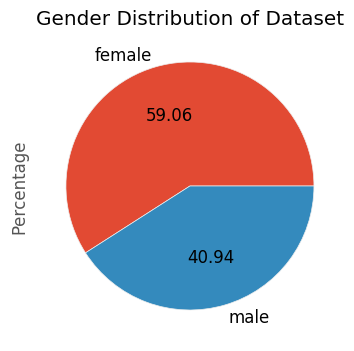


Before we begin, let’s take a look at the distribution of females and males within in our dataset. From the pie chart above, we can see that 59% of our subjects are female and about 41% are males. 

<h3> Data Preparation </h3>

Since we are comparing the Females and Males within our dataset, we will subset the females and males into their individual dataset. Furthermore, we will be using the following columns:

<ul class="task-list">
<li>I take my time to make decision. - 'Decision making'</li>
<li>I try to give as much as I can to other people at Christmas. - 'Giving'</li>
<li>I always give to charity. - 'Charity'</li>
<li>I save all the money I can. - 'Finances'</li>
<li>I prefer branded clothing to non branded. - 'Branded clothing'</li>
<li>I spend a lot of money on  partying and socializing. - 'Entertainment spending'</li>
<li>I spend a lot of money on my appearance. - 'Spending on looks'</li>
<li>I spend a lot of money on gadgets. - 'Spending on gadgets'</li>
<li>I will hapilly pay more money for good, quality or healthy food. - 'Spending on healthy eating'</li>
</ul>


```python
gender_col = ["Decision making", "Giving", "Charity", "Finances", "Branded clothing", "Entertainment spending", "Spending on looks", "Spending on gadgets", "Spending on healthy eating"]
```


```python
f_data = y_data[y_data['Gender'] == 'female'][gender_col]
f_data.shape
```


    (593, 9)


```python
m_data = y_data[y_data['Gender'] == 'male'][gender_col]
m_data.shape
```


    (411, 9)


```python
f_total = f_data.count()
print f_total
```

    Decision making               592
    Giving                        589
    Charity                       593
    Finances                      591
    Branded clothing              591
    Entertainment spending        592
    Spending on looks             592
    Spending on gadgets           593
    Spending on healthy eating    592
    dtype: int64


```python
m_total = m_data.count()
print m_total
```

    Decision making               409
    Giving                        409
    Charity                       408
    Finances                      410
    Branded clothing              411
    Entertainment spending        409
    Spending on looks             409
    Spending on gadgets           411
    Spending on healthy eating    410
    dtype: int64


As we can see from the above female data count and male data count, we have different numbers (frequency) for each columns and there are more females than males (as we stated in the above pie chart too). Therefore, to properly compare the female and male data, we have to convert the count to percentages.

First, we will create study_col, a new dataframe that will consist the total number of each response from onefive (onefive = ['Strongly Disagree', 'Disagree', 'Neutral', 'Agree', 'Strongly Agree']) in each column.


```python
study_col = list(f_data)
f_study = pd.DataFrame(0, index = xrange(1,6) ,columns = study_col)
m_study = pd.DataFrame(0, index = xrange(1,6) ,columns = study_col)
```

We will iterrate through both the female data and male data. We will add 1 to the column of the question it asks (and it belongs to) and the number of onefive that it responded will be the row index. We will be using try and except to catch NAs. If there is an NA, we will simply ignore it with continue.


```python
for index, row in f_data.iterrows():
    for y in study_col:
        try:
            f_study.loc[row[y],y] += 1
        except:
            continue
```


```python
for index, row in m_data.iterrows():
    for y in study_col:
        try:
            m_study.loc[row[y],y] += 1
        except:
            continue
```

Lets take a preview at our newly created dataframe.


```python
m_study.head()
```


<div>
<table border="1" class="dataframe">
  <thead>
    <tr style="text-align: right;">
      <th></th>
      <th>Decision making</th>
      <th>Giving</th>
      <th>Charity</th>
      <th>Finances</th>
      <th>Branded clothing</th>
      <th>Entertainment spending</th>
      <th>Spending on looks</th>
      <th>Spending on gadgets</th>
      <th>Spending on healthy eating</th>
    </tr>
  </thead>
  <tbody>
    <tr>
      <th>1</th>
      <td>34</td>
      <td>89</td>
      <td>156</td>
      <td>60</td>
      <td>55</td>
      <td>19</td>
      <td>55</td>
      <td>36</td>
      <td>16</td>
    </tr>
    <tr>
      <th>2</th>
      <td>90</td>
      <td>97</td>
      <td>120</td>
      <td>76</td>
      <td>50</td>
      <td>71</td>
      <td>101</td>
      <td>79</td>
      <td>54</td>
    </tr>
    <tr>
      <th>3</th>
      <td>152</td>
      <td>127</td>
      <td>95</td>
      <td>137</td>
      <td>99</td>
      <td>109</td>
      <td>118</td>
      <td>112</td>
      <td>116</td>
    </tr>
    <tr>
      <th>4</th>
      <td>76</td>
      <td>60</td>
      <td>30</td>
      <td>102</td>
      <td>122</td>
      <td>125</td>
      <td>88</td>
      <td>97</td>
      <td>132</td>
    </tr>
    <tr>
      <th>5</th>
      <td>57</td>
      <td>36</td>
      <td>7</td>
      <td>35</td>
      <td>85</td>
      <td>85</td>
      <td>47</td>
      <td>87</td>
      <td>92</td>
    </tr>
  </tbody>
</table>
</div>


Taking the column Decision making, we see that we have totaled up the respective one to five responses. However, this is not what we want to plot with. We want to plot with percentages, so we will convert each column's response to a percentage based on each column's total response.


Next, we created a function that will convert each column into it's percentage. This will use f_total and m_total from above that have the total amount of each column.


```python
def gender_study(df_s, df_t, x , y):
    """Input: df_s, dataframe, the dataframe that contains the total response count.
              df_t, list, the list that contains each column's total count.
              x, variable, the index of df_s to convert to a percentage
              y, variable, the index of df_s and df_t to convert to a percentage
              
       Function: Convert the x,y element of df_s to a percentage.
       
       Output: Nothing. Since python's parameter is a pointer, the pointer of df_s already changes the actual dataframe.
    """
    df_s.loc[x,y] = float(df_s.loc[x,y])/df_t[y]
    return None
```


```python
[gender_study(f_study, f_total, x,y) for x in xrange(1,6) for y in study_col]
f_study
```


<div>
<table border="1" class="dataframe">
  <thead>
    <tr style="text-align: right;">
      <th></th>
      <th>Decision making</th>
      <th>Giving</th>
      <th>Charity</th>
      <th>Finances</th>
      <th>Branded clothing</th>
      <th>Entertainment spending</th>
      <th>Spending on looks</th>
      <th>Spending on gadgets</th>
      <th>Spending on healthy eating</th>
    </tr>
  </thead>
  <tbody>
    <tr>
      <th>1</th>
      <td>0.082770</td>
      <td>0.134126</td>
      <td>0.333895</td>
      <td>0.109983</td>
      <td>0.201354</td>
      <td>0.119932</td>
      <td>0.092905</td>
      <td>0.215852</td>
      <td>0.042230</td>
    </tr>
    <tr>
      <th>2</th>
      <td>0.187500</td>
      <td>0.168081</td>
      <td>0.298482</td>
      <td>0.160745</td>
      <td>0.172589</td>
      <td>0.204392</td>
      <td>0.175676</td>
      <td>0.310287</td>
      <td>0.131757</td>
    </tr>
    <tr>
      <th>3</th>
      <td>0.314189</td>
      <td>0.285229</td>
      <td>0.284992</td>
      <td>0.370558</td>
      <td>0.306261</td>
      <td>0.341216</td>
      <td>0.302365</td>
      <td>0.244519</td>
      <td>0.278716</td>
    </tr>
    <tr>
      <th>4</th>
      <td>0.192568</td>
      <td>0.191851</td>
      <td>0.055649</td>
      <td>0.252115</td>
      <td>0.199662</td>
      <td>0.201014</td>
      <td>0.265203</td>
      <td>0.134907</td>
      <td>0.329392</td>
    </tr>
    <tr>
      <th>5</th>
      <td>0.222973</td>
      <td>0.220713</td>
      <td>0.026981</td>
      <td>0.106599</td>
      <td>0.120135</td>
      <td>0.133446</td>
      <td>0.163851</td>
      <td>0.094435</td>
      <td>0.217905</td>
    </tr>
  </tbody>
</table>
</div>


```python
[gender_study(m_study, m_total, x,y) for x in xrange(1,6) for y in study_col]
m_study
```


<div>
<table border="1" class="dataframe">
  <thead>
    <tr style="text-align: right;">
      <th></th>
      <th>Decision making</th>
      <th>Giving</th>
      <th>Charity</th>
      <th>Finances</th>
      <th>Branded clothing</th>
      <th>Entertainment spending</th>
      <th>Spending on looks</th>
      <th>Spending on gadgets</th>
      <th>Spending on healthy eating</th>
    </tr>
  </thead>
  <tbody>
    <tr>
      <th>1</th>
      <td>0.083130</td>
      <td>0.217604</td>
      <td>0.382353</td>
      <td>0.146341</td>
      <td>0.133820</td>
      <td>0.046455</td>
      <td>0.134474</td>
      <td>0.087591</td>
      <td>0.039024</td>
    </tr>
    <tr>
      <th>2</th>
      <td>0.220049</td>
      <td>0.237164</td>
      <td>0.294118</td>
      <td>0.185366</td>
      <td>0.121655</td>
      <td>0.173594</td>
      <td>0.246944</td>
      <td>0.192214</td>
      <td>0.131707</td>
    </tr>
    <tr>
      <th>3</th>
      <td>0.371638</td>
      <td>0.310513</td>
      <td>0.232843</td>
      <td>0.334146</td>
      <td>0.240876</td>
      <td>0.266504</td>
      <td>0.288509</td>
      <td>0.272506</td>
      <td>0.282927</td>
    </tr>
    <tr>
      <th>4</th>
      <td>0.185819</td>
      <td>0.146699</td>
      <td>0.073529</td>
      <td>0.248780</td>
      <td>0.296837</td>
      <td>0.305623</td>
      <td>0.215159</td>
      <td>0.236010</td>
      <td>0.321951</td>
    </tr>
    <tr>
      <th>5</th>
      <td>0.139364</td>
      <td>0.088020</td>
      <td>0.017157</td>
      <td>0.085366</td>
      <td>0.206813</td>
      <td>0.207824</td>
      <td>0.114914</td>
      <td>0.211679</td>
      <td>0.224390</td>
    </tr>
  </tbody>
</table>
</div>


Lets confirm we did this right. If we sum up all each columns in f_study and m_study, it should sum up to 1.


```python
f_study.sum()
```


    Decision making               1.0
    Giving                        1.0
    Charity                       1.0
    Finances                      1.0
    Branded clothing              1.0
    Entertainment spending        1.0
    Spending on looks             1.0
    Spending on gadgets           1.0
    Spending on healthy eating    1.0
    dtype: float64


```python
m_study.sum()
```


    Decision making               1.0
    Giving                        1.0
    Charity                       1.0
    Finances                      1.0
    Branded clothing              1.0
    Entertainment spending        1.0
    Spending on looks             1.0
    Spending on gadgets           1.0
    Spending on healthy eating    1.0
    dtype: float64


Confirm the data is converted to percentage since all of the data adds up to 1.
Now we are ready to analyze and plot.

## Young People and Saving Money

And before we dive into the spending of young people, let’s see how we can potentially find ways to help them save money.The opinions on saving as much money as possible are plotted, showing us how the opinions of males and females are fairly similar.

Since all our column's numeric response are between 1 to 5, we will set up the following for our plots:

Also, we will be ploting a side by side bar plot to show the different between female and male and have individual pie charts to show the distribution within the female and male dataset.


```python
bar_width = 0.3
bar_locations = np.arange(1,6)
```


```python
plt.bar(bar_locations, f_study['Finances'], bar_width, color = 'orangered', label = 'Female')
plt.bar(bar_locations - bar_width, m_study['Finances'], bar_width, color='b', label = 'Male')
plt.legend(["Female", "Male"], loc = 'upper left')
plt.xlabel('Opinion on saving as much money as possible (1 disagree, 5 agree)')
plt.ylabel('Percentage')
plt.title('Opinion on saving as much money as possible between Male and Female ')
plt.show()
```


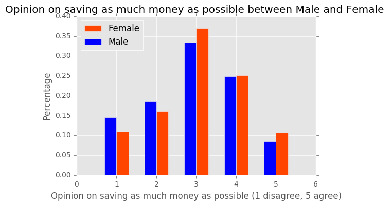


However, if we are to look at the individual percentages of responses between males and females,below, we see that 35.87% of females and 33.42% agree or strongly agree with saving as much money as possible. That’s roughy one third of of each gender group. We can then take this information and advise banks to target both females and males equally because it appears that among young people, a good portion of each gender feels the need to save money.


```python
plt.subplot(1,2,1)
f_study['Finances'].plot.pie(labels = onefive, autopct = '%.2f', fontsize = 12, figsize = (12,5))
plt.ylabel('Percentage')
plt.title('Female\'s opinion on saving as much money')
plt.subplot(1,2,2)
m_study['Finances'].plot.pie(labels = onefive, autopct = '%.2f', fontsize = 12, figsize = (12,5))
plt.ylabel('')
plt.title('Male\'s opinion on saving as much money')
plt.show()
```


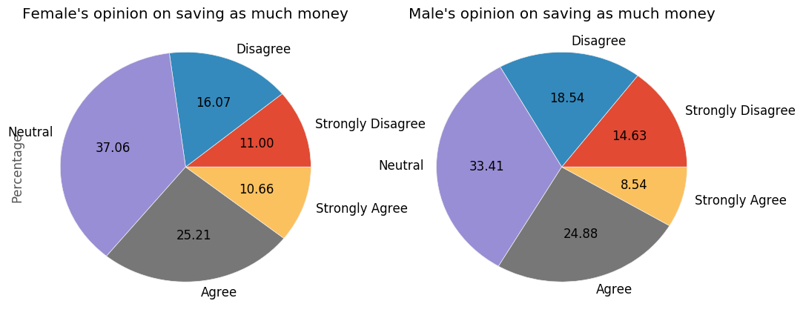


## Decision Making Opinions of Each Gender

Now let’s delve into something that may not be intuitively related to spending - decision making. For our purposes, since our data is in a categorical format, we will be mainly focusing on responses that are “agree” and “strongly agree.” From he bar graph below, we can see that females agree more strongly on the need to take time when making decisions. 


```python
plt.bar(bar_locations, f_study['Decision making'], bar_width, color = 'tomato', label = 'Female')
plt.bar(bar_locations - bar_width, m_study['Decision making'], bar_width, color='c', label = 'Male')
plt.legend(["Female", "Male"], loc = 'upper left')
plt.xlabel('Opinion on taking time to make decisions (1 disagree, 5 agree)')
plt.ylabel('Percentage')
plt.title('Opinion on taking time to make decisions between Male and Female ')
plt.show()
```


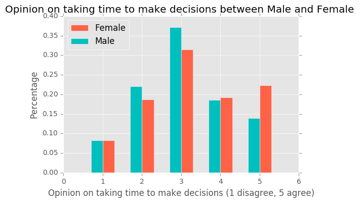


Further breakdown of the decisions in the pie charts below between each gender shows us that combined 41.56% of females agree or strongly agree on the need to take time when making a decision compared to 32.52% of males that agree or strongly agree. Now what can we do with this seemingly broad information? Well we can advise companies to target males with more time sensitive ads and promotions. Companies frequently email out promotions about how a sale or promotional code will be expiring soon, so one possible course of action is to target males with this kind of advertisement. Companies that sell men’s clothing in store can also be advised to hold shorter sales since the time sensitivity of the sales could encourage males to feel the urgency to purchase clothing. 


```python
plt.subplot(1,2,1)
f_study['Decision making'].plot.pie(labels = onefive, autopct = '%.2f', fontsize = 12, figsize = (12,5))
plt.ylabel('Percentage')
plt.title('Female\'s opinion on time to make decision')
plt.subplot(1,2,2)
m_study['Decision making'].plot.pie(labels = onefive, autopct = '%.2f', fontsize = 12, figsize = (12,5))
plt.ylabel('')
plt.title('Male\'s opinion ontime to make decision')
plt.show()
```


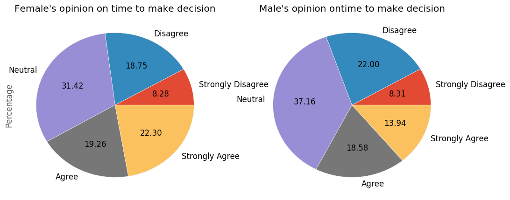


## Young People and Their Opinions on Giving to Charity

Let’s now look at how young females and males feel about giving to charity. We frequently see ads on the side of the road and on television about giving to different charities such as animal shelters and the Salvation army, but how do young people potentially feel about them? From the figure below, it appears that most people do not have a high opinion on giving to charity. Most responses recorded have a negative response to always giving to charity.


```python
plt.bar(bar_locations, f_study['Charity'], bar_width, color = 'firebrick', label = 'Female')
plt.bar(bar_locations - bar_width, m_study['Charity'], bar_width, color='steelblue', label = 'Male')
plt.legend(["Female", "Male"], loc = 'upper right')
plt.xlabel('Opinion on always giving to charity (1 disagree, 5 agree)')
plt.ylabel('Percentage')
plt.title('Opinion on always giving to charity between Male and Female ')
plt.show()
```


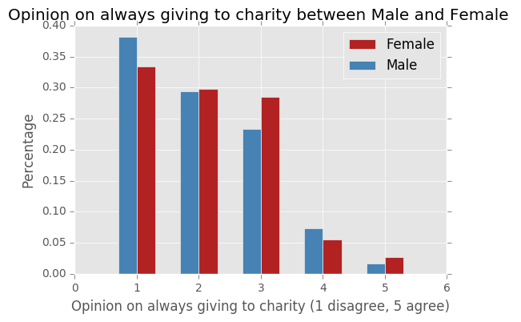


Breaking this down by gender in below, both genders have a very similar opinion on always giving to charity. Less than 10% of each gender agrees or strongly agrees with giving to charity. Moving forward, we can advise charities to perhaps spend less on advertising to younger demographics and instead focus on building stronger relationships with current donors that are known to consistently donate. 


```python
plt.subplot(1,2,1)
f_study['Charity'].plot.pie(labels = onefive, autopct = '%.2f', fontsize = 12, figsize = (12,5))
plt.ylabel('Percentage')
plt.title('Female\'s opinion on giving to Charity')
plt.subplot(1,2,2)
m_study['Charity'].plot.pie(labels = onefive, autopct = '%.2f', fontsize = 12, figsize = (12,5))
plt.ylabel('')
plt.title('Male\'s opinion on giving to Charity')
plt.show()
```


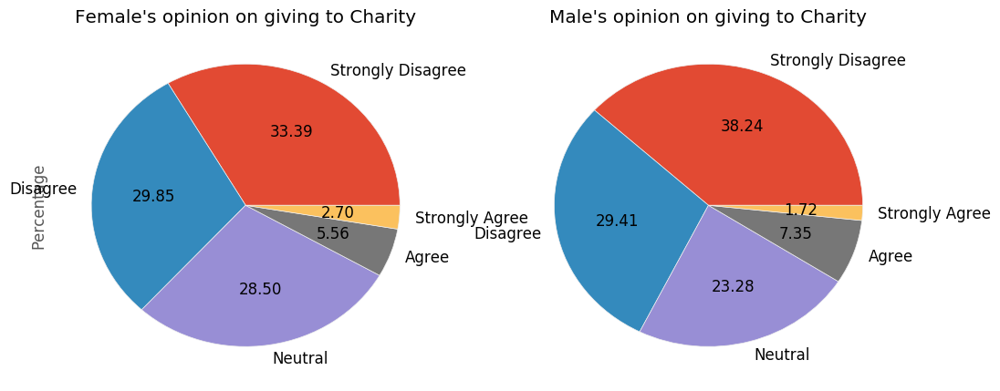


## Which Gender Spends More on Christmas Gifts?

Next, let’s look into holiday spending between females and males. From the bar graphs below, it appears that females have a stronger opinion of giving during Christmas compared to males.


```python
plt.bar(bar_locations, f_study['Giving'], bar_width, color = 'r', label = 'Female')
plt.bar(bar_locations - bar_width, m_study['Giving'], bar_width, color='aqua', label = 'Male')
plt.legend(["Female", "Male"], loc = 'upper right')
plt.xlabel('Opinion on giving as much as possible at Christmas (1 disagree, 5 agree)')
plt.ylabel('Percentage')
plt.title('Opinion on giving during Christmas between Male and Female ')
plt.show()
```


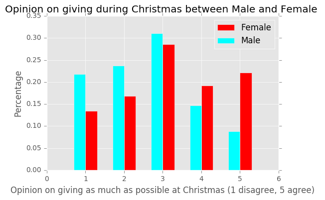


Breaking down this data by the percentage of responses for each gender below, we see that 41.26% of females agree or strongly agree with the need to give during Christmas, compared to 23.47% of men. From this, we can advise companies to have more female related promotions. Companies that have a larger female audience such as Sephora, Lulu Lemon, H&M can send more holiday ads and promotions to females through email, youtube ads, and in the mail.


```python
plt.subplot(1,2,1)
f_study['Giving'].plot.pie(labels = onefive, autopct = '%.2f', fontsize = 12, figsize = (12,5))
plt.ylabel('Percentage')
plt.title('Female\'s opinion on giving on Christmas')
plt.subplot(1,2,2)
m_study['Giving'].plot.pie(labels = onefive, autopct = '%.2f', fontsize = 12, figsize = (12,5))
plt.ylabel('')
plt.title('Male\'s opinion on giving on Christmas')
plt.show()
```


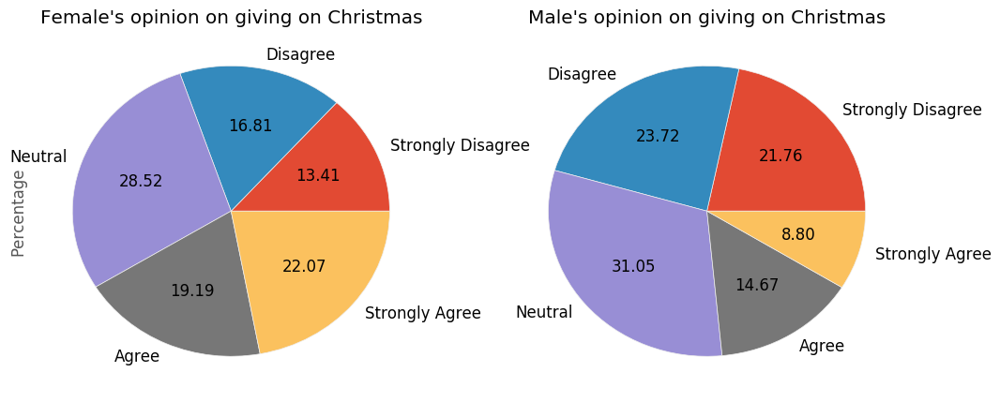


## Which Gender Spends More on Branded Clothing?

So what about clothing? Below, we see that males tend to have a higher of preference of branded clothing compared to females. 


```python
plt.bar(bar_locations, f_study['Branded clothing'], bar_width, color = 'r', label = 'Female')
plt.bar(bar_locations - bar_width, m_study['Branded clothing'], bar_width, color='b', label = 'Male')
plt.legend(["Female", "Male"], loc = 'upper left')
plt.xlabel('Preferrance on branded clothing (1 disagree, 5 agree)')
plt.ylabel('Percentage')
plt.title('Preferrance on branded clothing between Male and Female ')
plt.show()
```


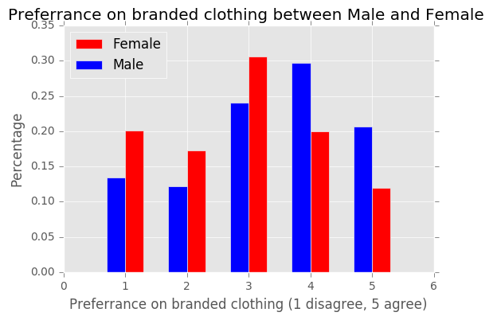


We see from the percentages that 50.36% of females agree or strongly agree with spending on branded clothing compared to 31.98% of females. Knowing this, we can now advise higher end fashion labels to target males more than females when it comes to advertising. Furthermore, high end fashion labels can perhaps focus more on Men’s trends for a season or offer more promotions for men’s clothing.


```python
plt.subplot(1,2,1)
f_study['Branded clothing'].plot.pie(labels = onefive, autopct = '%.2f', fontsize = 12, figsize = (12,5))
plt.ylabel('Percentage')
plt.title('Female\'s opinion on Branded clothing')
plt.subplot(1,2,2)
m_study['Branded clothing'].plot.pie(labels = onefive, autopct = '%.2f', fontsize = 12, figsize = (12,5))
plt.ylabel('')
plt.title('Male\'s opinion on Branded clothing')
plt.show()
```


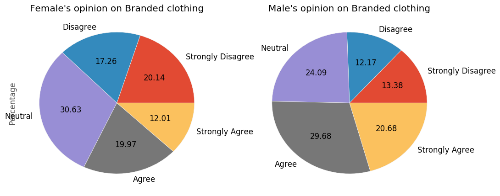


## Which Gender Spends More on Looks?

Now that we’ve covered clothing, one can’t help but wonder which gender might spend more on looks in general. The graph below shows us that it’s females that have a higher opinion on spending on looks. 


```python
plt.bar(bar_locations, f_study['Spending on looks'], bar_width, color = 'sienna', label = 'Female')
plt.bar(bar_locations - bar_width, m_study['Finances'], bar_width, color='royalblue', label = 'Male')
plt.legend(["Female", "Male"], loc = 'upper left')
plt.xlabel('Opinion on spending a lot of money on looks (1 disagree, 5 agree)')
plt.ylabel('Percentage')
plt.title('Opinion on spending a lot of money on looks between Male and Female ')
plt.show()
```


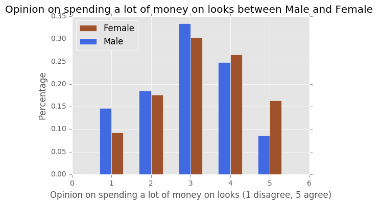


To be more precise, according to the pie charts below, 42.91% of females compared to 33.01% of males agree or strongly agree with spending money on looks. This is something we may have already intuitively known from female stereotypes, but now that we have data on female spending on looks, we can advise skincare and makeup companies such as Kiehl’s, Sephora, Ulta, etc. to focus in on a female audience when it comes to advertisements. If we were to advise a skincare and makeup company further, one course of action could be to do further research on the current and upcoming trends in skincare and makeup. 


```python
plt.subplot(1,2,1)
f_study['Spending on looks'].plot.pie(labels = onefive, autopct = '%.2f', fontsize = 12, figsize = (12,5))
plt.ylabel('Percentage')
plt.title('Female\'s opinion Spending on looks')
plt.subplot(1,2,2)
m_study['Spending on looks'].plot.pie(labels = onefive, autopct = '%.2f', fontsize = 12, figsize = (12,5))
plt.ylabel('')
plt.title('Male\'s opinion Spending on looks')
plt.show()
```


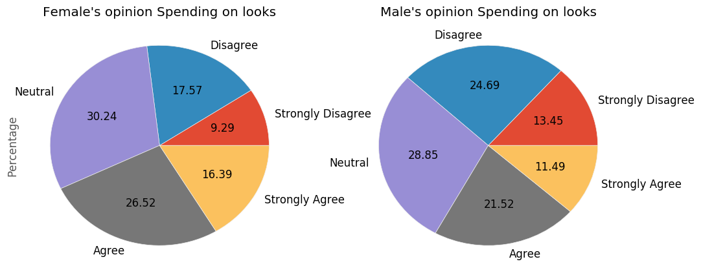


## Which Gender Spends More on Entertainment?

Transitioning to entertainment industry, let’s see which gender has a higher opinion of spending on entertainment. Below, we see that it seems it is males that hold a higher opinion on spending on entertainment.


```python
plt.bar(bar_locations, f_study['Entertainment spending'], bar_width, color = 'red', label = 'Female')
plt.bar(bar_locations - bar_width, m_study['Finances'], bar_width, color='lightskyblue', label = 'Male')
plt.legend(["Female", "Male"], loc = 'upper right')
plt.xlabel('Opinion on spending a lot of money on entertainment (1 disagree, 5 agree)')
plt.ylabel('Percentage')
plt.title('Opinion on spending a lot of money on entertainment between Male and Female ')
plt.show()
```


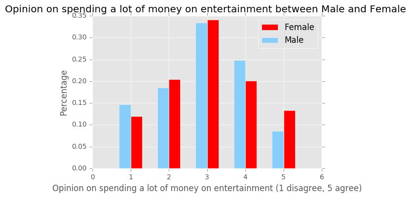


By percentage, 51.34% of men compared to 33.44% of women agree or disagree on spending on entertainment. This information could be particularly useful for movie theatres, concert venues, comedy clubs, and other businesses that are primarily involved in entertainment that can now potentially allocate more resources towards targeting males in their advertising of upcoming events. 


```python
plt.subplot(1,2,1)
f_study['Entertainment spending'].plot.pie(labels = onefive, autopct = '%.2f', fontsize = 12, figsize = (12,5))
plt.ylabel('Percentage')
plt.title('Female\'s opinion on Entertainment spending')
plt.subplot(1,2,2)
m_study['Entertainment spending'].plot.pie(labels = onefive, autopct = '%.2f', fontsize = 12, figsize = (12,5))
plt.ylabel('')
plt.title('Male\'s opinion on Entertainment spending')
plt.show()
```


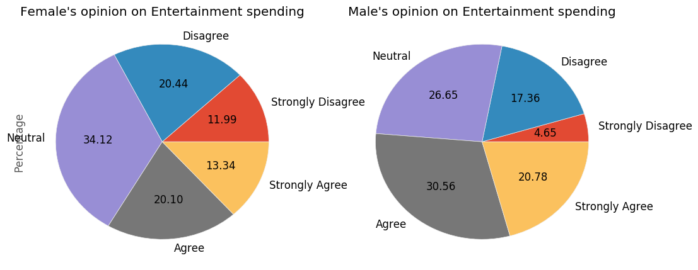


## Which Gender Spends More on Gadgets?

With the technology industry being one of the biggest and fastest growing industries, many technology companies may want to know who to target. Intuitively, it may seem obvious that men have a larger preference for gadgets than females, but it is important to also assess the size of the female audience. The bar graph shows us that males tend to spend more money on gadgets, but let’s take a look at the percentage breakdowns.


```python
plt.bar(bar_locations, f_study['Spending on gadgets'], bar_width, color = 'firebrick', label = 'Female')
plt.bar(bar_locations - bar_width, m_study['Finances'], bar_width, color='darkcyan', label = 'Male')
plt.legend(["Female", "Male"], loc = 'upper right')
plt.xlabel('Opinion on spending a lot of money on gadgets (1 disagree, 5 agree)')
plt.ylabel('Percentage')
plt.title('Opinion on spending a lot of money on gadgets between Male and Female ')
plt.show()
```


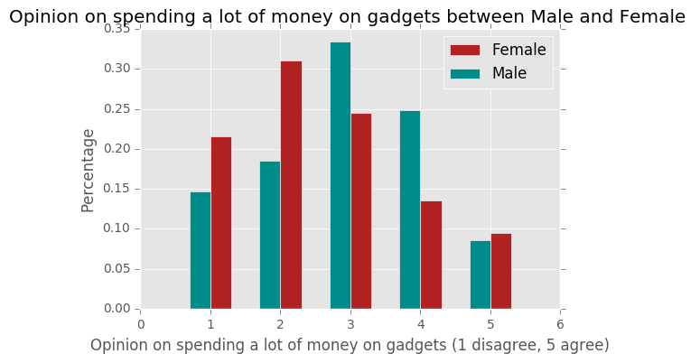


The pie chart percentages show us that 44.77% of males and  22.93% of females agree or strongly disagree with spending on gadgets. While the male audience is indeed twice as large as the female audience, we now know that about one in five women holds a strong opinion on spending on gadgets. Companies can now be advised to spend more money on advertising to males, but to also allocate a decent amount of money to advertise gadgets to females as well. 


```python
plt.subplot(1,2,1)
f_study['Spending on gadgets'].plot.pie(labels = onefive, autopct = '%.2f', fontsize = 12, figsize = (12,5))
plt.ylabel('Percentage')
plt.title('Female\'s opinion on Spending on gadgets')
plt.subplot(1,2,2)
m_study['Spending on gadgets'].plot.pie(labels = onefive, autopct = '%.2f', fontsize = 12, figsize = (12,5))
plt.ylabel('')
plt.title('Male\'s opinion on Spending on gadgets')
plt.show()
```


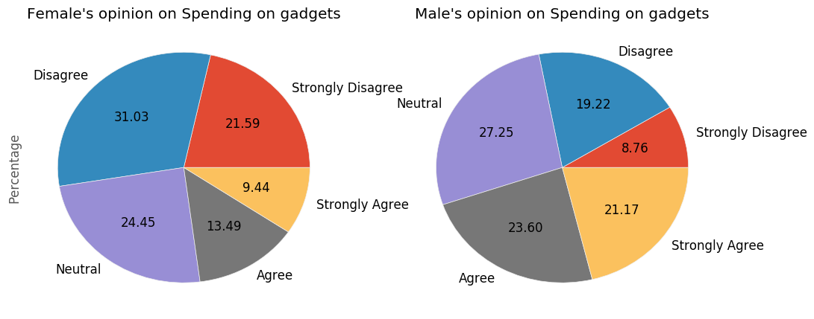


## Which Gender Spends More on Healthy Eating?

Finally, let’s take a look at healthy eating preferences between females and males. Our graph shows us that females are more likely to spend on healthy eat compared to males. 


```python
plt.bar(bar_locations, f_study['Spending on healthy eating'], bar_width, color = 'red', label = 'Female')
plt.bar(bar_locations - bar_width, m_study['Finances'], bar_width, color='deepskyblue', label = 'Male')
plt.legend(["Female", "Male"], loc = 'upper left')
plt.xlabel('Opinion on spending a lot of money on healthy eating (1 disagree, 5 agree)')
plt.ylabel('Percentage')
plt.title('Opinion on spending a lot of money on healthy eating between Male and Female ')
plt.show()
```


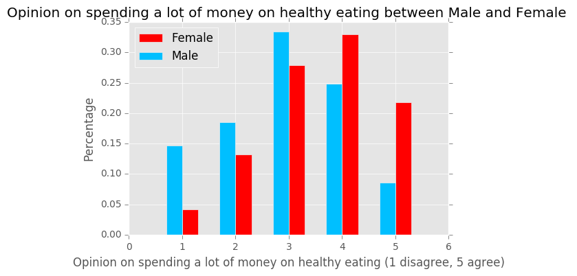


A further look at the breakdown of responses below tells us that 54.73% of females and 53.64% of males agree or strongly agree with spending on healthy eating. We can now advise companies to target wellness ads more towards females whether it be meal plans, athletic clothing, gadgets, etc. We will look further into the spending of healthy individuals in our next section. 


```python
plt.subplot(1,2,1)
f_study['Spending on healthy eating'].plot.pie(labels = onefive, autopct = '%.2f', fontsize = 12, figsize = (12,5))
plt.ylabel('Percentage')
plt.title('Female\'s opinion on Spending on healthy eating')
plt.subplot(1,2,2)
m_study['Spending on healthy eating'].plot.pie(labels = onefive, autopct = '%.2f', fontsize = 12, figsize = (12,5))
plt.ylabel('')
plt.title('Male\'s opinion on Spending on healthy eating')
plt.show()
```


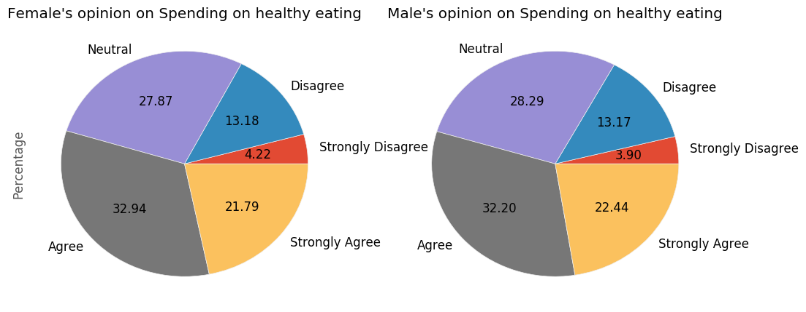


```python

```


```python

```


```python

```

<h1> Health Analysis</h1>

Here we will analysis on youngster's health. For this section, we will be working extensive with the following columns:

<ul class="task-list">
<li>I live a very healthy lifestyle. - 'Healthy eating'</li>
<li>Smoking habits - 'Smoking'</li>
<li>Drinking - 'Alcohol'</li>
<li>I worry about my health - 'Health'</li>
<li>I will happily pay more money for good, quality or healthy food. - 'Spending on healthy eating'</li>
<li>Sport and leisure activities - 'Passive sport'</li>
<li>Sport at competitive level - 'Active sport'</li>
<li>Adrenaline sports - 'Adrenaline sports'</li>
</ul>

First, we will subset these columns.


```python
health_an = y_data[['Healthy eating', 'Health', 'Smoking', 'Alcohol', 'Spending on healthy eating', 'Passive sport', 'Active sport', 'Adrenaline sports']]
```

We are going to convert the smoking and alcohol responses to numerical values. 0 being 'never' and 5 being 'a lot'
First, lets take a look at the unique responses of the 'Smoking' and 'Alcohol' section.


```python
smoking_id = y_data['Smoking'].unique()
alc_id = y_data['Alcohol'].unique()
print smoking_id, '\n', alc_id
```

    ['never smoked' 'tried smoking' 'former smoker' 'current smoker' nan] 
    ['drink a lot' 'social drinker' 'never' nan]


```python
life_dict = {'never smoked': 5, 'tried smoking': 4, 'former smoker': 2, 'current smoker': 0,'never': 5, 'social drinker': 3, 'drink a lot': 0}
```

Using the dictionary above, we will convert the smoking and alcohol into numeric and add these two values together. We will iterate through the y_data by rows, and then add add a column, 'Life Health', to indicate the score we give them for "How healthy they are" according to their smoking and drinking habits.


```python
for index, row in health_an.iterrows():
    try:
        val = life_dict[row['Alcohol']] + life_dict[row['Smoking']]
        health_an.loc[index,'Life health'] = val
    except:
        health_an.loc[index,'Life health'] = np.nan
    
```


```python
health_an.head()
```


<div>
<table border="1" class="dataframe">
  <thead>
    <tr style="text-align: right;">
      <th></th>
      <th>Healthy eating</th>
      <th>Health</th>
      <th>Smoking</th>
      <th>Alcohol</th>
      <th>Spending on healthy eating</th>
      <th>Passive sport</th>
      <th>Active sport</th>
      <th>Adrenaline sports</th>
      <th>Life health</th>
    </tr>
  </thead>
  <tbody>
    <tr>
      <th>0</th>
      <td>4.0</td>
      <td>1.0</td>
      <td>never smoked</td>
      <td>drink a lot</td>
      <td>3.0</td>
      <td>1.0</td>
      <td>5.0</td>
      <td>4.0</td>
      <td>5.0</td>
    </tr>
    <tr>
      <th>1</th>
      <td>3.0</td>
      <td>4.0</td>
      <td>never smoked</td>
      <td>drink a lot</td>
      <td>2.0</td>
      <td>1.0</td>
      <td>1.0</td>
      <td>2.0</td>
      <td>5.0</td>
    </tr>
    <tr>
      <th>2</th>
      <td>3.0</td>
      <td>2.0</td>
      <td>tried smoking</td>
      <td>drink a lot</td>
      <td>2.0</td>
      <td>5.0</td>
      <td>2.0</td>
      <td>5.0</td>
      <td>4.0</td>
    </tr>
    <tr>
      <th>3</th>
      <td>3.0</td>
      <td>1.0</td>
      <td>former smoker</td>
      <td>drink a lot</td>
      <td>1.0</td>
      <td>1.0</td>
      <td>1.0</td>
      <td>1.0</td>
      <td>2.0</td>
    </tr>
    <tr>
      <th>4</th>
      <td>4.0</td>
      <td>3.0</td>
      <td>tried smoking</td>
      <td>social drinker</td>
      <td>4.0</td>
      <td>3.0</td>
      <td>1.0</td>
      <td>2.0</td>
      <td>7.0</td>
    </tr>
  </tbody>
</table>
</div>


Since Life Health will consist of NA if either smoking or alcohol is NA, and we can not compare it with healthy eating if either are NA, we will drop all the rows with NA in Life Health or Healthy eating


```python
health_an = health_an.dropna()
```


```python
health_an = health_an[np.isfinite(health_an['Life health'])].reset_index()
health_an = health_an[np.isfinite(health_an['Healthy eating'])].reset_index()
```

<strong> Now we are finished preparing for our analysis </strong>

One of the goals was to convert student's lifestyles into qualitative data that could be used for better advertising. When asked to evaluate their own health, the majority of the young people believed that they lived moderately healthy lifestyles (a score of 3 or above). This is an important starting point because the data from Figure 1 visualizes that more than half of the sample felt this way. The next objective was to split the sample into four categories based upon their response about their smoking habits. These four habits were later faceted and the results regarding their personal opinion of their health was plotted again. 

We will create a histogram on youngster's opinion on being healthy.'


```python
health_an.hist(column='Healthy eating', bins=np.arange(1, 7, 1),figsize = (5,5))
plt.xlabel('Score on being healthy (1 disagree, 5 agree)')
plt.ylabel('Frequency')
plt.title('Youngster\'s opinion on being healthy')
plt.show()
```


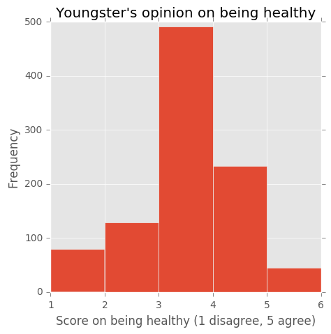


Surprisingly most of the survey correspondents were not as concerned with health and lifestyle choices and we would have expected. Because more than half off the results had an opinion of ‘3’ or moderate concern over health. This led our group to analyze whether student’s opinion on health and their own personal health scores had any sort of relationship. In the figure below,  the main area of interest were people that were worried about health (scores 3-5) and not worried about health (scores 1-2). It is hypothesized that those that have little concern over health would have worse health. There is some ambiguity in the overall results of this test, but it looks like those that did not worry about health tended to have lower health.  

Using the 'Life Health' column we created that scores the youngster's health according to their smoking and drinking habits, we will create a boxplot that compares how much the youngster worries about their health vs what we think their health habits are.


```python
health_an.boxplot(column='Life health', by='Health', vert=False,figsize = (10,5))
plt.xlabel('Total score on health (1 not healthy, 10 very healthy)')
plt.ylabel('Worrying about health (1 not worried, 5 very worried)')
plt.title('Worried about health vs health habit')
plt.suptitle('')
plt.show()
```


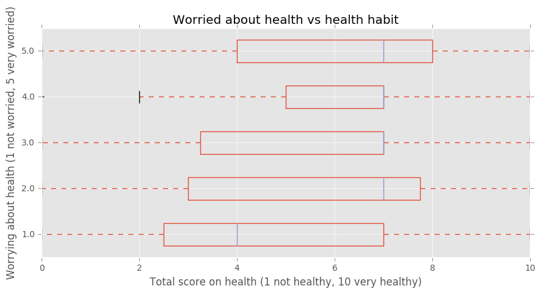


According to the Center for Disease Control and Prevention, the Tobacco industry spends billions of dollars a year towards marketing and has continued to see a steady rate of cigarette purchases around the globe. The percentage of Slovakian children abusing tobacco is 23.2% for males and 23% for females. This is particularly alarming because this percentage is higher in than the average percentage of children smoking in high-income countries. 


```python
plt.rcParams['figure.figsize'] = (8,8)
health_an.hist(column='Healthy eating', by='Smoking', color = 'orange', bins=np.arange(1, 7, 1))
plt.ylim((0,250))
plt.xlabel('Score on being healthy (1 disagree, 5 agree)')
plt.ylabel('Frequency')
plt.show()
```


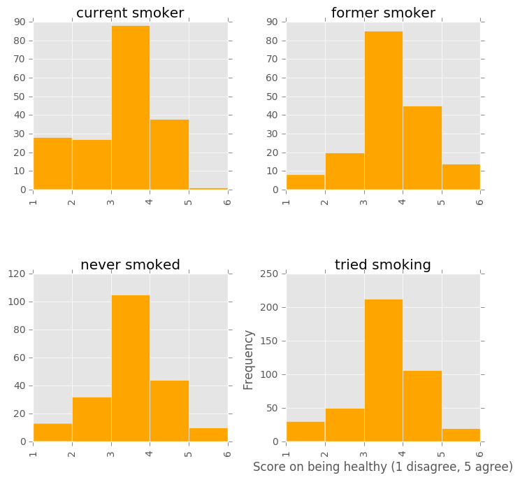


The first observation is that the largest group is the one where people said they had tried smoking. And similar to the combined data, all of the groups felt that they had moderate health levels of 3. However, it is important to note that for current smokers, none of them believed that they were very healthy (score of 5). Because the data could be split into two groups of smokers vs non-smokers, further research into the spending habits and personality traits of these groups was needed.


```python
y_data.hist(column='Spending on healthy eating', bins=np.arange(1, 7, 1), figsize = (5,5))
plt.xlabel('Score on spending a lot of money on healthy eating (1 disagree, 5 agree)')
plt.ylabel('Frequency')
plt.title('Youngster\'s spending on healthy eating')
plt.show()
```


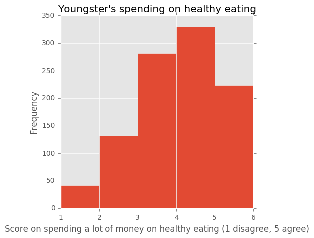


Young people’s spending habits on food was particularly interesting because food expenses are a major portion of people’s expenses. From the USDA, it was reported that in 2013 around 10% of people’s per capita disposable income was spent on food away from home or food at home. According to the figure above, it appears that this demographic is willing to spend money for healthier foods. Slightly more than 50% of the survey participants indicated they were willing to spend money on healthier types of food. 

Next, we want to look at smoker's interest in active sports. We will categorize smokers are someone who is a former smoker or current smoker and subset them


```python
smokers = health_an[health_an['Smoking'].str.contains('smoker', na = False)][['Alcohol', 'Spending on healthy eating', 'Passive sport', 'Active sport']]
```


```python
smokers.hist(column='Active sport', bins=np.arange(1, 7, 1), figsize = (5,5), color = 'Grey',normed = 1)
plt.xlabel('Score on Interest in Active Sports by Smokers (1 disagree, 5 agree)')
plt.ylabel('Frequency')
plt.title('Smoker\'s Interest in Active Sports')
plt.show()
```


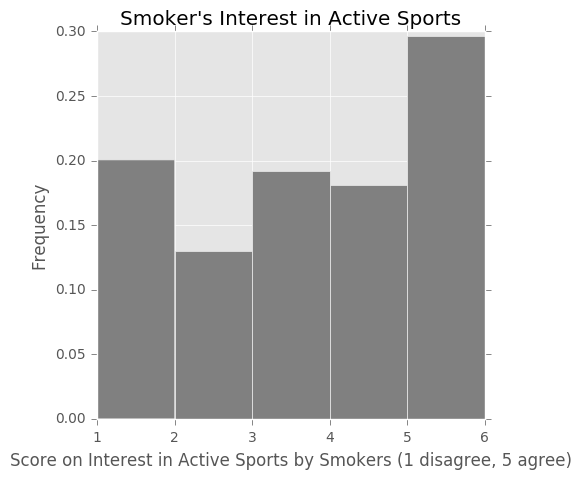


From this we see that smoker’s personal interests are in athletic events. Surprisingly, major interest in sports was the response with the highest frequency. Nearly 50% of the respondents indicated an interest level of 4 or 5. This just goes to show that regardless of their personal choices, sports are an important component of their day. 

<h3> Health Interpertation </h3>

Next, we want to look at youngsters who we categorized as living a healthy life style, according to the 'Life health' Column we created based on their smoking and drinking habits. We will create a subset of these healthier youngsters.


```python
health_sport = health_an[health_an['Life health'] > 6][['Passive sport','Spending on healthy eating', 'Active sport', 'Adrenaline sports']]
```

We will create a histogram that takes a look at this subsets and how willing are these healthier youngsters willing to spend on healthy eating.


```python
health_sport.hist(column='Spending on healthy eating', bins=np.arange(1, 7, 1), figsize = (5,5), color = 'Blue',normed=1)
plt.xlabel('Spending on Healthy Eating (1 disagree, 5 agree)')
plt.ylabel('Frequency')
plt.title('Healthy People\'s Spending on Healthy Eating')
plt.show()
```


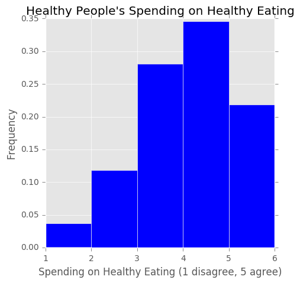


Since the target demographic is willing to spend their income on healthier foods, there is a demand for these products. From the figures below, one can see that the willingness to spend on healthy food (scores 4 or 5) are higher for healthy people compared to smoker’s.  


```python
smokers.hist(column='Spending on healthy eating', bins=np.arange(1, 7, 1), figsize = (5,5), color = 'Grey',normed = 1)
plt.xlabel('Spending on Healthy Eating (1 disagree, 5 agree)')
plt.ylabel('Frequency')
plt.title('Smoker\'s Spending on Healthy Eating')
plt.show()
```


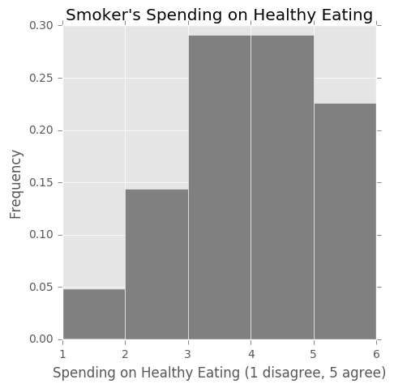


Now with this information, a business can gear advertisements towards this demographic of people. High quality grocery stores such as Whole Food could promote their products n fitness centers or athletic sporting events. This is beneficial since we learned above that the age demographic spends a large portion of their income towards food expenditures. 

While tobacco is a very controversial industry, these businesses can use the cultural information to make better advertising decision. They can spend more money towards advertising in popular Slovakian sports such as Soccer and Ice hockey. The promotion of tobacco through sports may seem counter intuitive, but the widespread cultural popularity of athletic competition may be too profitable to pass on. 


```python

```


```python

```

# Village vs City

As consultants for an advertising firm, we strive to efficiently allocate spending at any demographic. With a diverse dataset at hand, we decided to divide the groups of young people by the area they reside in. The first step was to split the necessary responses by whether a person was a village resident or a city resident. It can be seen that approximately _70%_ of young people live in cities and about _30%_ reside in villages.   


```python
y_data['Village - town'].value_counts().plot.pie(labels = ['city','village'], autopct = '%.2f', fontsize = 12, figsize = (4,4))
plt.ylabel('Percentage')
plt.title('Village - City Distribution')
plt.show()
```


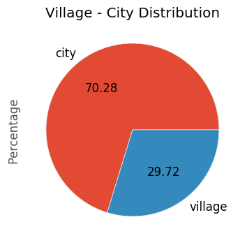


<h3> Data Preparation </h3>

Similar to our previous analysis between Male and Female, we will take the same approach for youngsters from Village and City. We will subset our data into village and city. Furthermore, we will be working with the following columns:

<ul class="task-list">
<li>How much time do you spend online? - 'Internet usage'</li>
<li>Enjoy going to Theatre - 'Theatre'</li>
<li>I prefer branded clothing to non branded. - 'Branded clothing'</li>
<li>I spend a lot of money on my appearance. - 'Spending on looks'</li>
</ul>


```python
vc_columns = ['Internet usage', 'Theatre', 'Spending on looks', 'Branded clothing']
```


```python
v_data = y_data[y_data['Village - town'] == 'village'][vc_columns]
v_data = v_data.reset_index(drop = True)
```


```python
c_data = y_data[y_data['Village - town'] == 'city'][vc_columns]
c_data = c_data.reset_index(drop = True)
```


```python
y_data['Internet usage'].unique()
```


    array(['few hours a day', 'most of the day', 'less than an hour a day',
           'no time at all'], dtype=object)


Since the 'Internet usage' column responses are categorical, we will be treating this column separately by adding up each category with value_counts() and then dividing by the length. <strong> Note: </strong> The reason we are doing the dataframe for the columns with numerical responses differently is because the value_counts() method will sort the result in descending order of the count. For the 1 to 5 responses, we want to keep our order from 1 to 5 so our plot will be organized better, hence we will be using a loop (such as before) and below.


```python
c_len = len(c_data['Internet usage'])
v_len = len(v_data['Internet usage'])
```


```python
v_int = v_data['Internet usage'].value_counts()/float(v_len)
c_int = c_data['Internet usage'].value_counts()/float(c_len)
```


```python
vc_col = ['Spending on looks', 'Branded clothing', 'Theatre']
c_study = pd.DataFrame(0, index = xrange(1,6), columns = vc_col)
v_study = pd.DataFrame(0, index = xrange(1,6), columns = vc_col)
```

We will iterrate through both the village data and city data. We will add 1 to the column of the question it asks (and it belongs to) and the number of onefive that it responded will be the row index. We will be using try and except to catch NAs. If there is an NA, we will simply ignore it with continue.


```python
for index, row in v_data.iterrows():
    for y in vc_col:
        try:
            v_study.loc[row[y],y] += 1
        except:
            continue
```


```python
for index, row in c_data.iterrows():
    for y in vc_col:
        try:
            c_study.loc[row[y],y] += 1
        except:
            continue
```


```python
v_total = v_study.sum(axis=0)
c_total = c_study.sum(axis=0)
```

Using the gender_study function we created back when we compared the female and male data, we will convert the village and city data from total count to percentages.


```python
[gender_study(v_study, v_total, x,y) for x in xrange(1,6) for y in vc_col]
v_study
```


<div>
<table border="1" class="dataframe">
  <thead>
    <tr style="text-align: right;">
      <th></th>
      <th>Spending on looks</th>
      <th>Branded clothing</th>
      <th>Theatre</th>
    </tr>
  </thead>
  <tbody>
    <tr>
      <th>1</th>
      <td>0.137124</td>
      <td>0.214765</td>
      <td>0.154362</td>
    </tr>
    <tr>
      <th>2</th>
      <td>0.234114</td>
      <td>0.147651</td>
      <td>0.221477</td>
    </tr>
    <tr>
      <th>3</th>
      <td>0.297659</td>
      <td>0.295302</td>
      <td>0.251678</td>
    </tr>
    <tr>
      <th>4</th>
      <td>0.214047</td>
      <td>0.184564</td>
      <td>0.208054</td>
    </tr>
    <tr>
      <th>5</th>
      <td>0.117057</td>
      <td>0.157718</td>
      <td>0.164430</td>
    </tr>
  </tbody>
</table>
</div>


```python
[gender_study(c_study, c_total, x,y) for x in xrange(1,6) for y in vc_col]
c_study
```


<div>
<table border="1" class="dataframe">
  <thead>
    <tr style="text-align: right;">
      <th></th>
      <th>Spending on looks</th>
      <th>Branded clothing</th>
      <th>Theatre</th>
    </tr>
  </thead>
  <tbody>
    <tr>
      <th>1</th>
      <td>0.099432</td>
      <td>0.155807</td>
      <td>0.161429</td>
    </tr>
    <tr>
      <th>2</th>
      <td>0.191761</td>
      <td>0.154391</td>
      <td>0.200000</td>
    </tr>
    <tr>
      <th>3</th>
      <td>0.295455</td>
      <td>0.276204</td>
      <td>0.264286</td>
    </tr>
    <tr>
      <th>4</th>
      <td>0.259943</td>
      <td>0.257790</td>
      <td>0.187143</td>
    </tr>
    <tr>
      <th>5</th>
      <td>0.153409</td>
      <td>0.155807</td>
      <td>0.187143</td>
    </tr>
  </tbody>
</table>
</div>


```python
v_study.sum(axis=0)
```


    Spending on looks    1.0
    Branded clothing     1.0
    Theatre              1.0
    dtype: float64


Once again we check that our function works by summing up each column to confirm that (since it is percentages) it adds up to one. It shows above that indeed it does add up to one.

Hence we are ready to analyze.

<h2> Internet Usage </h2>

There is an underlying assumption that city residents spend more time on the internet, because city residents have more direct access to more advanced technology.  As displayed on the figure below, when the participants were asked how much time they spent on the internet every day it is apparent that a vast majority of both demographics spend _a few hours a day_. While approximately the same amount of people from both villages and cities spend _less than 1 hour_ and _spend most of the day_ on the internet. Thus, the general distributions of internet time are the very similar. 

We will set up or bar_width and bar_locations. Since we want to display internet usage from highest to least (most of the day to no time), we will set our locations as 2,1,3,4


```python
bar_width = 0.4
bar_locations = np.array([2,1,3,4])
```


```python
hr_int = ['few hrs/day', 'most of the day', 'less than 1hr', 'no time']
plt.figure(figsize=(7,7))
plt.bar(bar_locations, v_int, bar_width, color = 'gold')
plt.bar(bar_locations - bar_width, c_int, bar_width, color='limegreen')
plt.xticks(bar_locations, hr_int)
plt.legend(["Village", "City"], loc = 'upper right')
plt.xlabel('Hours spend on the Internet per day')
plt.ylabel('Percentage')
plt.title('Hours spend on the Internet between village and city people ')
plt.show()
```


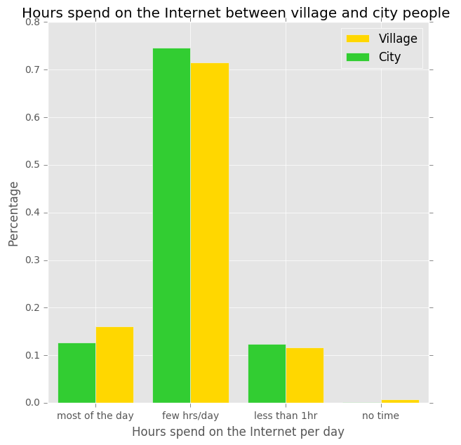


The distribution can be viewed more clearly on the charts in the figure below. It is interesting to note that very few people spend _no time_ on the internet.  As consultants, we take advantage of this information. As a vast majority of the population spends a hefty amount of their time on the internet, it would be very effective to advise an advertising firm to allocate a large amount of capital on internet advertisements.  

Thus, this would eliminate inefficient investments on other means of advertising.  The firm could thus explore different types of internet advertising, whether it be website ads, email ads, and even social media advertisements.  [Research](http://blog.cmglocalsolutions.com/social-media-advertising-efficient-spending-on-social-platforms) shows that online advertising is the most powerful advertisment method, where social media platforms such as twitter, facebook and instagram are sites where users most encounter online ads. 


```python
plt.subplot(1,2,1)
v_int.plot.pie(labels = hr_int, autopct = '%.2f', fontsize = 12, figsize = (12,5))
plt.ylabel('Percentage')
plt.title('Village\'s Hours spend on the Internet')
plt.subplot(1,2,2)
c_int.plot.pie(labels = hr_int, autopct = '%.2f', fontsize = 12, figsize = (12,5))
plt.ylabel('')
plt.title('City\'s Hours spend on the Internet')
plt.show()
```


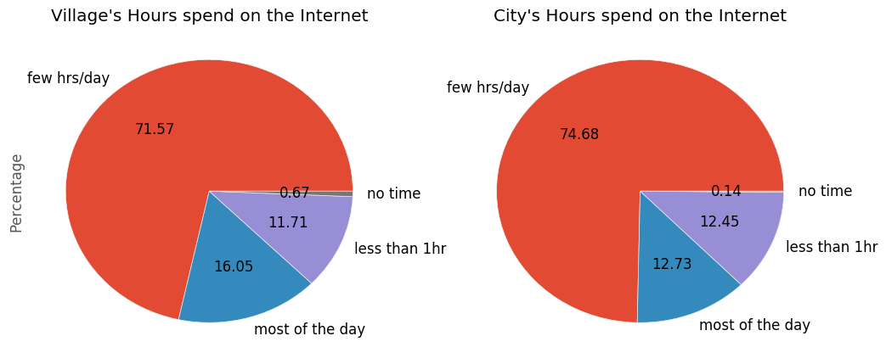


Now that we know how much time young people spend on the internet, we wanted to see the whether they also have a habit of spending on looks. We factored the level of young people’s spending on looks as: spending a significant amount on looks (5) to those who do not spend a significant amount of money on looks (1). From the bar chart below, we see that the distribution of spending on looks across the demographics is actually approximately normal.  The figure also shows that more city residents have responses on the higher end of spending on looks, whereas villagers tend to spend less on looks.  But how could we connect this to the advertisement industry? 


```python
bar_width = 0.3
bar_locations = np.arange(1,6)
```


```python
ax,fig = plt.subplots(figsize = (8,5))
plt.bar(bar_locations, v_study['Spending on looks'], bar_width, color = 'gold')
plt.bar(bar_locations - bar_width, c_study['Spending on looks'], bar_width, color='limegreen')
plt.legend(["Village", "City"], loc = 'upper right')
plt.xlabel('Opinion on spending on looks (1 disagree, 5 agree)')
plt.ylabel('Percentage')
plt.title('Opinion on spending on looks between People from Villages and Cities ', y= 1.1)
plt.show()
```


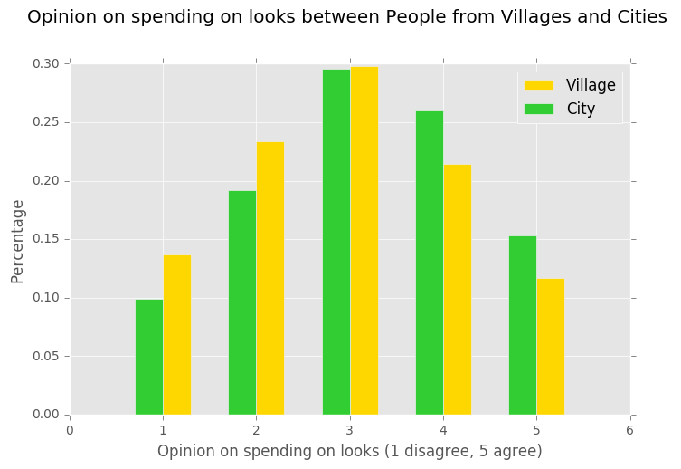


To utilize the previous information, we gathered information on a young person’s preferences for purchasing branded clothing.  The next figure clearly shows that the percentages are not similar for young villagers’ and young city residents’ preferences on buying clothing. More than 40% of city residents spend more on branded clothing, whereas only _34%_ of villagers spend a large amount of money on branded clothing. With this new information, we can advise an advertising firm to tailor their advertisements for higher end clothing towards the population residing in cities, while also tailoring their ads for unbranded clothes towards the village population. This would drastically lower the underlying costs of mindless spending on ineffective ads, which large clothing industries often spend on. 


```python
plt.subplot(1,2,1)
v_study['Branded clothing'].plot.pie(labels = onefive, autopct = '%.2f', fontsize = 12, figsize = (15,7))
plt.ylabel('Percentage')
plt.title('Village\'s Opinion on buying branded clothing')
plt.subplot(1,2,2)
c_study['Branded clothing'].plot.pie(labels = onefive, autopct = '%.2f', fontsize = 12, figsize = (15,7))
plt.ylabel('')
plt.title('City\'s Opinion on buying branded clothing')
plt.show()
```


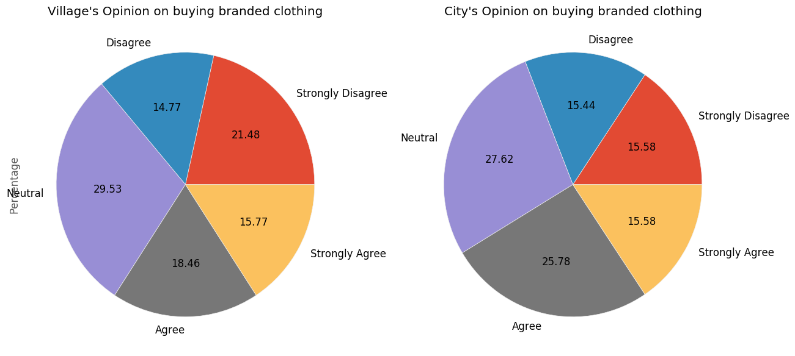


```python
plt.bar(bar_locations, v_study['Theatre'], bar_width, color = 'gold')
plt.bar(bar_locations - bar_width, c_study['Theatre'], bar_width, color='steelblue')
plt.legend(["Village", "City"], loc = 'upper right')
plt.xlabel('Opinion on going to Theatre (1 disagree, 5 agree)')
plt.ylabel('Percentage')
plt.title('Opinion on going to Theatre between People from Villages and Cities ')
plt.show()
```


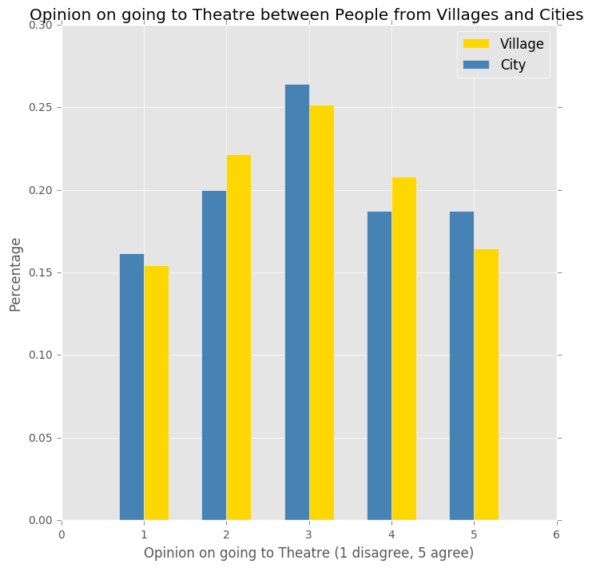


Have you ever seen ads while at the movies? If you answered no, then you must be very lucky.  Chances are you have been to the movie theater, and you have seen many interesting ads on the big screen.  We all know the inevitability of seeing these ads before your movie comes on, and how effective they are.  For the last section, we decided to see whether villagers or city residents enjoyed going to the movies more, depicted in a visual representation below . Surprisingly, the distribution of movie-going preferences are quite similar across the two demographics.  Meaning we can advise the firm to invest on advertisements for movies theaters in villages and cities. Perhaps they could cut funding proportionately by the amount of people who disagree on going to the theaters.  


```python

```


```python

```


```python

```
